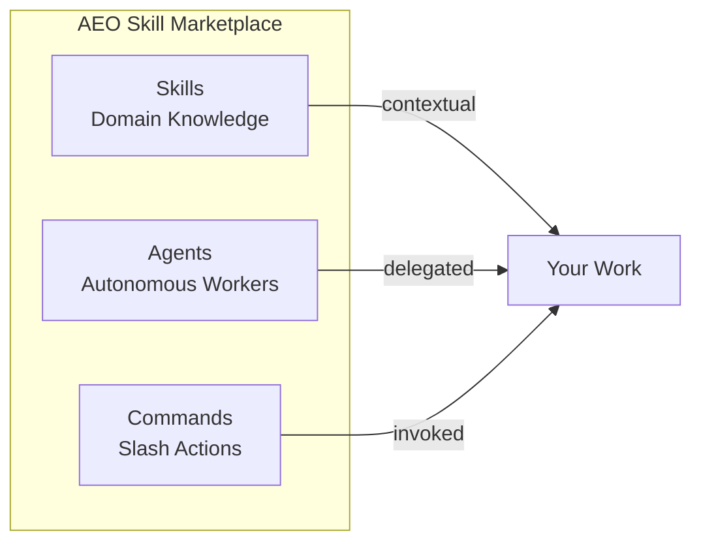

# AEO Skill Marketplace

**Reusable skills, agents, and workflows for AI-assisted development.**

Stop reinventing the wheel. Get battle-tested automation for architecture design, testing workflows, documentation generation, and more — organized into installable plugins you can mix and match.



---

## What's Inside

| Category | Plugins | What You Get |
|----------|---------|--------------|
| **Development** | 8 plugins | Architecture, code analysis, documentation, troubleshooting |
| **Testing** | 3 plugins | TDD workflows, QA agents, security scanning |
| **Automation** | 2 plugins | n8n workflows, Python tooling |
| **Productivity** | 2 plugins | Agile roles, requirements gathering |
| **Design** | 1 plugin | UX optimization, React PWA patterns |

**Total:** 16 plugins · 18 skills · 65 agents · 24 commands

---

## Quick Start

```bash
# Add the marketplace
/plugin marketplace add AeyeOps/aeo-skill-marketplace

# Install what you need
/plugin install aeo-architecture@aeo-skill-marketplace
/plugin install aeo-testing@aeo-skill-marketplace
```

Or load directly for development:

```bash
claude --plugin-dir ./aeo-skill-marketplace/aeo-architecture
```

---

## Architecture & Design

Design systems, document decisions, and maintain quality.

| Plugin | Description |
|--------|-------------|
| [**aeo-architecture**](./aeo-architecture) | 10 agents for system design, C4 diagrams, ADRs, and architecture review |
| [**aeo-documentation**](./aeo-documentation) | Diataxis framework implementation with tutorial, how-to, reference, and explanation agents |
| [**aeo-code-analysis**](./aeo-code-analysis) | Code archaeology for legacy systems, technical debt assessment, technology evaluation |

**Skills included:** MCP server design, Mermaid diagram creation

---

## Testing & Quality

Enforce quality through systematic testing workflows.

| Plugin | Description |
|--------|-------------|
| [**aeo-tdd-workflow**](./aeo-tdd-workflow) | Red-green-refactor methodology with 6 specialized agents |
| [**aeo-testing**](./aeo-testing) | Test planning, quality gates, coverage analysis |
| [**aeo-security**](./aeo-security) | Vulnerability scanning, compliance validation, permission auditing |

**Commands:** `/tdd-feature`, `/tdd-bugfix`, `/security-scan`, `/generate-tests`

---

## Workflow Automation

Structured methodologies for complex development tasks.

| Plugin | Description |
|--------|-------------|
| [**aeo-epcc-workflow**](./aeo-epcc-workflow) | Explore-Plan-Code-Commit cycle with 12 agents and 7 commands |
| [**aeo-n8n**](./aeo-n8n) | 7 skills for n8n workflow automation — expressions, nodes, validation, patterns |
| [**aeo-python**](./aeo-python) | CLI engineering, data pipelines, terminal UI development |

**Commands:** `/epcc-explore`, `/epcc-plan`, `/epcc-code`, `/epcc-commit`, `/prd`, `/trd`

---

## Team & Process

Agents that embody specific roles and responsibilities.

| Plugin | Description |
|--------|-------------|
| [**aeo-agile-tools**](./aeo-agile-tools) | Scrum Master, Product Owner, Business Analyst, Project Manager |
| [**aeo-requirements**](./aeo-requirements) | Product discovery, technical specifications, build-vs-buy analysis |
| [**aeo-troubleshooting**](./aeo-troubleshooting) | Systematic debugging with escalation mechanisms |

**Commands:** `/prd`, `/tech-req`, `/troubleshoot`

---

## Design & UX

User experience optimization and interface design.

| Plugin | Description |
|--------|-------------|
| [**aeo-ux-design**](./aeo-ux-design) | UI design, accessibility validation, WCAG compliance |

**Skills included:** React PWA patterns with shadcn/ui

---

## Developer Tools

Skills for building AI-powered tooling.

| Plugin | Description |
|--------|-------------|
| [**aeo-claude**](./aeo-claude) | Agent SDK reference, skill creation, slash command creation, Opus prompting |
| [**aeo-deployment**](./aeo-deployment) | Release orchestration, compliance automation, progressive rollouts |
| [**aeo-performance**](./aeo-performance) | Profiling, bottleneck identification, optimization planning |

**Skills included:** Agent SDK patterns, skill authoring, command development, prompt engineering

---

## How Plugins Work

Each plugin can contain any combination of:

```
plugin-name/
├── .claude-plugin/
│   └── plugin.json       # Metadata and version
├── skills/
│   └── topic/
│       └── SKILL.md      # Domain knowledge (loaded contextually)
├── agents/
│   └── role.md           # Autonomous workers (delegated via Task)
├── commands/
│   └── action.md         # Slash commands (invoked directly)
└── hooks/
    └── hooks.json        # Event automation
```

| Component | How It Works |
|-----------|--------------|
| **Skills** | Loaded automatically when context matches trigger phrases |
| **Agents** | Delegated tasks via the Task tool for autonomous work |
| **Commands** | Invoked directly with `/command-name` |
| **Hooks** | Run automatically on events (tool use, session start, etc.) |

---

## Creating Your Own Plugin

1. Create a directory at the marketplace root:
   ```bash
   mkdir -p my-plugin/.claude-plugin
   ```

2. Add `plugin.json`:
   ```json
   {
     "name": "my-plugin",
     "version": "0.1.0",
     "description": "What your plugin does",
     "author": {"name": "You", "url": "https://github.com/you"},
     "license": "MIT"
   }
   ```

3. Add components (skills, agents, commands, hooks)

4. Update `.claude-plugin/marketplace.json` to include your plugin

5. Validate:
   ```bash
   claude plugin validate ./my-plugin
   ```

---

## Project Goals

- **Reusable** — Extract common patterns into shareable components
- **Composable** — Mix and match plugins for your workflow
- **Maintainable** — Versioned, documented, validated
- **Framework-agnostic** — Works with any AI coding assistant that supports the plugin spec

---

## Repository Structure

```
aeo-skill-marketplace/
├── .claude-plugin/
│   └── marketplace.json    # Plugin index
├── aeo-agile-tools/        # Agile team roles
├── aeo-architecture/       # System design
├── aeo-claude/             # Developer tools
├── aeo-code-analysis/      # Legacy systems
├── aeo-deployment/         # Release management
├── aeo-documentation/      # Diataxis framework
├── aeo-epcc-workflow/      # Development methodology
├── aeo-n8n/                # Workflow automation
├── aeo-performance/        # Profiling & optimization
├── aeo-python/             # Python tooling
├── aeo-requirements/       # Requirements gathering
├── aeo-security/           # Security & compliance
├── aeo-tdd-workflow/       # Test-driven development
├── aeo-testing/            # QA & quality gates
├── aeo-troubleshooting/    # Debugging
└── aeo-ux-design/          # UX & accessibility
```

---

## Contributing

Contributions welcome. To add a plugin:

1. Fork the repository
2. Create your plugin following the structure above
3. Ensure `claude plugin validate` passes
4. Update `marketplace.json`
5. Submit a pull request

## License

MIT — see [LICENSE](LICENSE).

---

**Maintainer:** [AeyeOps](https://github.com/AeyeOps)
