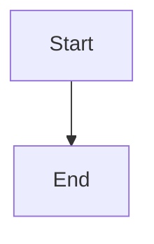
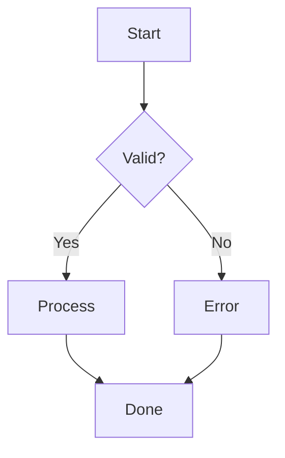
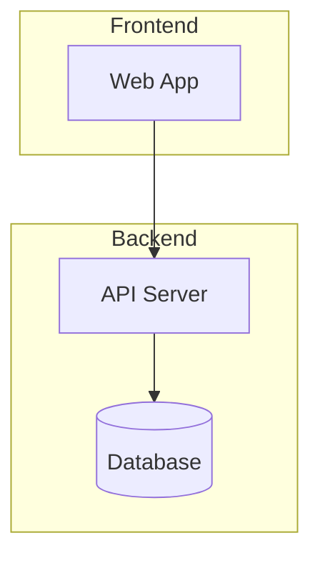
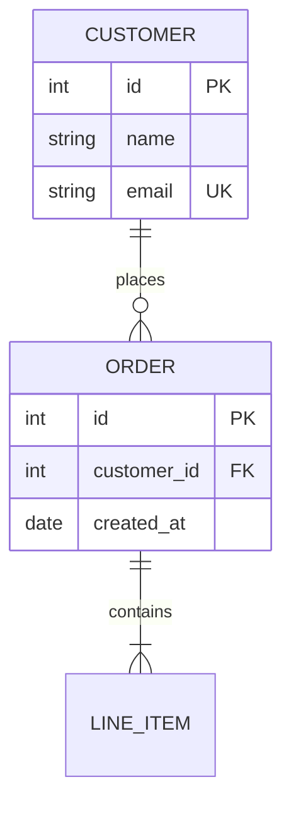
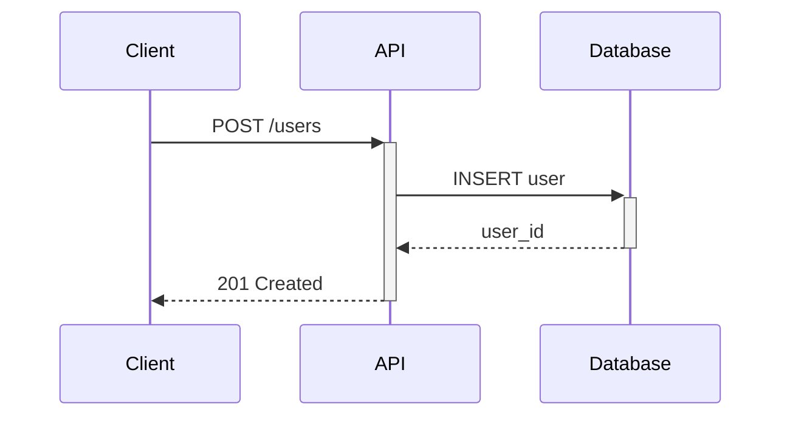
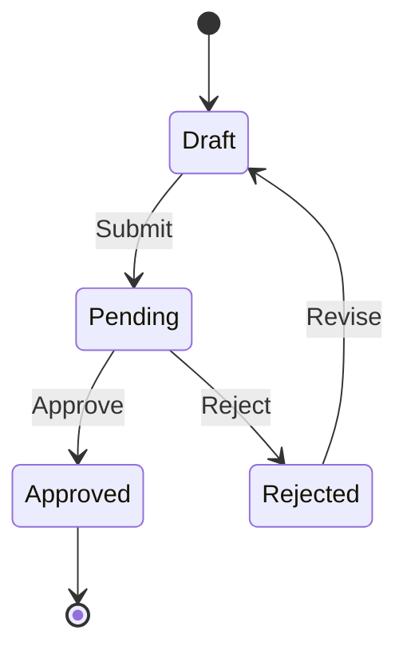
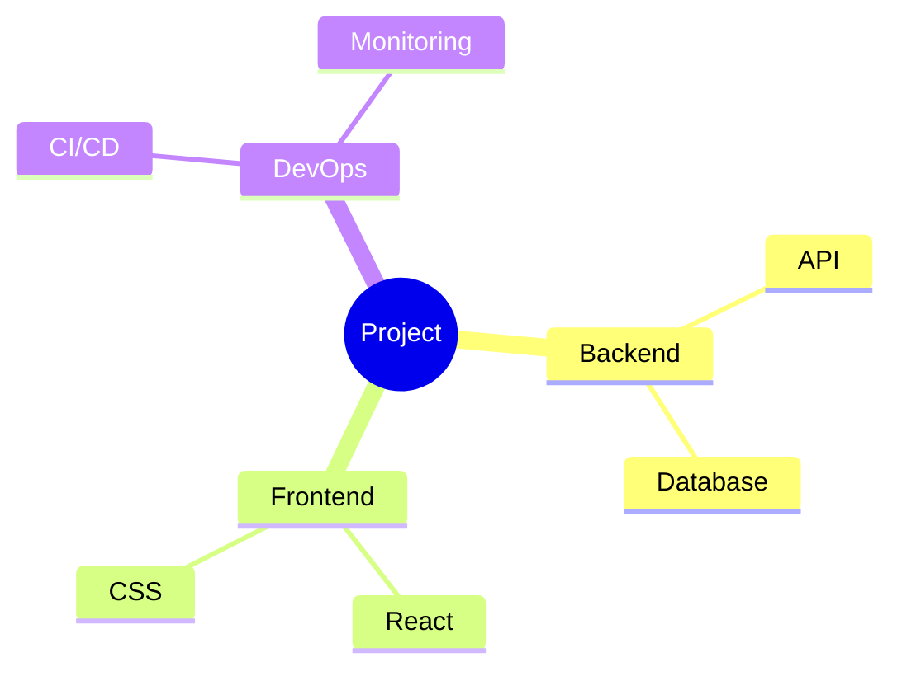
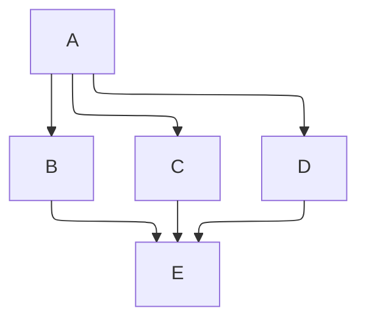
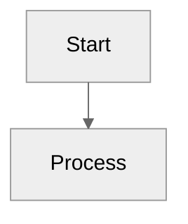

# Mermaid in Markdown

Create diagrams using fenced code blocks:

````markdown

````

## Reference Files (Load Only What You Need)

### Core Diagrams
| Diagram Type | Load this file |
|--------------|----------------|
| **Flowchart** - processes, workflows | [flowchart.md](references/flowchart.md) |
| **Sequence** - API interactions | [sequence.md](references/sequence.md) |
| **Class** - OOP structures | [class.md](references/class.md) |
| **State** - lifecycles, FSM | [state.md](references/state.md) |
| **ERD** - database schemas | [erd.md](references/erd.md) |
| **Gantt** - project timelines | [gantt.md](references/gantt.md) |

### Charts & Data Visualization
| Diagram Type | Load this file |
|--------------|----------------|
| **Pie** - proportional data | [pie.md](references/pie.md) |
| **Quadrant** - priority matrix | [quadrant.md](references/quadrant.md) |
| **Radar** - multi-dimensional | [radar.md](references/radar.md) |
| **XY Chart** - line/bar graphs | [xychart.md](references/xychart.md) |
| **Sankey** - flow quantities | [sankey.md](references/sankey.md) |
| **Treemap** - hierarchical data | [treemap.md](references/treemap.md) |

### Specialized Diagrams
| Diagram Type | Load this file |
|--------------|----------------|
| **C4** - architecture (Context/Container/Component) | [c4.md](references/c4.md) |
| **Architecture** - cloud/infra | [architecture.md](references/architecture.md) |
| **Block** - manual layouts | [block.md](references/block.md) |
| **Mindmap** - brainstorming | [mindmap.md](references/mindmap.md) |
| **Timeline** - chronological events | [timeline.md](references/timeline.md) |
| **Journey** - user workflows | [journey.md](references/journey.md) |
| **GitGraph** - branching | [gitgraph.md](references/gitgraph.md) |
| **Kanban** - task boards | [kanban.md](references/kanban.md) |
| **ZenUML** - code-like sequence | [zenuml.md](references/zenuml.md) |
| **Requirement** - SysML | [requirement.md](references/requirement.md) |
| **Packet** - network protocols | [packet.md](references/packet.md) |

### Reference & Guides
| When you need... | Load this file |
|------------------|----------------|
| **Which diagram to use?** | [selection-guide.md](references/selection-guide.md) |
| **Layout/width problems** | [layout.md](references/layout.md) |
| **Styling and themes** | [styling.md](references/styling.md) |
| **Platform compatibility** | [platforms.md](references/platforms.md) |
| **Core syntax rules** | [syntax.md](references/syntax.md) |
| **Copy-paste templates** | [templates.md](references/templates.md) |

## Quick Diagram Selection

| Scenario | Diagram | Keyword |
|----------|---------|---------|
| Database tables | ERD | `erDiagram` |
| API calls | Sequence | `sequenceDiagram` |
| Process steps | Flowchart | `flowchart TB` |
| Status lifecycle | State | `stateDiagram-v2` |
| Project schedule | Gantt | `gantt` |
| Brainstorm | Mindmap | `mindmap` |
| Architecture | Flowchart+subgraphs | `flowchart TB` |
| Git workflow | GitGraph | `gitGraph` |
| Task board | Kanban | `kanban` |

## Essential Patterns (Copy-Paste Ready)

### Flowchart with Decision


### Flowchart with Subgraphs (Architecture)


### ERD with Attributes


### Sequence with Activation


### State Machine


### Mindmap


## Critical Rules

1. **Use TB direction** - LR causes width overflow on letter-size PDF and narrow viewports
2. **Wrap "end"** - Use `[end]`, `(end)`, or `"end"` (reserved word)
3. **Quote special chars** - Text with `[]{}()` needs double quotes: `A["text [with] brackets"]`
4. **Avoid node IDs starting with o/x** - `A---oB` parsed as circle edge; use `A--- oB` or `A---OB`
5. **Alphanumeric node IDs only** - Use `A1`, `userAuth`, not `user-auth` or `step.1` (hyphens/dots break parsing)
6. **Split large diagrams** - Keep under 20 nodes per diagram
7. **Test first** - Use [mermaid.live](https://mermaid.live/) before committing
8. **ASCII labels only** - Avoid emoji/Unicode because not all renderers support them
9. **Dark theme preferred** - Use `%%{init: {'theme': 'dark'}}%%` for all diagrams; provides color differentiation and consistent appearance
10. **No inline styling** - Avoid `style NodeID fill:#hex` lines because themes provide consistent colors across diagrams

## Initialization Directives

Control rendering with `%%{init: ...}%%` at the start of the diagram:

### ELK Layout (Complex Diagrams)
For diagrams with many edge crossings or complex layouts:


### Theme + Layout Combined


### Common Init Options
| Option | Values | Use Case |
|--------|--------|----------|
| `theme` | neutral, default, dark, forest | Print: neutral. Dark mode: dark |
| `defaultRenderer` | dagre (default), elk | ELK for complex layouts |
| `htmlLabels` | true/false | false for markdown in labels |
| `curve` | basis, linear, cardinal | Edge curve style |

## Common Fixes

| Problem | Solution |
|---------|----------|
| Diagram not rendering | Check for lowercase "end" - capitalize or quote it |
| Diagram too wide / PDF overflow | Change `LR` to `TB` for letter-size output |
| "Parse error" on node | Quote text containing brackets: `["my [label]"]` |
| Node ID parse error | Use alphanumeric only - no hyphens, dots, or special chars |
| Unexpected edge style | Node ID starts with o/x - add space or capitalize |
| Subgraph direction ignored | External connections override - restructure links |
| GitHub not rendering | Check for unsupported features (ELK, some beta charts) |
| Edge crossings messy | Add `%%{init: {'flowchart': {'defaultRenderer': 'elk'}}}%%` |
| Emoji/symbols missing | Replace with ASCII text - not all renderers support Unicode |
| Poor contrast or inconsistent colors | Use `%%{init: {'theme': 'dark'}}%%` for all diagrams |
| Inline style declarations | Remove `style X fill:#hex` lines - use theme directive instead |
| Platform differences | See [platforms.md](references/platforms.md) |
