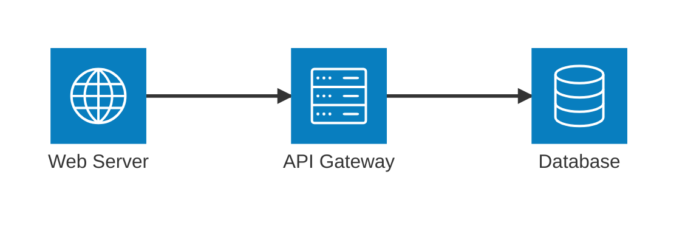
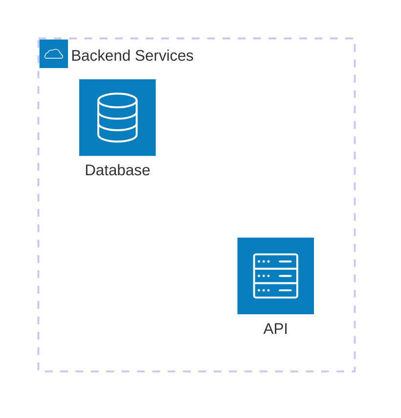
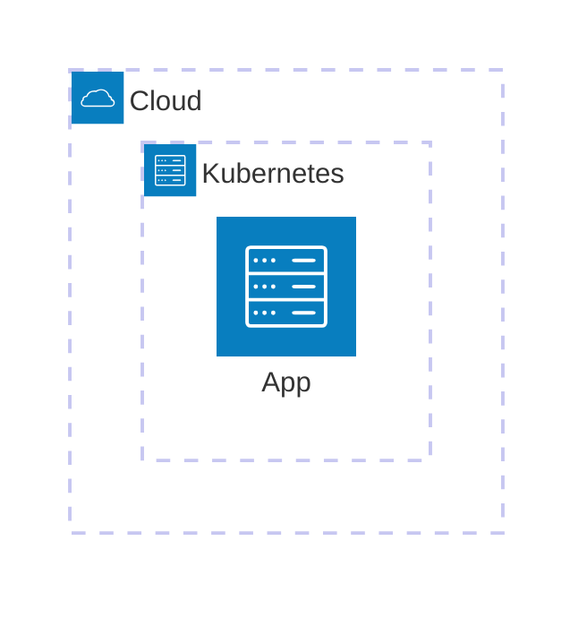

# Architecture Diagrams

**Keyword:** `architecture-beta`

**Purpose:** Cloud/CI-CD service and infrastructure visualization.

## Table of Contents
- [Basic Syntax](#basic-syntax)
- [Groups](#groups)
- [Services](#services)
- [Edges](#edges)
- [Junctions](#junctions)
- [Icons](#icons)
- [Icon and Label Syntax](#icon-and-label-syntax)
- [Key Limitations](#key-limitations)
- [When to Use](#when-to-use)

## Basic Syntax



## Groups



**Nested groups:**


## Services

```mermaid
architecture-beta
    service name(icon)[Label]
    service name(icon)[Label] in groupId
```

## Edges

**Syntax:** `serviceId{group}?:SIDE <-->? SIDE:serviceId{group}?`

**Sides:** `T` (top), `B` (bottom), `L` (left), `R` (right)


**Group connections:**


## Junctions


## Icons

**Default icons:**
- `cloud`
- `database`
- `disk`
- `internet`
- `server`

**Iconify icons (200,000+):**
```yaml
---
config:
  architecture:
    iconifyPacks:
      - mdi
---
architecture-beta
    service app(mdi:application)[Application]
```

**Format:** `packname:icon-name`

## Icon and Label Syntax

- Icons: `(icon-name)`
- Labels: `[Label Text]`

## Key Limitations
- Beta feature
- Limited default icons (must register packs)
- Manual positioning required

## When to Use
- Cloud architecture diagrams
- CI/CD pipeline visualization
- Microservices topology
- Infrastructure documentation
