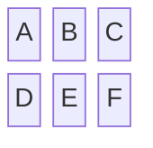
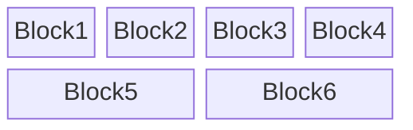
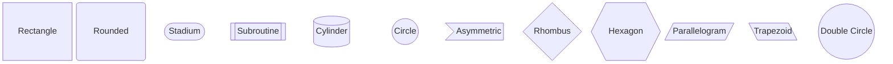
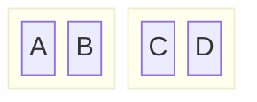
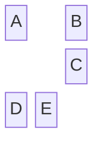
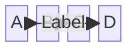
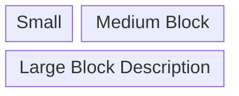

# Block Diagrams

**Keyword:** `block-beta`

**Purpose:** Custom layout diagrams with manual positioning (CSS grid-style).

## Table of Contents
- [Basic Syntax](#basic-syntax)
- [Columns and Layout](#columns-and-layout)
- [Block Shapes](#block-shapes)
- [Composite Blocks](#composite-blocks)
- [Space Blocks](#space-blocks)
- [Edges and Connections](#edges-and-connections)
- [Block Width](#block-width)
- [Key Principle](#key-principle)
- [Key Limitations](#key-limitations)
- [When to Use](#when-to-use)

## Basic Syntax

## Columns and Layout

**Block spanning:** `BlockName:n` (spans n columns)

## Block Shapes

## Composite Blocks

## Space Blocks

**Sized spaces:** `space:n` (n columns)

## Edges and Connections

## Block Width

## Key Principle

Block diagrams provide **full manual control** over positioning, unlike flowcharts with automatic layout.

## Key Limitations
- Requires manual layout planning
- No automatic positioning
- Complex layouts need careful column calculation

## When to Use
- Network diagrams
- System architecture
- Infrastructure layouts
- Custom positioned components
