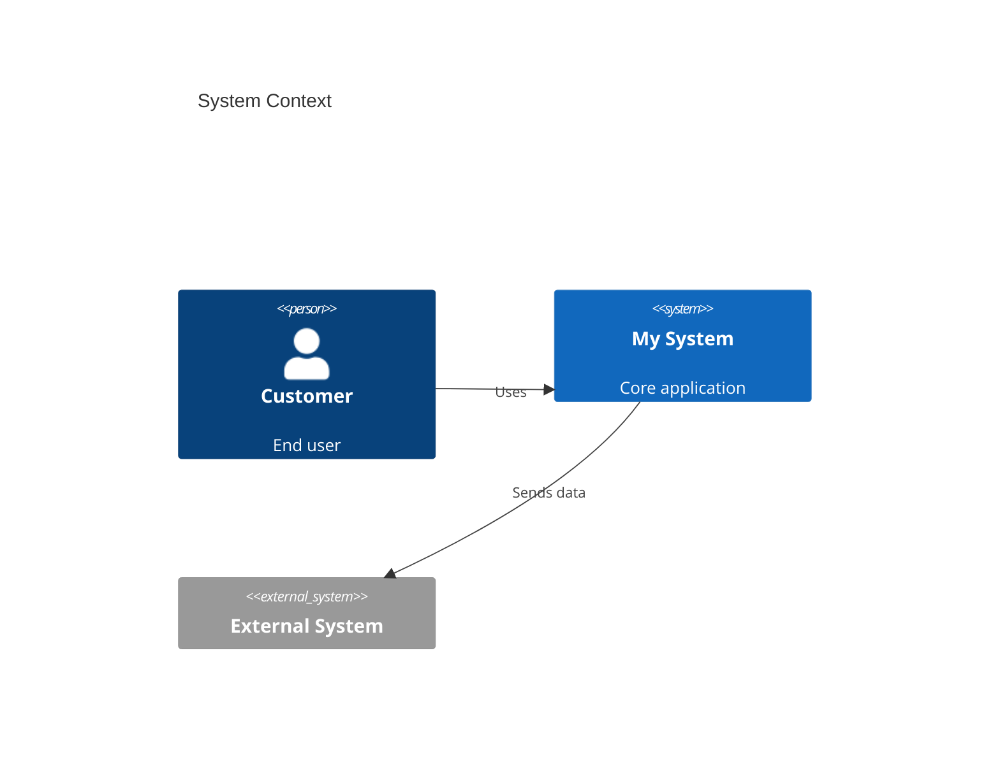
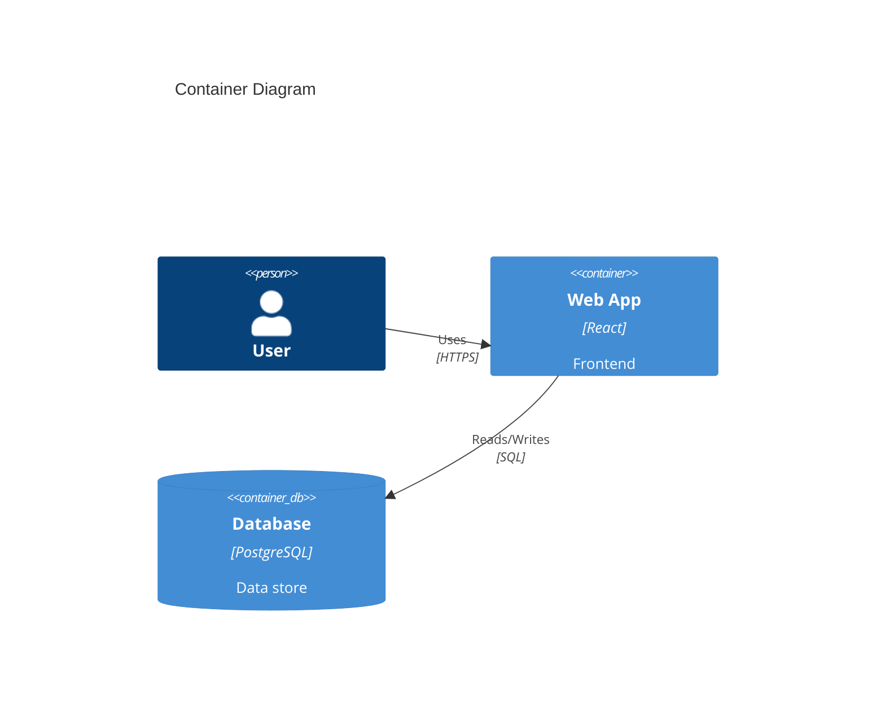
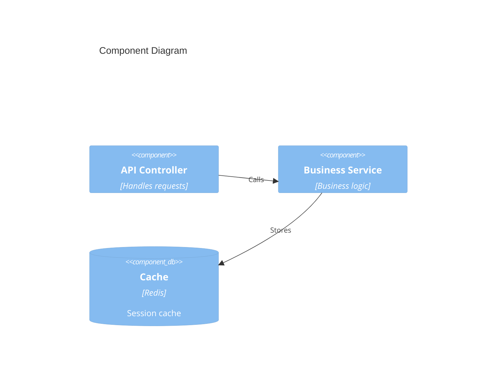
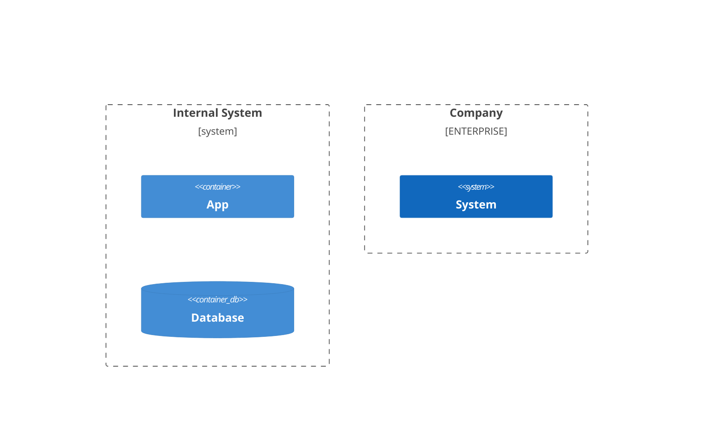
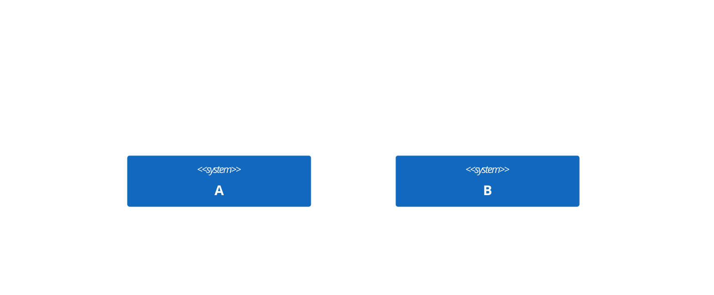

# C4 Diagrams

**Keyword:** `C4Context`, `C4Container`, `C4Component`, `C4Dynamic`, `C4Deployment`

**Status:** Experimental (incomplete feature support)

**Purpose:** Hierarchical architecture visualization (Context -> Container -> Component -> Dynamic -> Deployment).

## Table of Contents
- [C4 Context Diagram](#c4-context-diagram)
- [C4 Container Diagram](#c4-container-diagram)
- [C4 Component Diagram](#c4-component-diagram)
- [Element Types](#element-types)
- [Boundaries](#boundaries)
- [Relationships](#relationships)
- [Styling](#styling)
- [Layout Configuration](#layout-configuration)
- [Key Limitations](#key-limitations)
- [When to Use](#when-to-use)

## C4 Context Diagram



## C4 Container Diagram



## C4 Component Diagram



## Element Types

**People:**
- `Person(id, label, description)`
- `Person_Ext(id, label, description)` - External person

**Systems:**
- `System(id, label, description)`
- `SystemDb(id, label, description)` - Database system
- `SystemQueue(id, label, description)` - Queue system
- `System_Ext()` - External system

**Containers:**
- `Container(id, label, tech, description)`
- `ContainerDb()` - Database container
- `ContainerQueue()` - Queue container

**Components:**
- `Component(id, label, description)`
- `ComponentDb()` - Database component
- `ComponentQueue()` - Queue component

## Boundaries



## Relationships

**Standard:**
```mermaid
Rel(source, target, "Label")
BiRel(a, b, "Bidirectional")
```

**Directional:**
```mermaid
Rel_U(a, b, "Up")
Rel_D(a, b, "Down")
Rel_L(a, b, "Left")
Rel_R(a, b, "Right")
```

**Dynamic (numbered):**
```mermaid
C4Dynamic
    RelIndex(1, a, b, "First interaction")
    RelIndex(2, b, c, "Second interaction")
```

## Styling

```mermaid
C4Context
    UpdateElementStyle(system, $bgColor="blue", $fontColor="white")
    UpdateRelStyle(customer, system, $lineColor="red")
```

## Layout Configuration



## Key Limitations (Experimental)
- Sprites not supported
- Tags not supported
- Links not supported
- Legends not supported
- Automatic layout algorithms unavailable
- Limited compared to PlantUML C4

## When to Use
- System architecture documentation
- Technical onboarding
- Architecture decision records
- High-level design communication
