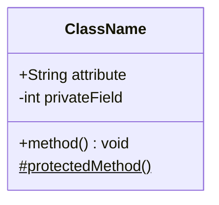
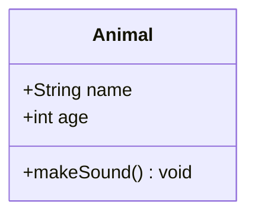
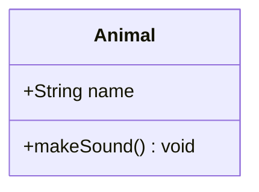
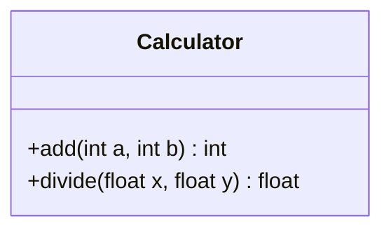
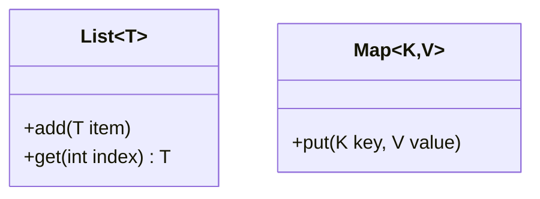
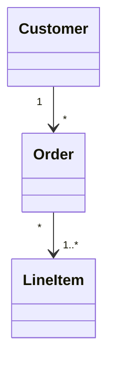
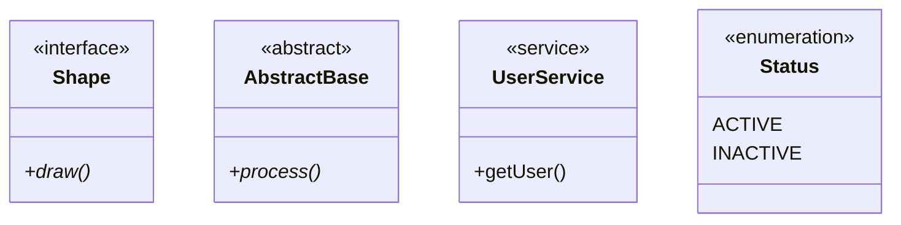

# Class Diagrams

**Keyword:** `classDiagram`

**Purpose:** Model object-oriented structures with classes, attributes, methods, and relationships.

## Table of Contents
- [Basic Syntax](#basic-syntax)
- [Class Definition](#class-definition)
- [Members](#members)
- [Visibility Modifiers](#visibility-modifiers)
- [Method Classifiers](#method-classifiers)
- [Return Types](#return-types)
- [Generic Types](#generic-types)
- [Relationships](#relationships)
- [Annotations](#annotations)
- [Key Limitations](#key-limitations)
- [When to Use](#when-to-use)

## Basic Syntax



## Class Definition

**Bracket syntax:**


**Colon syntax:**


## Members

**Attributes:** No parentheses
```
+publicAttribute
-privateAttribute
#protectedAttribute
~packageAttribute
```

**Methods:** Include parentheses
```
+publicMethod()
-privateMethod()
#protectedMethod()
~packageMethod()
```

## Visibility Modifiers
- `+` Public
- `-` Private
- `#` Protected
- `~` Package/Internal

## Method Classifiers
- `*` Abstract: `method()*`
- `$` Static: `method()$`

## Return Types



## Generic Types



**Note:** Nested generics like `List~List~int~~` are supported, but comma-separated generics have limited support.

## Relationships

| Syntax | Type | Meaning |
|--------|------|---------|
| `<\|--` | Inheritance | Extends/implements |
| `*--` | Composition | Strong "has-a" |
| `o--` | Aggregation | Weak "has-a" |
| `-->` | Association | Uses/knows |
| `--` | Link (solid) | Generic connection |
| `..>` | Dependency | Temporary usage |
| `..\|>` | Realization | Interface implementation |
| `..` | Link (dashed) | Weak connection |

**With cardinality:**


## Annotations



## Key Limitations
- Class names: alphanumeric, underscores, dashes only
- Comma-separated generics not fully supported
- Complex nested relationships may require careful formatting

## When to Use
- Software architecture documentation
- Database schema modeling
- OOP design planning
- API structure visualization
