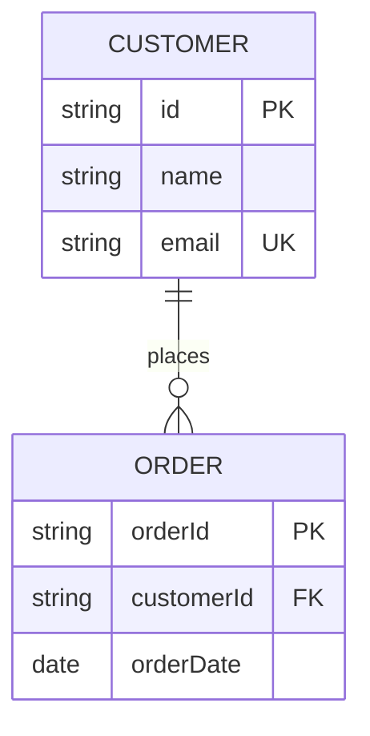
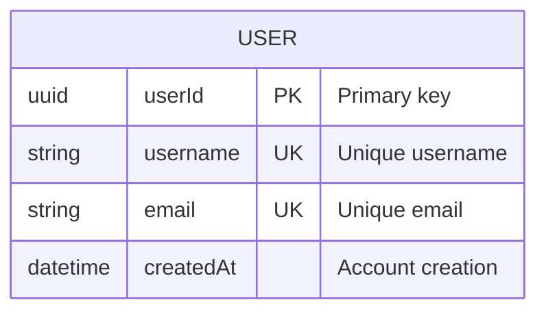
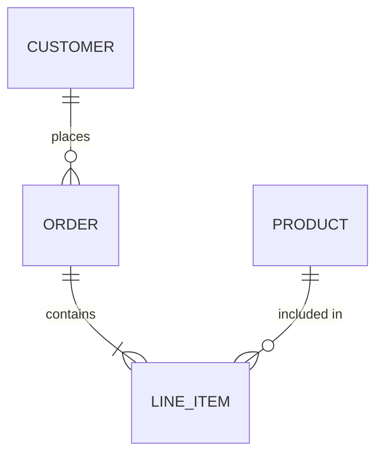
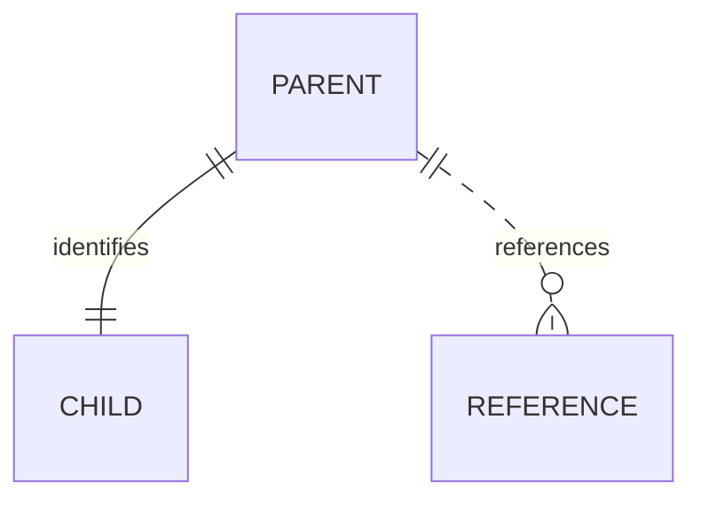
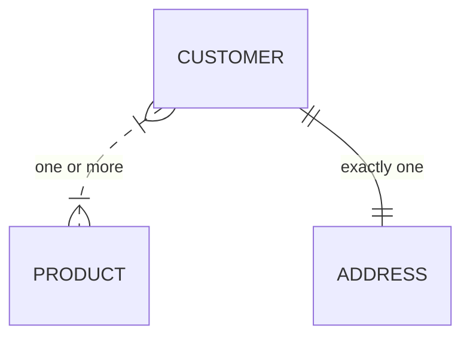
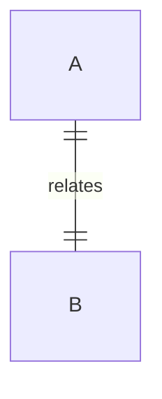
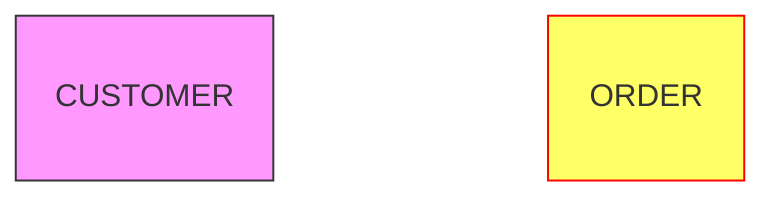

# Entity Relationship Diagrams (ERD)

**Keyword:** `erDiagram`

**Purpose:** Model database schemas and entity relationships.

## Table of Contents
- [Basic Syntax](#basic-syntax)
- [Entity Definition](#entity-definition)
- [Attribute Constraints](#attribute-constraints)
- [Cardinality Notation](#cardinality-notation)
- [Relationship Examples](#relationship-examples)
- [Relationship Aliases](#relationship-aliases)
- [Diagram Direction](#diagram-direction)
- [Styling](#styling)
- [Key Limitations](#key-limitations)
- [When to Use](#when-to-use)

## Basic Syntax



## Entity Definition

```mermaid
erDiagram
    ENTITY_NAME {
        datatype attributeName constraints "comment"
    }
```

**Example:**


## Attribute Constraints
- `PK` - Primary Key
- `FK` - Foreign Key
- `UK` - Unique Key

## Cardinality Notation

**Crow's foot notation:**

| Marker | Meaning |
|--------|---------|
| `\|o` | Zero or one |
| `\|\|` | Exactly one |
| `}o` | Zero or more (many) |
| `}\|` | One or more |

**Syntax:** `ENTITY1 [left][right]--[right][left] ENTITY2 : label`

## Relationship Examples



**Identifying vs Non-identifying:**
- `--` Solid line (identifying relationship)
- `..` Dashed line (non-identifying relationship)



## Relationship Aliases

Alternative syntax:


## Diagram Direction



Options: `TB`, `BT`, `LR`, `RL`

## Styling



## Key Limitations
- Data types are cosmetic (not validated)
- Complex many-to-many requires junction tables
- Comments must be quoted

## When to Use
- Database schema design
- Data modeling workshops
- Technical documentation
- Migration planning
