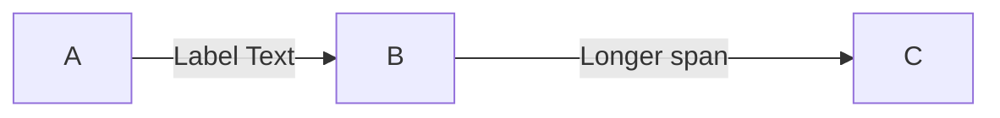
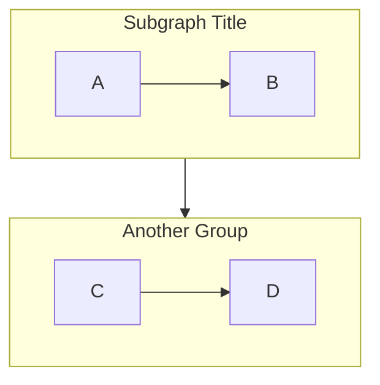
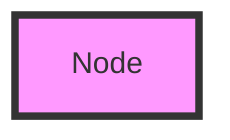
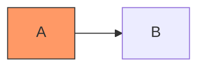

# Flowchart/Graph Diagrams

**Keyword:** `flowchart` (or legacy `graph`)

**Purpose:** Visualize processes, workflows, and decision trees using nodes and directional edges.

## Table of Contents
- [Basic Syntax](#basic-syntax)
- [Direction Options](#direction-options)
- [Node Shapes](#node-shapes)
- [Arrow Types](#arrow-types)
- [Link Text and Length](#link-text-and-length)
- [Subgraphs](#subgraphs)
- [Styling](#styling)
- [Key Limitations](#key-limitations)
- [When to Use](#when-to-use)

## Basic Syntax

```mermaid
flowchart [direction]
    nodeId[Node Label]
    nodeId --> anotherNode
```

## Direction Options
- `TB` or `TD`: Top to bottom (default)
- `BT`: Bottom to top
- `LR`: Left to right
- `RL`: Right to left

## Node Shapes

| Syntax | Shape | Example |
|--------|-------|---------|
| `A[text]` | Rectangle | `id1[Process]` |
| `A(text)` | Rounded rectangle | `id2(Start)` |
| `A([text])` | Stadium | `id3([End])` |
| `A((text))` | Circle | `id4((1))` |
| `A{text}` | Diamond | `id5{Decision?}` |
| `A{{text}}` | Hexagon | `id6{{Prepare}}` |
| `A[[text]]` | Subroutine | `id7[[Subprocess]]` |
| `A[(text)]` | Cylinder (database) | `id8[(Database)]` |
| `A((text))` | Circle | `id9((Point))` |
| `A>text]` | Asymmetric | `id10>Flag]` |
| `A{text}` | Rhombus | `id11{Choice}` |

**Note:** Version 11.3.0+ adds 30+ additional shapes including trapezoids, documents, storage symbols, and more.

## Arrow Types

| Syntax | Style | Description |
|--------|-------|-------------|
| `-->` | Solid arrow | Standard flow |
| `---` | Solid line | Connection without direction |
| `-.->` | Dotted arrow | Optional/conditional flow |
| `-.-` | Dotted line | Weak relationship |
| `==>` | Thick arrow | Primary flow |
| `===` | Thick line | Strong connection |
| `~~~` | Invisible | Spacing/alignment |
| `--o` | Circle end | Data flow |
| `--x` | Cross end | Termination |

## Link Text and Length



## Subgraphs



## Styling

**Inline:**


**Class-based:**


## Key Limitations
- Avoid "end" in lowercase (breaks parser)
- Don't start node IDs with "o" or "x" (add space or capitalize)
- Reserved keywords must be quoted

## When to Use
- Process documentation
- Decision workflows
- System architecture overviews
- Algorithm visualization
