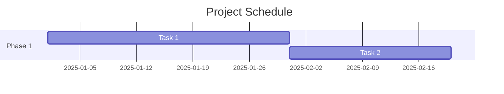
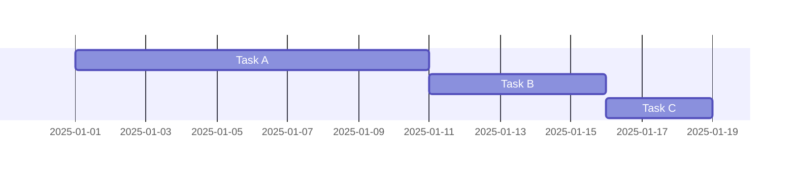
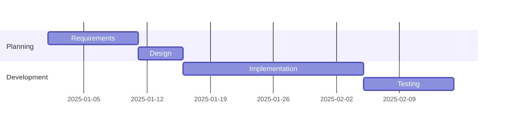
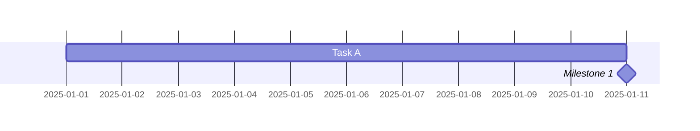
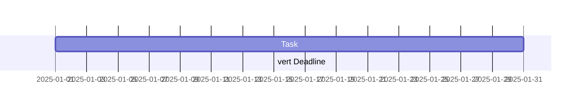
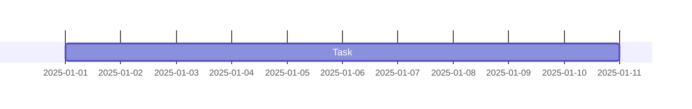
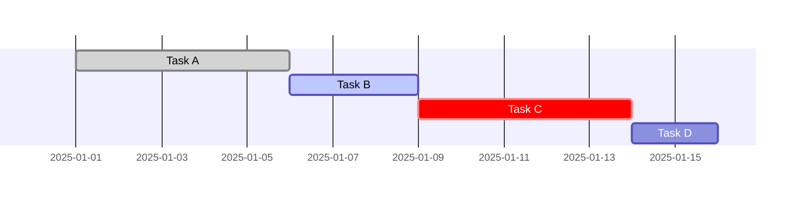

# Gantt Charts

**Keyword:** `gantt`

**Purpose:** Project timeline and task scheduling.

## Table of Contents
- [Basic Syntax](#basic-syntax)
- [Task Definition](#task-definition)
- [Sections](#sections)
- [Milestones](#milestones)
- [Vertical Markers](#vertical-markers)
- [Date Configuration](#date-configuration)
- [Excluding Dates](#excluding-dates)
- [Task States](#task-states)
- [Compact Mode](#compact-mode)
- [Key Limitations](#key-limitations)
- [When to Use](#when-to-use)

## Basic Syntax



## Task Definition

**Syntax:** `Task name: [taskId], [startDate/dependency], [duration/endDate]`

**Duration formats:**
- `30d` - 30 days
- `2w` - 2 weeks
- `1m` - 1 month

**Dependencies:**


## Sections



## Milestones



## Vertical Markers



## Date Configuration


**Date formats:** Use JavaScript date format tokens
- `%Y-%m-%d` - 2025-01-15
- `%b %d` - Jan 15
- `%d/%m/%Y` - 15/01/2025

## Excluding Dates



## Task States



States: `done`, `active`, `crit` (critical)

## Compact Mode

```yaml
---
displayMode: compact
---
gantt
    Task A: 2025-01-01, 10d
    Task B: 2025-01-01, 5d
```

## Key Limitations
- Date parsing depends on `dateFormat` setting
- Excluded dates extend tasks rightward
- Complex dependencies may require manual calculation

## When to Use
- Project planning
- Sprint scheduling
- Resource allocation
- Milestone tracking
