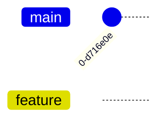
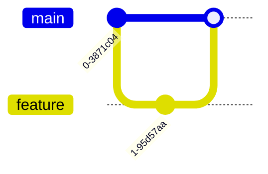

# GitGraph Diagrams

**Keyword:** `gitGraph`

**Purpose:** Visualize Git branching and merging workflows.

## Table of Contents
- [Basic Syntax](#basic-syntax)
- [Commits](#commits)
- [Branching](#branching)
- [Checkout/Switch](#checkoutswitch)
- [Merging](#merging)
- [Cherry-Pick](#cherry-pick)
- [Key Limitations](#key-limitations)
- [When to Use](#when-to-use)

## Basic Syntax


## Commits


**Commit types:**
- `NORMAL` - Solid circle (default)
- `REVERSE` - Crossed circle
- `HIGHLIGHT` - Filled rectangle

**Custom IDs:**


**Tags:**


## Branching


**Branch with options:**


## Checkout/Switch


**Note:** `checkout` and `switch` are interchangeable.

## Merging



**Merge with tag:**


## Cherry-Pick


**Cherry-pick parent (merge commits):**
```mermaid
gitGraph
    commit
    branch feature
    commit id: "F1"
    checkout main
    merge feature id: "M1"
    checkout feature
    commit id: "F2"
    checkout main
    cherry-pick id: "M1" parent: "F1"
```

## Key Limitations
- Branch names conflicting with keywords must be quoted
- Cherry-pick requires commit to exist on different branch
- Self-merge prohibited (causes error)
- Current branch must have at least one commit before cherry-pick
- Merge commit cherry-pick requires parent ID

## When to Use
- Git workflow documentation
- Branching strategy illustration
- Release process visualization
- Training materials
