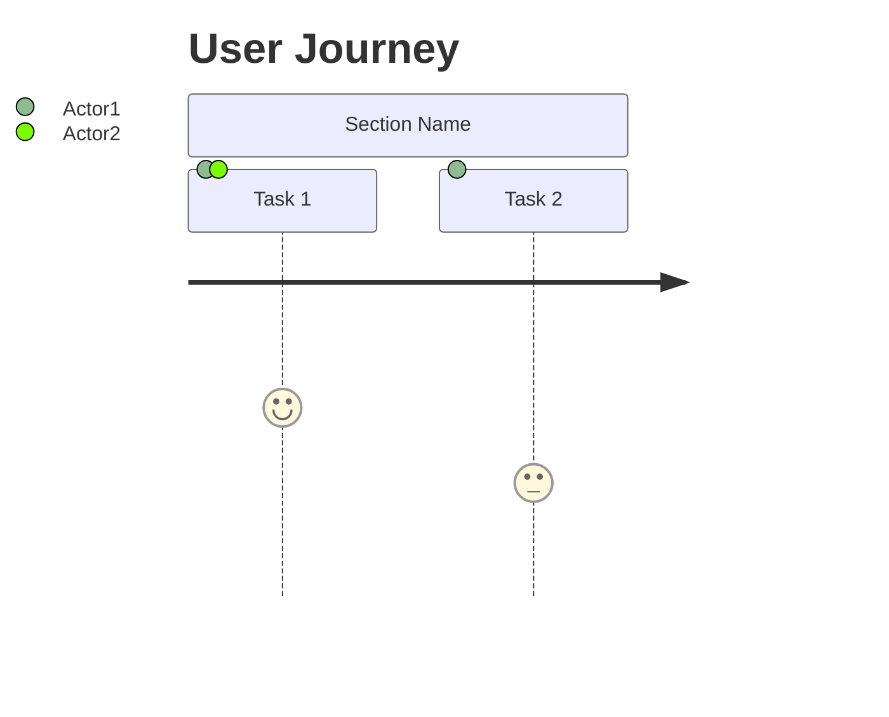
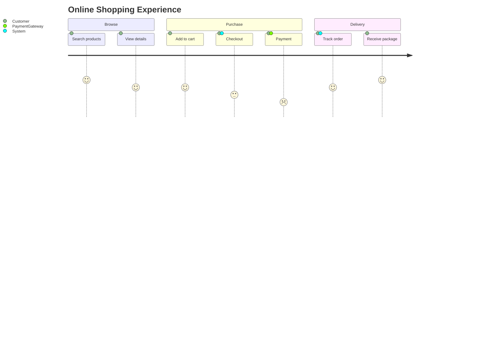

# User Journey Diagrams

**Keyword:** `journey`

**Purpose:** Visualize user workflows and satisfaction levels.

## Basic Syntax



## Task Syntax

```
Task name: score: actor1, actor2, actor3
```

**Score:** 1-5 (inclusive)
- 1: Very dissatisfied
- 5: Very satisfied

## Example



## Key Limitations
- Score must be 1-5
- Limited formatting options
- Multiple actors separated by commas

## When to Use
- UX research documentation
- Customer journey mapping
- Process improvement analysis
- User story illustration
