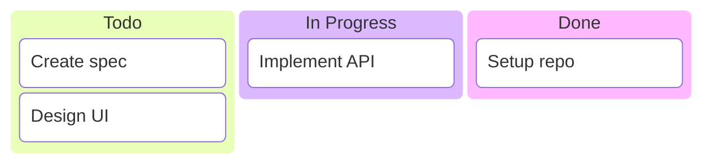
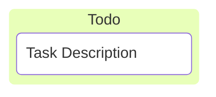

# Kanban Diagrams

**Keyword:** `kanban`

**Purpose:** Task board visualization with workflow columns.

## Basic Syntax



## Column Definition


## Task Definition



**Indentation is required** - tasks must be indented under columns.

## Task Metadata

```mermaid
kanban
    todo[Todo]
        task1[Implement auth] @{ assigned: "Alice", ticket: "JIRA-123", priority: "High" }
```

**Metadata keys:**
- `assigned` - Task owner
- `ticket` - Issue/ticket number
- `priority` - Urgency (Very High, High, Low, Very Low)

## Configuration

```yaml
---
config:
  kanban:
    ticketBaseUrl: 'https://project.atlassian.net/browse/#TICKET#'
---
kanban
    todo[Todo]
        task1[Task] @{ ticket: "ABC-123" }
```

**ticketBaseUrl:** `#TICKET#` replaced with ticket value, creates clickable links.

## Example

```mermaid
kanban
    backlog[Backlog]
        task1[Research] @{ assigned: "Bob", priority: "Low" }

    todo[To Do]
        task2[Design] @{ assigned: "Alice", ticket: "PROJ-100" }

    inProgress[In Progress]
        task3[Development] @{ assigned: "Charlie", ticket: "PROJ-101", priority: "High" }

    review[Review]
        task4[Code review] @{ assigned: "Alice" }

    done[Done]
        task5[Testing] @{ ticket: "PROJ-99" }
```

## Key Limitations
- All identifiers must be unique
- Proper indentation required
- Limited visual customization

## When to Use
- Agile project boards
- Workflow visualization
- Sprint planning
- Task status tracking
