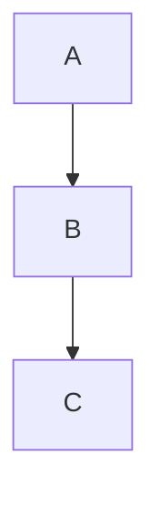
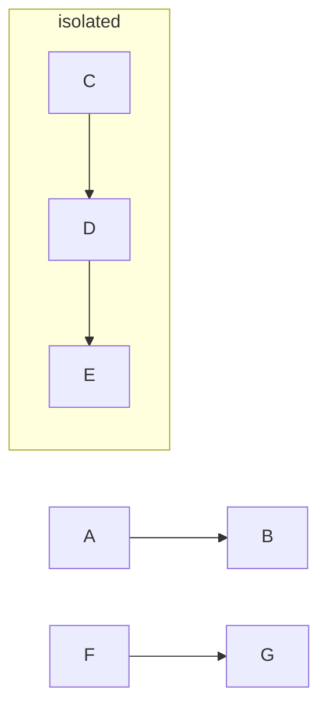
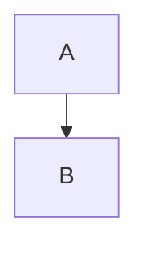
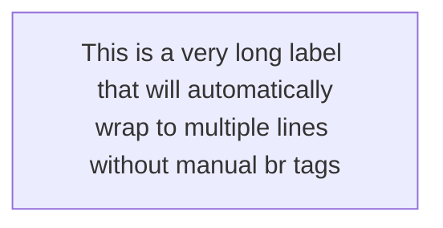
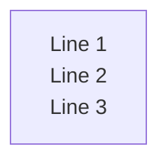
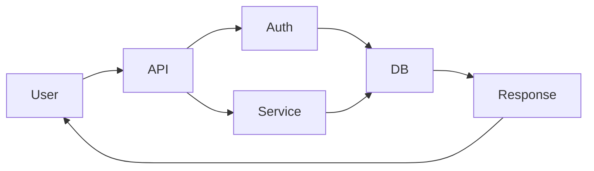

# Mermaid Layout Engines and Rendering Control

CRITICAL RESEARCH: This document addresses diagram width issues for letter-width viewport rendering.

## Executive Summary: Solving Width Issues

The CRITICAL solution to diagrams rendering too wide for letter-width viewports:

1. **Use multiple separate Mermaid code blocks** - Each ````mermaid` block is TRULY INDEPENDENT
2. **Force TB (Top-to-Bottom) direction** - Vertical layouts fit better in narrow viewports
3. **Use ELK renderer for complex diagrams** - Better layout optimization than Dagre
4. **Configure nodeSpacing and rankSpacing** - Reduce spacing to compress diagrams
5. **Enable text wrapping** - Use markdown strings to prevent horizontal expansion
6. **DO NOT rely on subgraph direction** - It's ignored when nodes connect externally

## Layout Engines Available

Mermaid supports four primary layout algorithms:

### 1. Dagre (Default)
- **Best for**: Simple to medium complexity flowcharts
- **Characteristics**: Classic layered graph layout, good balance of simplicity and clarity
- **Issues**: Can spread wide horizontally, blocks positioning problems, edges drawing through other blocks
- **Configuration**: Minimal customization options

### 2. ELK (Eclipse Layout Kernel)
- **Best for**: Large, complex, or intricate diagrams
- **Characteristics**: Advanced optimization, reduces overlapping, improves readability
- **Availability**: Requires `@mermaid-js/layout-elk` package (not included by default)
- **Version**: Available from Mermaid 9.4+
- **Verdict**: "The difference between usable and not" for complex diagrams

### 3. Tidy Tree
- **Best for**: Hierarchical diagram structures
- **Characteristics**: Specialized for tree layouts with dedicated configuration options

### 4. Cose Bilkent
- **Best for**: Force-directed graph layouts
- **Characteristics**: Physics-based node positioning

## Direction Control (TB, BT, LR, RL)

### Basic Direction Syntax

Direction controls flowchart orientation:

- **TB** or **TD**: Top to Bottom (vertical, default) - BEST FOR LETTER WIDTH
- **BT**: Bottom to Top (inverted vertical) - FITS LETTER WIDTH
- **LR**: Left to Right (horizontal) - OFTEN TOO WIDE
- **RL**: Right to Left (reversed horizontal) - OFTEN TOO WIDE



### Why Diagrams Sometimes Ignore Direction

CRITICAL LIMITATION: Direction settings are ignored in these scenarios:

1. **Subgraph External Connections**: If ANY node inside a subgraph connects to something outside, the subgraph direction is IGNORED and inherits parent direction
2. **Class Diagrams**: Direction keywords have NO EFFECT on class diagrams regardless of setting
3. **Renderer Override**: Some renderers may override direction based on optimization

From GitHub Issue #6438:
> "If any of a subgraph's nodes are linked to the outside, subgraph direction will be ignored. The subgraph will inherit the direction of the parent graph."

### Subgraph Behavior

Subgraphs CAN have independent direction IF AND ONLY IF:
- No nodes inside the subgraph connect to external nodes
- The subgraph is completely isolated



In this example, the subgraph will render TB only because C, D, E don't connect to A, B, F, or G.

If you add `E --> F`, the entire subgraph will switch to LR layout.

## CRITICAL: Creating Truly Independent Diagrams

### The ONLY Way to Ensure Independence

Use **separate Mermaid code blocks** in your Markdown:

```markdown
### Diagram 1: User Authentication

\`\`\`mermaid
flowchart TB
    A[User] --> B[Login]
    B --> C[Validate]
\`\`\`

### Diagram 2: Data Processing

\`\`\`mermaid
flowchart TB
    X[Data] --> Y[Process]
    Y --> Z[Store]
\`\`\`
```

Each code block:
- Renders COMPLETELY INDEPENDENTLY
- Has its own layout calculation
- Cannot influence other diagrams
- Can use different configurations
- Processes in separate rendering contexts

From GitHub/Markdown documentation:
> "Each \`\`\`mermaid code block in a Markdown document is rendered independently as its own separate diagram."

### Why This Solves Width Issues

Breaking large wide diagrams into multiple smaller vertical diagrams:
1. Each diagram calculates width independently
2. Vertical (TB) orientation fits letter-width viewports
3. No cross-diagram layout contamination
4. Easier to control individual diagram complexity

## Node Spacing and Sizing Controls

### Configuration Options

From the Flowchart Diagram Config Schema:

```javascript
// Via mermaid.initialize()
mermaid.initialize({
  flowchart: {
    nodeSpacing: 50,      // Horizontal spacing for TB/BT, vertical for LR/RL (default: 50)
    rankSpacing: 50,      // Spacing between levels (default: 50)
    diagramPadding: 20,   // Padding around entire diagram (default: 20)
    wrappingWidth: 200,   // Width where text wraps (default: 200)
    defaultRenderer: 'dagre-wrapper',  // or 'elk'
    curve: 'basis',       // How curves render: basis, linear, cardinal, etc.
    padding: 15,          // Space between labels and shapes (default: 15)
  }
});
```

### YAML Configuration in Diagram



### Known Spacing Issues

From GitHub Issue #3258:
> "Node spacing doesn't apply when nodes are inside subgraphs - the vertical distance remains the same regardless of nodeSpacing setting."

Workaround: Set spacing at the diagram level, not per-subgraph.

## How Connections/Edges Affect Layout

### Edge Impact on Width

Edges are a PRIMARY CAUSE of horizontal expansion:

1. **Long edge paths**: Dagre creates space for curved edges, expanding horizontally
2. **Edge crossings**: Algorithms minimize crossings by spreading nodes apart
3. **Edge labels**: Text on edges requires space, pushing nodes apart
4. **Parallel edges**: Multiple edges between same nodes increase spacing

### ELK mergeEdges Option

Reduces width by allowing edges to share paths:

```yaml
---
config:
  layout: elk
  elk:
    mergeEdges: true
---
```

From documentation:
> "The mergeEdges option allows edges to share path where convenient. It can make for pretty diagrams but can also make it harder to read."

Default: `false`

### Font Size Impact

From configuration schema:
> "Font size factor is used to guess the width of the edges labels before rendering by dagre layout."

Smaller fonts = narrower edge label estimates = tighter layout.

## Breaking Large Diagrams into Smaller Pieces

### Strategy 1: Separate by Feature/Layer

Instead of one massive diagram:

```markdown
## System Architecture

### Layer 1: API Endpoints
\`\`\`mermaid
flowchart TB
    API1[GET /users] --> Handler1
    API2[POST /users] --> Handler2
\`\`\`

### Layer 2: Business Logic
\`\`\`mermaid
flowchart TB
    Handler1 --> Service1[User Service]
    Handler2 --> Service1
\`\`\`

### Layer 3: Data Access
\`\`\`mermaid
flowchart TB
    Service1 --> DB[(Database)]
\`\`\`
```

Benefits:
- Each diagram renders narrow (TB direction)
- Clear separation of concerns
- Easier to understand
- Fits letter-width viewport

### Strategy 2: Separate by Flow/Process

Break workflows into sequential steps:

```markdown
### Step 1: User Input
\`\`\`mermaid
flowchart TB
    User --> Form --> Validate
\`\`\`

### Step 2: Processing
\`\`\`mermaid
flowchart TB
    Validate --> Process --> Transform
\`\`\`

### Step 3: Storage
\`\`\`mermaid
flowchart TB
    Transform --> Save --> Confirm
\`\`\`
```

### Strategy 3: Use Narrative Structure

Explain the flow with text between diagrams:

```markdown
First, the user submits data:
\`\`\`mermaid
flowchart TB
    User --> Submit
\`\`\`

The system validates the input:
\`\`\`mermaid
flowchart TB
    Submit --> Validate
    Validate --> |Valid| Accept
    Validate --> |Invalid| Reject
\`\`\`

Finally, data is stored:
\`\`\`mermaid
flowchart TB
    Accept --> Store
\`\`\`
```

## Render Width Constraints

### useMaxWidth Configuration

Controls responsive behavior:

```javascript
mermaid.initialize({
  flowchart: {
    useMaxWidth: true  // default
  }
});
```

When `true`:
- Diagram width set to 100%
- Scaled to available container space
- Responsive to viewport changes

When `false`:
- Uses absolute calculated space
- Fixed width based on layout
- May overflow container

From GitHub Issue #5038:
> "When this flag is set to true, the height and width is set to 100% and is then scaled with the available space. If set to false, the absolute space required is used."

### Known Width Issue (Legacy)

From GitHub Issue #204:
> "In the CLI or when using the API, flowchart graphs are always width 400px, causing complex charts to have small and blurry letters and boxes."

This is a legacy issue, mostly resolved in modern Mermaid versions.

### CSS Workarounds

For Obsidian, Markdown renderers, and custom implementations:

```css
.mermaid svg {
    height: auto !important;
    max-width: 100% !important;
}
```

From Stack Overflow:
> "Add height: auto; to the .mermaid svg selector to fix extra vertical white space on wide diagrams."

## Text Wrapping and Width Control

### Markdown String Syntax (v10.1.0+)

Use backtick-quoted strings for automatic wrapping:



Syntax: Start with `` "` `` and close with `` `" ``

Benefits:
- Automatic text wrapping
- No manual `<br>` tags
- Prevents horizontal expansion from long labels
- Works in flowcharts and mindmaps

### Disabling Auto-Wrap

If node text contains `<br>`, auto-wrap is disabled:



This gives author ultimate control but requires manual breaks.

### wrappingWidth Configuration

Controls when text wraps:

```javascript
mermaid.initialize({
  flowchart: {
    wrappingWidth: 200  // default: 200
  }
});
```

From documentation:
> "Width of nodes where text is wrapped. When using markdown strings the text is wrapped automatically, this value sets the max width of a text before it continues on a new line."

Smaller values = more wrapping = less horizontal expansion.

## Advanced ELK Configuration

### Complete ELK Setup

```yaml
---
config:
  layout: elk
  elk:
    mergeEdges: true
    nodePlacementStrategy: LINEAR_SEGMENTS
---
flowchart TB
    A --> B
```

### nodePlacementStrategy Options

Controls how ELK positions nodes:

- **SIMPLE**: Basic positioning
- **NETWORK_SIMPLEX**: Network flow optimization
- **LINEAR_SEGMENTS**: Linear segment-based placement (good for reducing width)
- **BRANDES_KOEPF**: Default, balanced approach

From schema documentation:
> "The nodePlacementStrategy option accepts: SIMPLE, NETWORK_SIMPLEX, LINEAR_SEGMENTS, or BRANDES_KOEPF. Default: BRANDES_KOEPF"

### ELK Installation

ELK is NOT included by default:

```bash
npm install @mermaid-js/layout-elk
```

Many hosted platforms (GitHub, GitLab, Obsidian, etc.) do NOT support ELK automatically.

From GitHub Discussion #138426:
> "The ELK Layout engine will not be available in all providers that support Mermaid by default. Websites will have to install the @mermaid-js/layout-elk package."

### When to Use ELK

Use ELK when:
- Dagre produces unusable wide layouts
- Complex diagrams with many connections
- You need advanced node placement control
- Diagram has overlapping elements

From user reports:
> "The difference in rendering between default and elk for stateDiagram and others is huge - the difference between usable and not."

## Complete Example: Optimizing for Letter Width

### BEFORE: Single Wide Diagram



This renders WIDE (LR direction + many connections).

### AFTER: Multiple Narrow Diagrams

```markdown
### User Request Flow
\`\`\`mermaid
flowchart TB
    A[User Request] --> B[API Gateway]
    B --> C{Authenticated?}
\`\`\`

### Authentication Process
\`\`\`mermaid
flowchart TB
    C{Authenticated?} --> |Yes| D[Process Request]
    C --> |No| E[Return 401]
\`\`\`

### Data Processing
\`\`\`mermaid
flowchart TB
    D[Process Request] --> F[Query Database]
    F --> G[Transform Data]
\`\`\`

### Response Delivery
\`\`\`mermaid
flowchart TB
    G[Transform Data] --> H[Format Response]
    H --> I[Send to User]
\`\`\`
```

Each diagram:
- Renders vertically (TB)
- Fits letter-width viewport
- Completely independent layout
- Easy to read and maintain

### Configuration for Compact Rendering

```yaml
---
config:
  flowchart:
    nodeSpacing: 30
    rankSpacing: 30
    diagramPadding: 10
    wrappingWidth: 150
    useMaxWidth: true
    defaultRenderer: elk
  elk:
    mergeEdges: true
    nodePlacementStrategy: LINEAR_SEGMENTS
---
flowchart TB
    A["`Short node
    with wrapped text`"] --> B
```

This maximizes compactness while maintaining readability.

## Summary: Solving Width Issues

### The Core Problem

Mermaid diagrams render too wide for letter-width viewports because:

1. Default LR (horizontal) direction spreads nodes wide
2. Edge routing requires horizontal space
3. Subgraph direction is ignored when nodes connect externally
4. Dagre layout spreads nodes to minimize edge crossings
5. Long text labels expand nodes horizontally

### The Solution (Priority Order)

1. **BREAK DIAGRAMS APART**: Use multiple separate `\`\`\`mermaid` code blocks
2. **USE TB DIRECTION**: Force top-to-bottom vertical layouts
3. **ENABLE TEXT WRAPPING**: Use markdown strings with backticks
4. **REDUCE SPACING**: Lower nodeSpacing and rankSpacing values
5. **USE ELK RENDERER**: Switch from Dagre to ELK for complex diagrams
6. **MERGE EDGES**: Enable mergeEdges in ELK configuration
7. **COMPACT NODE PLACEMENT**: Use LINEAR_SEGMENTS strategy in ELK

### What DOESN'T Work

1. Setting direction inside subgraphs with external connections
2. Relying on class diagram direction settings
3. Assuming all platforms support ELK renderer
4. Using single massive diagrams instead of multiple small ones
5. Expecting subgraphs to maintain independent layouts

## References

### Official Documentation
- [Mermaid Layouts](https://mermaid.js.org/config/layouts.html)
- [Flowcharts Syntax](https://mermaid.js.org/syntax/flowchart.html)
- [Flowchart Diagram Config Schema](https://mermaid.js.org/config/schema-docs/config-defs-flowchart-diagram-config.html)
- [Diagram Syntax Reference](https://mermaid.js.org/intro/syntax-reference.html)
- [Base Diagram Config Schema](https://mermaid.js.org/config/schema-docs/config-defs-base-diagram-config.html)

### GitHub Issues (Critical Reading)
- [Issue #6438: Direction inside subgraphs is ignored](https://github.com/mermaid-js/mermaid/issues/6438)
- [Issue #2980: Flowchart subgraph independent layout support](https://github.com/mermaid-js/mermaid/issues/2980)
- [Issue #5038: useMaxWidth flag doesn't really use max width](https://github.com/mermaid-js/mermaid/issues/5038)
- [Issue #1312: Set flowchart node spacing via graph definition](https://github.com/mermaid-js/mermaid/issues/1312)
- [Issue #3258: Flowchart node spacing doesn't apply when using subgraph](https://github.com/mermaid-js/mermaid/issues/3258)

### Stack Overflow Solutions
- [Can I control the direction of flowcharts in Mermaid?](https://stackoverflow.com/questions/66631182/can-i-control-the-direction-of-flowcharts-in-mermaid)
- [Mermaid class diagrams get wider only, ignore direction](https://stackoverflow.com/questions/69125190/mermaid-class-diagrams-get-wider-only-ignore-direction)
- [How to wrap text automatically in a Mermaid flowchart node?](https://stackoverflow.com/questions/71323427/how-to-wrap-text-automatically-in-a-mermaid-flowchart-node)

### Community Resources
- [GitLab Forum: Mermaid class diagrams ignore direction](https://forum.gitlab.com/t/mermaid-class-diagrams-get-wider-only-ignore-direction/58349)
- [GitHub Blog: Include diagrams in Markdown with Mermaid](https://github.blog/developer-skills/github/include-diagrams-markdown-files-mermaid/)
- [Mermaid v11 Release Notes](https://docs.mermaidchart.com/blog/posts/mermaid-v11)

---

**CRITICAL TAKEAWAY**: The ONLY guaranteed way to create truly independent Mermaid diagrams that don't influence each other's layout is to use **separate Mermaid code blocks** in your Markdown. Each code block renders independently with its own layout calculation, completely isolated from other diagrams. This is the fundamental solution to width issues in letter-width viewports.
