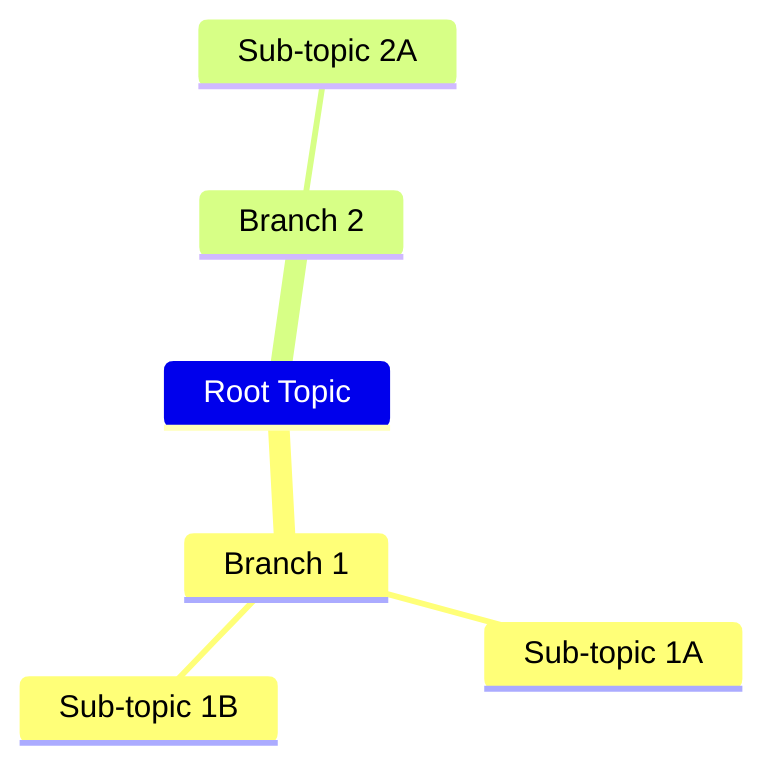
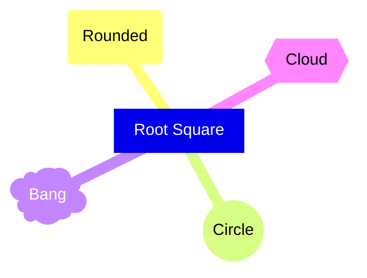

# Mindmaps

**Keyword:** `mindmap`

**Purpose:** Hierarchical information organization using indentation.

## Basic Syntax



## Node Shapes



**Shape syntax:**
- `[text]` - Square
- `(text)` - Rounded square
- `((text))` - Circle
- `)text(` - Bang
- `{{text}}` - Cloud
- Plain text - Default

## Icons


**Supported icon sets:**
- Font Awesome 5
- Material Design Icons

**Note:** Icon integration is experimental and may change.

## Classes

```mermaid
mindmap
    Root
        Important:::highlight
        Normal

classDef highlight fill:#ff0,stroke:#f00,stroke-width:3px
```

## Layout

```yaml
---
config:
  look: classic
  layout: tidy-tree
---
mindmap
    Root
```

**Layout algorithms:** `tidy-tree` (v9.4.0+)

## Key Limitations
- Icon feature is experimental
- Indentation must be consistent
- Complex hierarchies may affect readability

## When to Use
- Brainstorming sessions
- Knowledge organization
- Concept mapping
- Hierarchical note-taking
