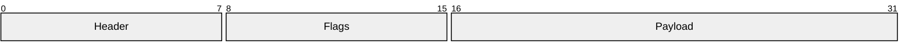
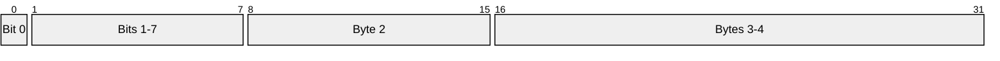
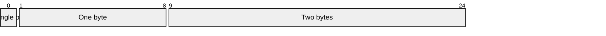
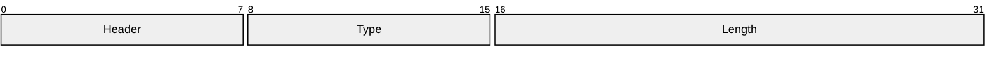
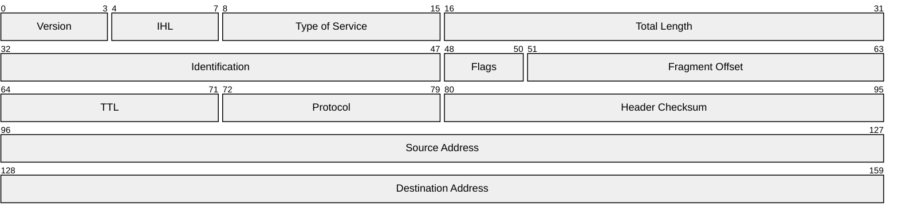

# Packet Diagrams

**Keyword:** `packet-beta`

**Purpose:** Network packet structure visualization.

## Basic Syntax



## Bit Range Notation

**Traditional (absolute):**


**Modern (relative, v11.7.0+):**


**Mixed notation:**


## Configuration

```yaml
---
config:
  packet:
    bitsPerRow: 32
    bitWidth: 10
    rowHeight: 32
    paddingX: 5
    paddingY: 5
    showBits: true
---
packet-beta
0-7: "Field A"
8-15: "Field B"
```

**Options:**
- `bitsPerRow` - Bits displayed per row (default: 32)
- `bitWidth` - Individual bit width in pixels
- `rowHeight` - Vertical spacing
- `paddingX/Y` - Margins
- `showBits` - Toggle bit number visibility

## Example: IPv4 Header



## Key Limitations
- Fixed row-based layout
- Limited styling options
- Best for standard packet formats

## When to Use
- Network protocol documentation
- Packet format specification
- Protocol analysis
- Educational materials
