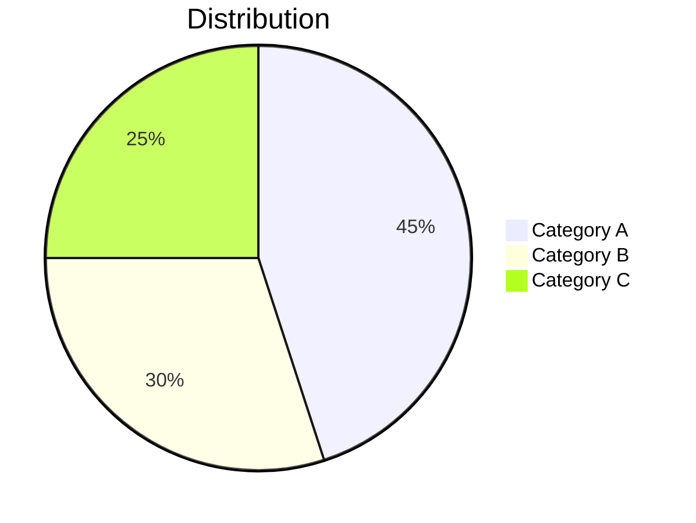
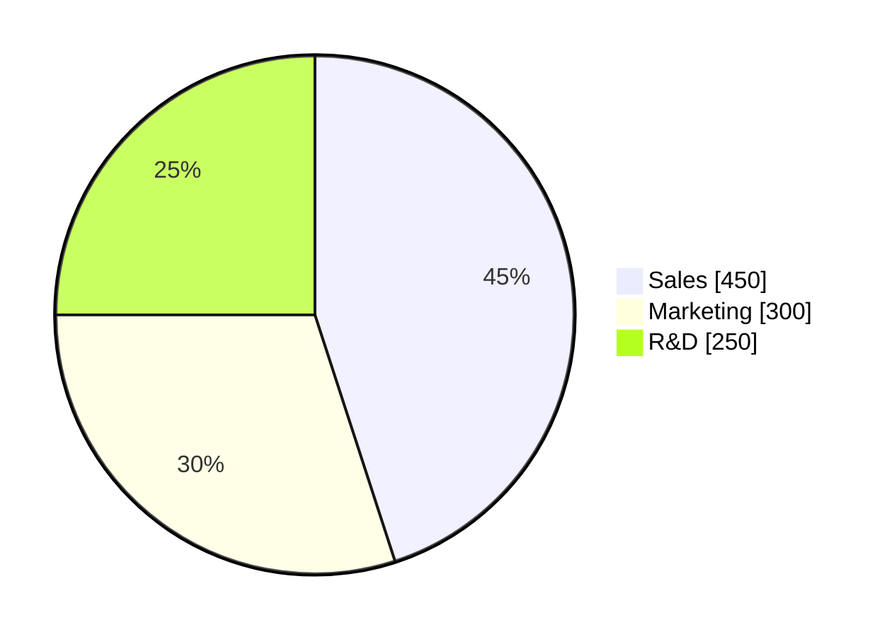
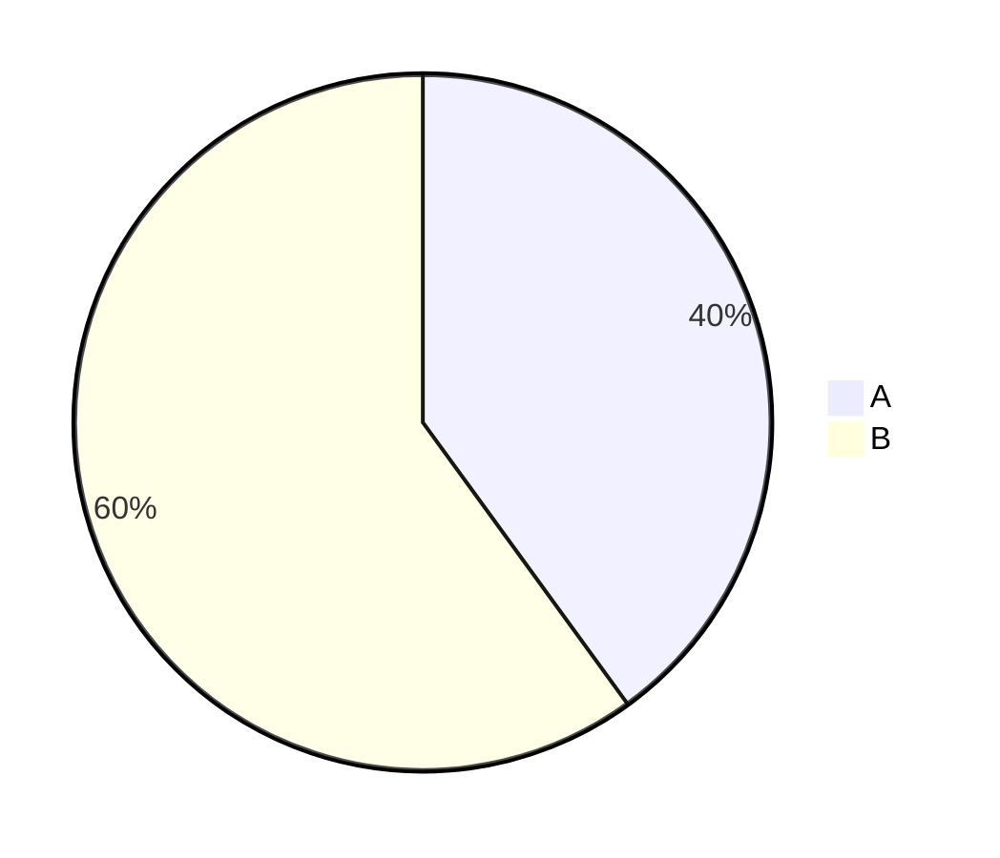

# Pie Charts

**Keyword:** `pie`

**Purpose:** Show proportional data distribution.

## Basic Syntax

## Show Data Values

## Configuration

**textPosition:** 0.0 (center) to 1.0 (edge), default 0.75

## Key Limitations
- Values must be positive numbers > 0
- Negative values cause errors
- Maximum 2 decimal places
- Slices ordered clockwise as defined

## When to Use
- Budget breakdowns
- Market share visualization
- Survey results
- Resource allocation
