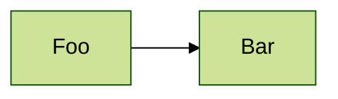
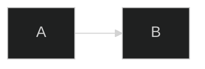

# Mermaid in Markdown Environments: Platform-Specific Rendering Guide

## Overview

Mermaid is a JavaScript-based diagramming tool that renders Markdown-inspired text definitions into dynamic diagrams in the browser. This document covers how Mermaid works when embedded in Markdown files (```mermaid blocks) across different platforms, their limitations, and platform-specific quirks.

## 1. GitHub Flavored Markdown

### Implementation Architecture

GitHub uses a two-stage rendering process:
1. **HTML Pipeline Filter**: Identifies code blocks marked as `mermaid` and substitutes them with a progressive template
2. **Viewscreen Service**: Injects an iframe pointing to GitHub's internal rendering service for asynchronous diagram generation

This architecture provides security (user content isolation in iframes), performance (reduced JavaScript payload, asynchronous rendering), and graceful degradation in non-JavaScript environments.

### Supported Features

- Flowcharts, sequence diagrams, state diagrams, Gantt charts, ER diagrams, Git graphs, user journey diagrams, class diagrams, pie charts
- Basic Markdown features in labels (with limitations)
- Automatic rendering on github.com (repositories, gists, wikis)

### Known Limitations

**Version Lag**: GitHub does not keep pace with latest Mermaid releases. As of 2024, GitHub lags significantly behind current versions, causing compatibility issues with newer features. There is no published update policy or roadmap for Mermaid version upgrades.

**Feature Restrictions**:
- Not all Mermaid symbols supported (e.g., `B-->C[fa:fa-ban forbidden]`)
- Hyperlinks and tooltips may not work within labels
- Relative links broken (relative to `https://viewscreen.githubusercontent.com/markdown` not the source)
- Internal hyperlinks non-functional (must use full URLs)
- Click events blocked for security ("This content is blocked. Contact the site owner to fix the issue")
- Markdown lists not supported (causes "Unsupported markdown: list" error)

**Character Issues**:
- Certain emojis and extended ASCII characters cause rendering errors
- Best practice: Use HTML entities (e.g., `&dagger;` for †, `&#128279;` for 🔗)
- Quote any label text with symbols, especially parentheses and brackets

**Platform Limitations**:
- Not supported in GitHub mobile app
- Not supported in GitHub Pages (lives outside github.com scope)
- Gists and wikis supported (as of August 2022)

### Best Practices for GitHub

1. Quote all labels with special characters
2. Use HTML entities for non-ASCII characters
3. Avoid relative or internal links
4. Test diagrams on mermaid.live first, then verify on GitHub
5. Keep diagrams simple due to version lag
6. Don't rely on cutting-edge Mermaid features

**Sources**:
- [Include diagrams in your Markdown files with Mermaid - The GitHub Blog](https://github.blog/developer-skills/github/include-diagrams-markdown-files-mermaid/)
- [Mermaid on Github Examples](https://gist.github.com/ChristopherA/bffddfdf7b1502215e44cec9fb766dfd)
- [What is the version of Mermaid used in GitHub Markdown?](https://github.com/orgs/community/discussions/37498)
- [Using click with MermaidJS in markdown causes blocking](https://github.com/orgs/community/discussions/46096)

## 2. GitLab Markdown

### Implementation

GitLab provides native Mermaid support out-of-the-box anywhere you can type Markdown. Uses standard code fence syntax with `mermaid` language identifier.

### Configuration Options

GitLab's Mermaid configuration is largely hard-coded with these defaults:
- **Neutral theme** by default
- **Dark theme** auto-switches for users using dark or solarizedDark web IDE themes
- **Inline directives** supported (GitLab 13.9.0+, Mermaid 8.9.0+):



**Note**: Mermaid is sensitive to newlines - blank lines between graph declaration and config cause syntax errors.

### Supported Diagram Types

- Flowcharts/graphs
- Sequence diagrams
- State diagrams
- Gantt charts
- Entity Relationship (ER) diagrams
- Git graphs

### Known Rendering Issues

1. **Detail View Problems**: Mermaid graphs inside detail view don't render HTML correctly
2. **Class Diagram Styling Conflicts**: Uses class name "title" which conflicts with surrounding Markdown styling, causing wrong font sizes
3. **Snippets Rendering**: Diagrams render as code blocks in snippet markdown files and descriptions
4. **ER Diagram Attributes**: Attributes in ER diagrams may not render properly
5. **Milestone View**: Occasional bugs with rendering in milestone views

### Best Practices for GitLab

1. Use init directives for theme control
2. Avoid blank lines between graph declaration and config
3. Test in multiple views (issues, merge requests, snippets, wikis)
4. Be aware of class name conflicts in class diagrams

**Sources**:
- [GitLab Flavored Markdown: Mermaid](https://everyonecancontribute.cafe/post/2020-06-05-mermaid/)
- [How do you specify Mermaid configuration within Gitlab Markdown?](https://stackoverflow.com/questions/62941962/how-do-you-specify-mermaid-configuration-within-gitlab-markdown)
- [Markdown rendering of mermaid inside of detail view mangles the html](https://gitlab.com/gitlab-org/gitlab/-/issues/28495)

## 3. VS Code Markdown Preview

### Extensions Required

VS Code requires extensions for Mermaid support:

**1. Markdown Preview Mermaid Support (by bierner)**
- Adds Mermaid support to built-in Markdown preview and notebook cells
- Current support: Mermaid v11.12.0
- Configuration options:
  - `markdown-mermaid.lightModeTheme`: Theme for light color schemes ("base", "forest", "dark", "default", "neutral")
  - `markdown-mermaid.darkModeTheme`: Theme for dark color schemes

**2. Mermaid Preview (Official)**
- Maintained by Mermaid.js creators
- Auto-detects mermaid code blocks in Markdown
- Click "edit diagram" link directly from Markdown file
- Syntax highlighting with theme-aware color schemes

### Features

- Real-time preview alongside Markdown
- Syntax highlighting for Mermaid code
- Theme-aware rendering (automatic light/dark switching)
- Integration with VS Code's built-in Markdown preview
- Support for all Mermaid diagram types

### Known Issues

Some users report rendering failures even with simple diagrams. Solution: Ensure extension is properly installed and up-to-date.

### Best Practices for VS Code

1. Install "Markdown Preview Mermaid Support" for seamless integration
2. Configure separate themes for light/dark modes
3. Use syntax highlighting to catch errors before preview
4. Leverage live preview for rapid iteration

**Sources**:
- [Markdown Preview Mermaid Support - Visual Studio Marketplace](https://marketplace.visualstudio.com/items?itemName=bierner.markdown-mermaid)
- [Using Mermaid in VS Code: A Complete Guide](https://medium.com/@shouke.wei/using-mermaid-in-vs-code-a-complete-guide-7e37e51cf51e)
- [GitHub - mjbvz/vscode-markdown-mermaid](https://github.com/mjbvz/vscode-markdown-mermaid)

## 4. Obsidian

### Implementation

Obsidian has native built-in Mermaid support - no plugins required for basic rendering. Uses standard code fence syntax.

### Supported Diagram Types

- Flowcharts
- Sequence diagrams
- Class diagrams
- Gantt charts
- Pie charts
- Git graphs

**Not Supported**:
- Timeline diagrams (error: "No diagram type detected for text: timeline")
- Packet diagrams (packet-beta syntax)
- Other cutting-edge Mermaid features (Obsidian may lag behind current Mermaid versions)

### Known Limitations

**Cropped Diagrams**: Large diagrams may be cut off at edges. Solution: Use CSS to adjust sizing:

```css
.mermaid {
    overflow: visible !important;
}
```

**Size and Alignment**: No native UI controls for resizing or realigning diagrams. Must use CSS for dynamic sizing based on diagram content.

**Rendering Quirks**: Described as "a bit clunky, and not everything works" - issues could be addressed by allowing user control over diagram size/alignment.

**Plugin Note**: Rendering is Obsidian's built-in feature. Third-party plugins like obsidian-mermaid have no control over rendering - bugs should be reported to official forums.

### Best Practices for Obsidian

1. Keep diagrams reasonably sized to avoid cropping
2. Use CSS snippets for custom sizing when needed
3. Avoid cutting-edge Mermaid features not yet supported
4. Report rendering bugs to Obsidian forums, not plugin developers

**Sources**:
- [Is there a list of supported mermaid diagram types anywhere?](https://forum.obsidian.md/t/is-there-a-list-of-supported-mermaid-diagram-types-anywhere/62721)
- [Fixing Cropped Mermaid Diagrams in Obsidian](https://unmesh.dev/post/obsidian_mermaid/)
- [Let the user decide the size and alignment of mermaid diagrams](https://forum.obsidian.md/t/let-the-user-decide-the-size-and-alignment-of-mermaid-diagrams/7019)

## 5. Other Common Markdown Renderers

### Notion

**Support**: Recently added Mermaid support to Code Blocks
**Implementation**: Select "Mermaid" as the language type in code blocks
**Display Options**:
- Show code only
- Show diagram only
- Show both code and diagram together

**Best Practice**: Use diagram-only mode for conciseness in documentation.

### Confluence

**Native Support**: None - requires third-party apps from Atlassian Marketplace

**Available Apps**:

1. **Mermaid Integration for Confluence** (v1.1.5-AC, Dec 2024)
   - Cloud, Server 5.4-9.3.2, Data Center 5.7-9.5.4
   - Syntax validation, error highlighting, live preview
   - All major diagram types supported

2. **Mermaid Charts & Diagrams for Confluence**
   - Cloud, Server 8.0.0-10.2.0, Data Center 8.0.0-10.2.0
   - Markdown-like textual descriptions

3. **Official Mermaid Chart for Confluence**
   - AI Chat for diagram generation
   - Edit existing diagrams
   - Requires Mermaid Chart account (free or Pro tier)

### JetBrains IDEs

Native Mermaid support in Markdown files with live preview.

### Other Supported Platforms

- Gitea
- NotesHub
- Observable
- Outline
- Microsoft Loop
- MkDocs (with plugins)
- Hugo (with configuration)
- Jekyll (with plugins)

**Sources**:
- [Mermaid Integrations](https://mermaid.js.org/ecosystem/integrations-community.html)
- [Editing and previewing Mermaid diagrams on your docs](https://mfyz.com/editing-and-previewing-mermaid-diagrams-on-your-docs-markdown-github-notion-confluence/)
- [Mermaid for Confluence - Atlassian Marketplace](https://marketplace.atlassian.com/apps/1224722/mermaid-for-confluence)

## 6. Platform-Specific Rendering Differences

### Theme Support Across Platforms

**Available Themes**:
- `default` - Standard theme for all diagrams
- `neutral` - Best for black/white printed documents
- `dark` - For dark backgrounds and dark mode
- `forest` - Alternative color scheme
- `base` - Only customizable theme (via themeVariables)

**Platform Behavior**:

| Platform | Auto Dark Mode | Config Support | Theme Switching |
|----------|----------------|----------------|-----------------|
| GitHub | No | Limited | Static only |
| GitLab | Yes (hard-coded) | Init directive | Static only |
| VS Code | Yes | Extension config | Dynamic |
| Obsidian | Partial | Via plugins | Limited |
| Notion | Unknown | Unknown | Unknown |

**Dynamic Theme Switching Challenges**:

Mermaid diagrams cannot change theme after rendering - the original source is lost from the DOM after SVG generation. Solutions vary by platform:

1. **VS Code**: Extension handles with separate light/dark config
2. **Hugo**: JavaScript re-renders diagrams on theme change
3. **MkDocs Material**: CSS `prefers-color-scheme` media feature
4. **Most platforms**: No dynamic switching - theme set at render time

**Init Directive Syntax** (for platforms supporting it):



**Sources**:
- [Theme Configuration - Mermaid](https://mermaid.js.org/config/theming.html)
- [Can I theme a mermaid diagram so it responds to dark mode?](https://stackoverflow.com/questions/75827387/can-i-theme-a-mermaid-diagram-so-it-responds-to-dark-mode)
- [Integrating Dark Mode with Mermaid Diagrams](https://herczegzsolt.hu/posts/integrating-dark-mode-with-mermaid-diagrams/)

### Export and Rendering Formats

**Rendering Process**:
1. Browser loads HTML with Mermaid code blocks
2. JavaScript (mermaid.js) converts text to SVG/PNG
3. Conversion must complete before PDF export or printing

**Export Options by Platform**:

| Platform | PNG | SVG | PDF | Markdown |
|----------|-----|-----|-----|----------|
| Mermaid Live | ✓ | ✓ | ✗ | ✓ |
| Mermaid CLI (mmdc) | ✓ | ✓ | ✓ | ✗ |
| GitHub | Browser only | Browser only | Browser only | N/A |
| GitLab | Browser only | Browser only | Browser only | N/A |
| VS Code | Via extension | Via extension | Via extension | N/A |
| MkDocs | Plugin | Plugin | Plugin | N/A |

**Tools for Export**:

1. **Mermaid Live Editor**: Export PNG, SVG, Markdown directly
2. **Mermaid CLI (mmdc)**: Command-line export to SVG, PNG, PDF
3. **markdown-mermaid-exporter (npm)**: Batch convert diagrams in Markdown files
4. **MkDocs plugins**: Export during site generation
5. **MisterMD**: Online viewer with PDF/PNG export
6. **Pandoc**: With filters for PDF conversion

**Pandoc Considerations**: Mermaid diagrams must be pre-converted to SVG/PNG before Pandoc processing, as Pandoc doesn't execute JavaScript.

**Sources**:
- [Export diagram feature - Mermaid Chart](https://docs.mermaidchart.com/guides/export-diagram)
- [markdown-mermaid-exporter - npm](https://www.npmjs.com/package/markdown-mermaid-exporter)
- [Generating properly rendered SVGs from Mermaid diagrams in Markdown for Pandoc PDF conversion](https://stackoverflow.com/questions/79104331/generating-properly-rendered-svgs-from-mermaid-diagrams-in-markdown-for-pandoc-p)

## 7. Maximum Diagram Sizes and Performance

### Hard Limits

**Text Size Limit**: 50,000 characters by default
- Prevents performance issues from complex diagrams
- Configurable via `maxTextSize` parameter
- Can be overridden but not recommended (CPU usage concerns)

**Edge Limit**: 280 edges by default (500 in some implementations)
- Flowcharts fail with "Too many edges" error when exceeded
- Can be increased to ~2000 in local implementations
- Mermaid Live Editor supports up to 2000 maxEdges

**Configuration Example**:

```javascript
mermaid.initialize({
  startOnLoad: true,
  securityLevel: 'loose',
  maxTextSize: 100000,  // Increase cautiously
  maxEdges: 500         // Adjust as needed
});
```

### Performance Thresholds

**Computational Complexity**: O(n²) for flowcharts
- 100 connections = practical limit before significant slowdown
- 32-node class diagrams can cause 200-400ms keystroke delays

**Cognitive Limits** (User Comprehension):
- High-density graphs (>0.3): 50-node limit
- Low-density graphs (<0.3): 100-node limit
- 7±2 items = working memory limit (Miller's Law)
- 8 parallel branches = reasonable tree diagram limit

**McCabe Complexity Metric**:
- Formula: Complexity = edges - nodes + 2
- Threshold: 15 = "too complex"
- Applies to diagrams as well as code

### Layout Algorithm Performance

**Dagre (default)**:
- Good balance of simplicity and clarity
- Suitable for most diagrams
- Moderate performance

**ELK (Eclipse Layout Kernel)**:
- Better for large/complex diagrams
- Optimized arrangement reduces overlapping
- Available in Mermaid v9.4+
- Higher computational cost

### Best Practices for Performance

1. **Break Down Complexity**: Split large diagrams into smaller, focused components
2. **Limit Parallel Branches**: Keep to 8 or fewer
3. **Monitor Node Count**: Stay under 50-100 nodes depending on density
4. **Watch Edge Count**: Keep under 100 connections for responsive rendering
5. **Use ELK for Large Diagrams**: Switch layout algorithm when needed
6. **Keep maxTextSize Low**: Only increase when absolutely necessary
7. **Test Frequently**: Build incrementally and test after each addition
8. **Sketch First**: Plan on paper before coding complex diagrams

**Sources**:
- [Maximum Text Size In Diagram Exceeded](https://stackoverflow.com/questions/61870481/maximum-text-size-in-diagram-exceeded)
- [Flow charts are O(n²) complex, so don't go over 100 connections](https://docs.mermaidchart.com/blog/posts/flow-charts-are-on2-complex-so-dont-go-over-100-connections)
- [Too many edges error](https://github.com/mermaid-js/mermaid/issues/5042)
- [Mermaid-Sonar: Detecting Hidden Complexity in Diagram Documentation](https://dev.to/entropicdrift/mermaid-sonar-detecting-hidden-complexity-in-diagram-documentation-3461)

## 8. Mobile vs Desktop Rendering

### Responsive Design Features

**Default Behavior**: Mermaid diagrams are responsive by default with `useMaxWidth` config

**Configuration**:

```javascript
const responsiveConfig = {
  flowchart: { useMaxWidth: true, htmlLabels: true },
  sequence: { useMaxWidth: true },
  gantt: { useMaxWidth: true }
};
```

### Mobile-Specific Challenges

**Graph Direction Issue**: No automatic orientation switching
- Desktop: LR (left-right) works well
- Mobile: TB (top-bottom) preferred for narrow screens
- No built-in responsive direction switching
- Must choose one orientation for all screen sizes

**Scrolling Behavior**: Large diagrams may overflow on small screens

**CSS Solution**:

```css
.mermaid {
  overflow-x: auto;
  -webkit-overflow-scrolling: touch;
}

.mermaid svg {
  min-width: 100%;
  max-width: none;
  height: auto;  /* Fixes vertical whitespace on wide diagrams */
}
```

### Platform-Specific Mobile Support

| Platform | Mobile Support | Notes |
|----------|----------------|-------|
| GitHub | Limited | Not supported in mobile app |
| GitLab | Yes | Responsive rendering |
| VS Code | N/A | Desktop only |
| Obsidian | Yes | Mobile app supported |
| Notion | Yes | Mobile rendering works |

### Performance on Mobile

**Optimization Techniques**:
1. **Lazy Loading**: Use Intersection Observer to render only visible diagrams
2. **Preloading**: Load mermaid.js early to reduce perceived latency
3. **Smaller Diagrams**: Keep diagrams simple for mobile performance
4. **Testing**: Always test on actual mobile devices, not just browser dev tools

### Best Practices for Mobile

1. Prefer TB (top-bottom) orientation for mobile-first designs
2. Keep diagrams under 50 nodes for mobile performance
3. Test scrolling behavior on touch devices
4. Use lazy loading for pages with multiple diagrams
5. Consider separate mobile-optimized diagram versions for complex content

**Sources**:
- [Responsive graph layout for mobile viewers](https://github.com/knsv/mermaid/issues/51)
- [Rendering Mermaid Diagrams with Svelte](https://terrislinenbach.medium.com/dynamically-render-a-mermaid-diagram-with-sveltekit-and-very-little-code-d8130875cd68)
- [Making Mermaid.JS diagrams responsive to theme changes](https://kian.org.uk/dark-mode-responsive-mermaid-diagrams-with-mutation-observer/)

## 9. Accessibility Considerations in Markdown

### ARIA Implementation

Mermaid automatically implements basic accessibility:

**aria-roledescription**: Set to diagram type
- Example: `aria-roledescription="stateDiagram"`
- Automatically applied to SVG element

**Accessible Title and Description**: Creates `<title>` and `<desc>` SVG elements
- Linked via `aria-labelledby` and `aria-describedby` attributes

### Syntax for Accessibility

**Single-line Title**:

```mermaid
accTitle: User Authentication Flow
graph LR
A[Login] --> B[Verify]
```

**Single-line Description**:

```mermaid
accDescr: This diagram shows the authentication process from login to verification.
graph LR
A[Login] --> B[Verify]
```

**Multi-line Description**:

```mermaid
accDescr {
This diagram illustrates the complete user authentication workflow.
It starts with login, proceeds through verification,
and ends with either access granted or denied.
}
graph LR
A[Login] --> B[Verify]
B --> C{Valid?}
C -->|Yes| D[Access Granted]
C -->|No| E[Access Denied]
```

### Critical Limitations

**Diagram Content Inaccessibility**:
- Screen readers cannot interpret diagram relationships
- Presents as "near-nonsense" jumble of unrelated text
- Node connections not conveyed to assistive technology
- Makes complex diagrams completely unusable for non-sighted users

**ARIA Limitations**:
- `aria-owns` and `aria-flow` not designed for flowcharts
- Not valid inside standard SVG roles like `graphics-document`
- W3C standards: SVG elements excluded from accessibility tree by default
- Only appear if appropriate ARIA attributes added

### Best Practices for Accessibility

**CRITICAL**: Always provide detailed text description separate from diagram

1. **Comprehensive Description**: Describe all nodes, connections, and flow
2. **Alternative Content**: Provide equivalent information in prose
3. **Structured Format**: Use headings and lists for complex diagrams
4. **Context**: Explain the purpose and key insights of the diagram

**Example Pattern**:

```markdown
## Authentication Process

The following diagram shows our authentication workflow:

```mermaid
accTitle: User Authentication Flow
accDescr {
This flowchart shows the user authentication process.
Users start at login, credentials are verified,
and users receive either access or denial based on validity.
}
graph LR
A[Login] --> B[Verify Credentials]
B --> C{Valid?}
C -->|Yes| D[Grant Access]
C -->|No| E[Deny Access]
```

### Text Description

The authentication process follows these steps:

1. **Login**: User enters credentials
2. **Verification**: System checks credentials against database
3. **Decision**: System determines validity
4. **Access Grant**: Valid users receive access token
5. **Access Denial**: Invalid users receive error message
```

**Translation Considerations**: `aria-roledescription` should be translatable, human-readable names (not technical keys).

### Testing Accessibility

1. Test with screen readers (NVDA, JAWS, VoiceOver)
2. Verify text descriptions provide complete understanding
3. Ensure `accTitle` and `accDescr` are meaningful
4. Check that diagram is not critical to understanding when inaccessible

**Sources**:
- [Accessibility Options - Mermaid](https://mermaid.js.org/config/accessibility.html)
- [Screen reader / accessibility technology support for diagrams](https://github.com/mermaid-js/mermaid/issues/5632)
- [Accessible Mermaid charts in Github Markdown](https://pulibrary.github.io/2023-03-29-accessible-mermaid)
- [Accessibility (a11y) in diagrams - Discussion](https://github.com/orgs/mermaid-js/discussions/3689)

## Summary: Platform Selection Matrix

| Feature | GitHub | GitLab | VS Code | Obsidian | Notion | Confluence |
|---------|--------|--------|---------|----------|--------|------------|
| Native Support | ✓ | ✓ | Extension | ✓ | ✓ | Plugin |
| Version | Lags | Moderate | Latest | Moderate | Unknown | Varies |
| Theme Config | Limited | Directive | Extension | Plugin | Unknown | Plugin |
| Dark Mode | No | Auto | Yes | Partial | Unknown | Unknown |
| Max Complexity | Medium | Medium | High | Medium | Unknown | Unknown |
| Mobile | ✗ | ✓ | N/A | ✓ | ✓ | ✓ |
| Export | Browser | Browser | Extension | Plugin | Unknown | Plugin |
| Accessibility | Basic | Basic | Good | Basic | Unknown | Unknown |
| Click Events | ✗ | ✓ | ✓ | ✓ | Unknown | ✓ |
| Hyperlinks | ✗ | ✓ | ✓ | ✓ | Unknown | ✓ |

### Recommendation Guidelines

**Choose GitHub when**:
- Version control integration is primary concern
- Simple diagrams with basic features
- Wide audience already using GitHub

**Choose GitLab when**:
- Need better feature support than GitHub
- CI/CD integration important
- Willing to use init directives

**Choose VS Code when**:
- Local development and documentation
- Need latest Mermaid features
- Want real-time preview during editing

**Choose Obsidian when**:
- Personal knowledge management
- Need offline support
- Building personal documentation

**Choose Notion when**:
- Team collaboration focus
- Simple diagram needs
- Already using Notion ecosystem

**Choose Confluence when**:
- Enterprise documentation
- Willing to pay for plugins
- Need AI-assisted diagram creation

---

**Document Version**: 1.0
**Last Updated**: 2025-12-04
**Mermaid Version Reference**: Up to v11.12.0
**Primary Focus**: Embedded Mermaid in Markdown files
