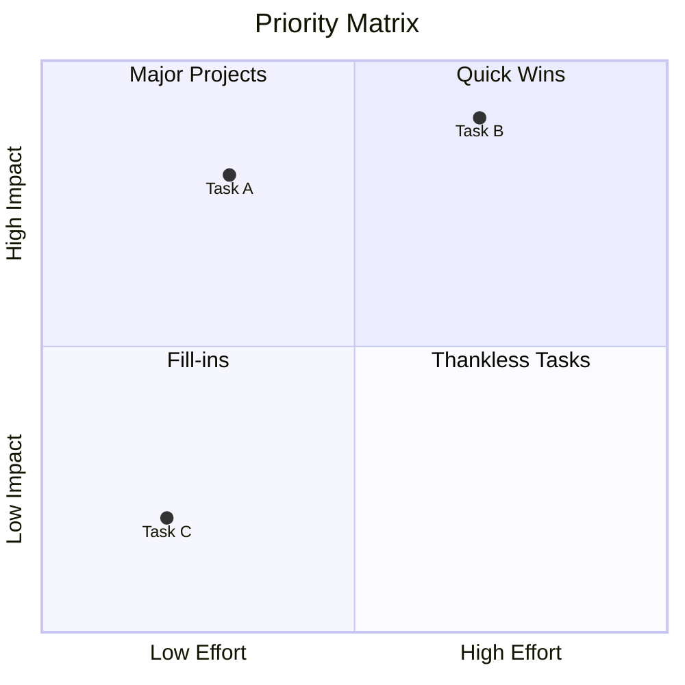
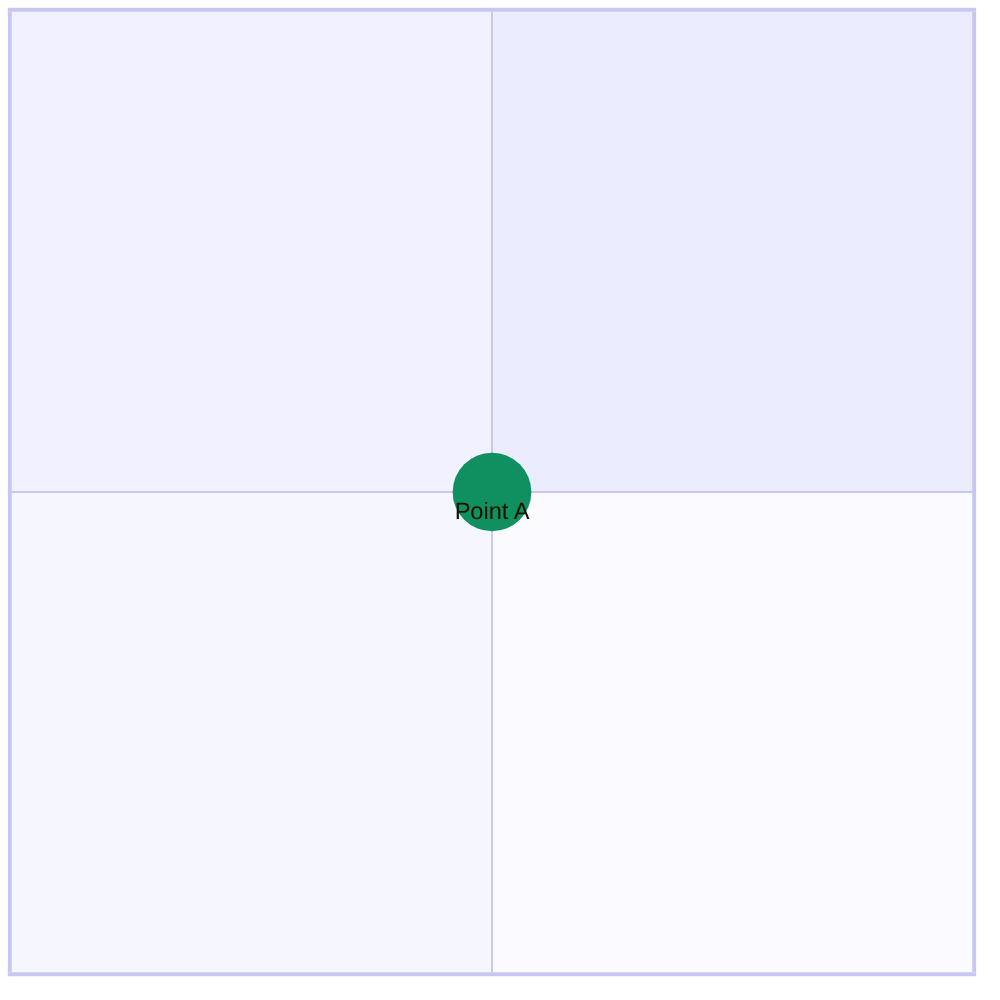

# Quadrant Charts

**Keyword:** `quadrantChart`

**Purpose:** Four-quadrant analysis (priority matrix, SWOT, etc.).

## Basic Syntax



## Axis Configuration

**Full syntax:**
```mermaid
x-axis Left Label --> Right Label
y-axis Bottom Label --> Top Label
```

**Short syntax:**
```mermaid
x-axis Horizontal Axis
y-axis Vertical Axis
```

## Quadrant Labels

- `quadrant-1` - Top right
- `quadrant-2` - Top left
- `quadrant-3` - Bottom left
- `quadrant-4` - Bottom right

## Data Points

**Basic:**
```mermaid
Point Name: [x, y]
```

**With styling:**
```mermaid
Point A: [0.9, 0.8] radius: 15, color: #ff0000
```

**Class-based styling:**


**Style properties:**
- `color` - Fill color
- `radius` - Point size
- `stroke-width` - Border width
- `stroke-color` - Border color

## Key Limitations
- Coordinates must be 0.0 to 1.0
- Limited to 2D visualization
- Fixed quadrant layout

## When to Use
- Priority matrices (Eisenhower)
- Risk/impact assessment
- SWOT analysis
- Strategic planning
