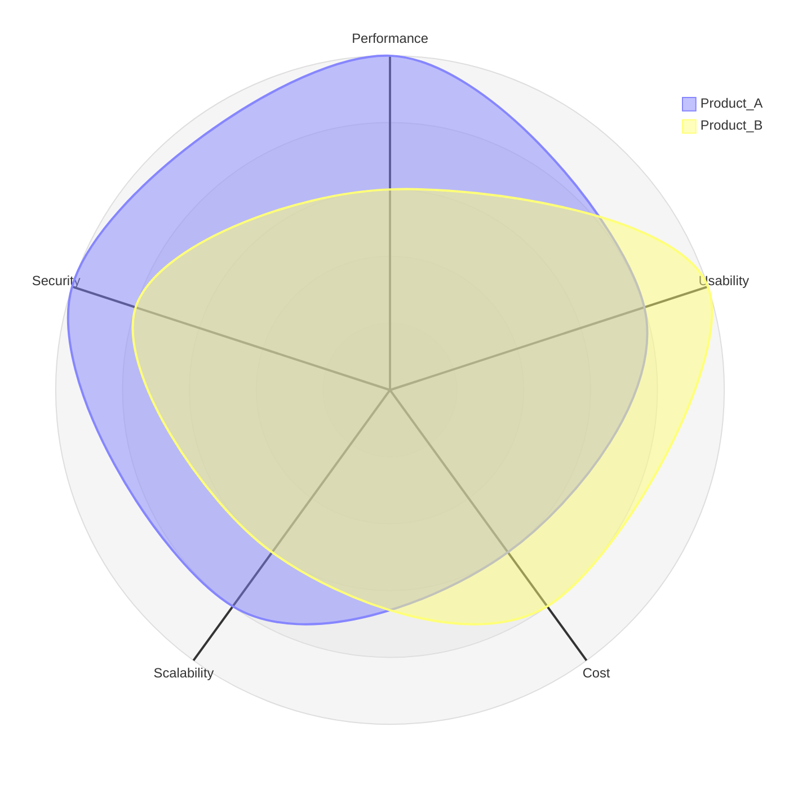
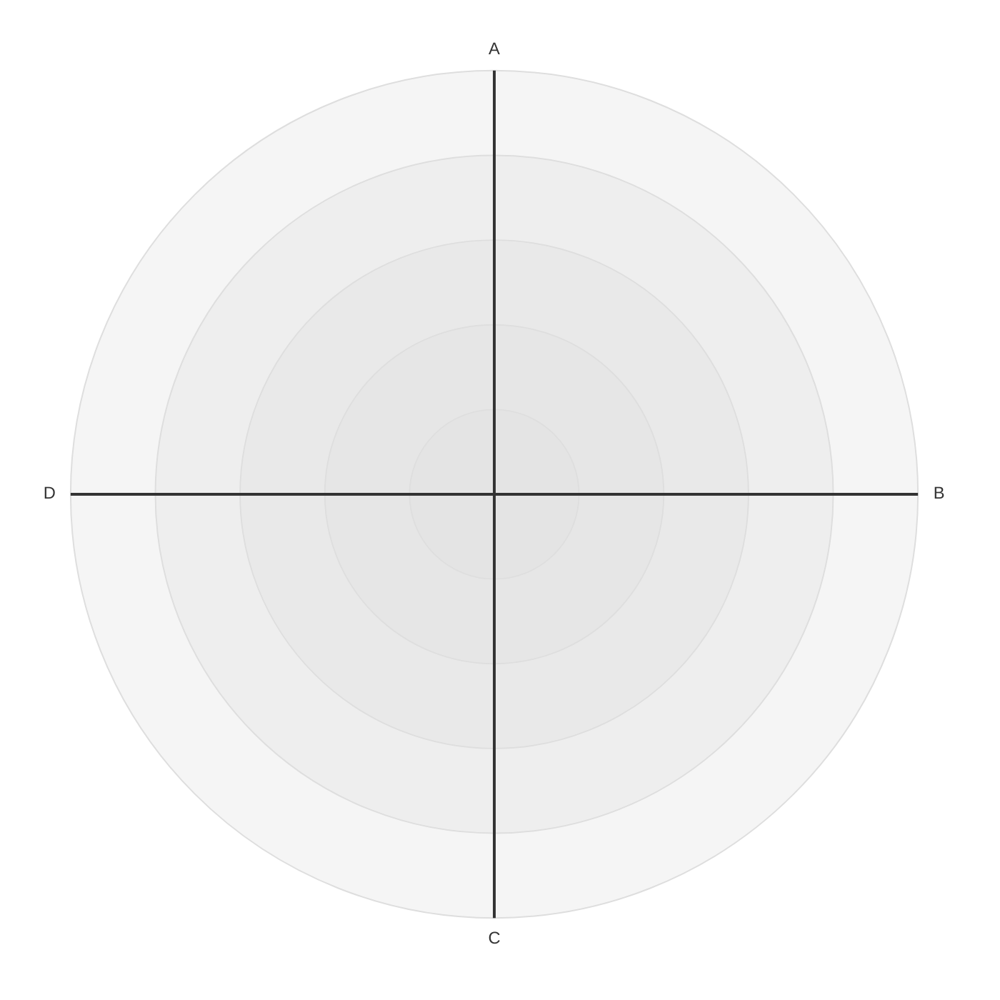
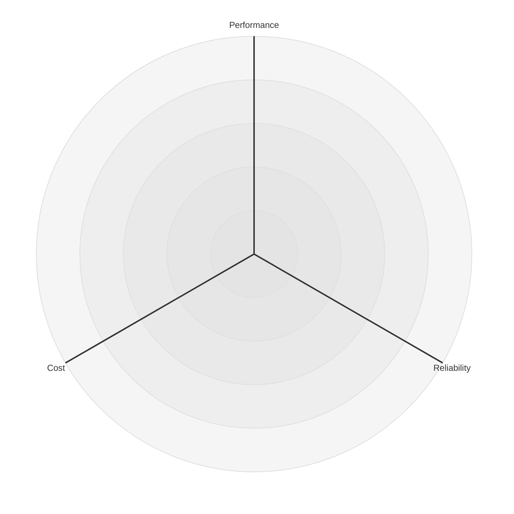
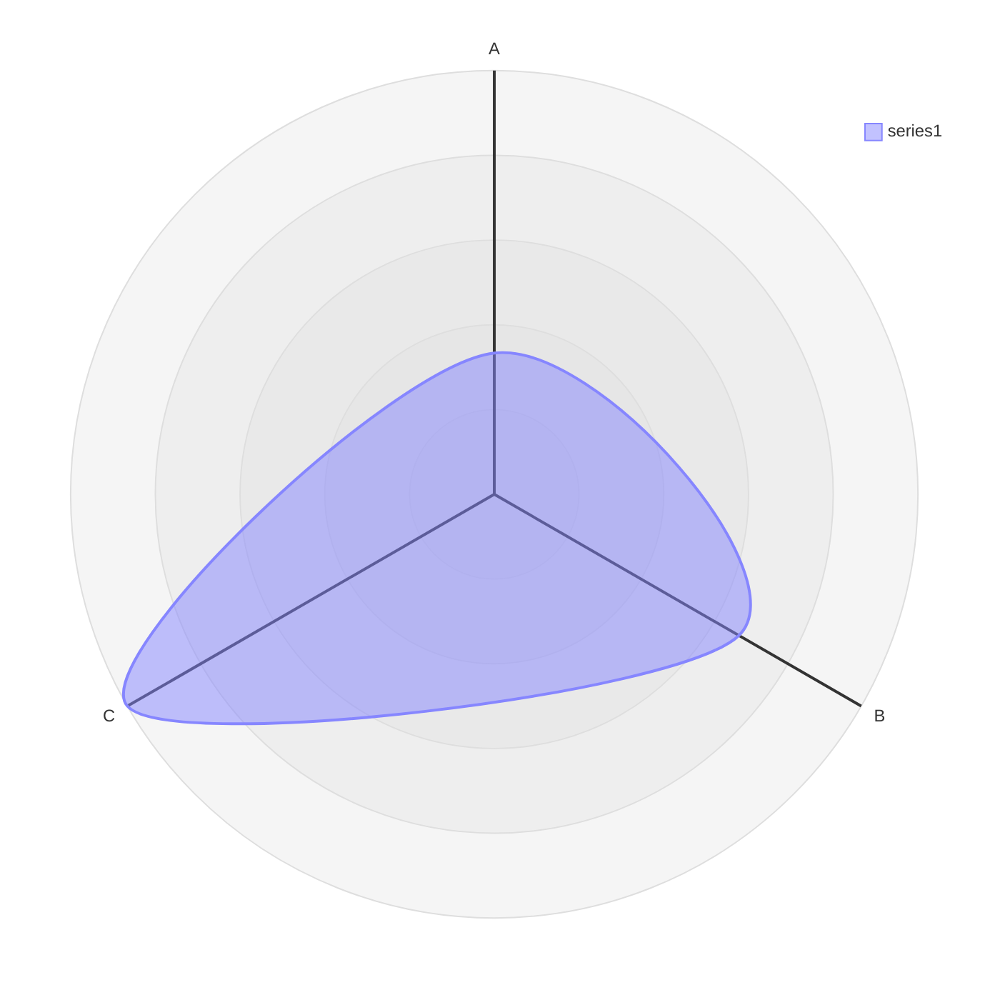
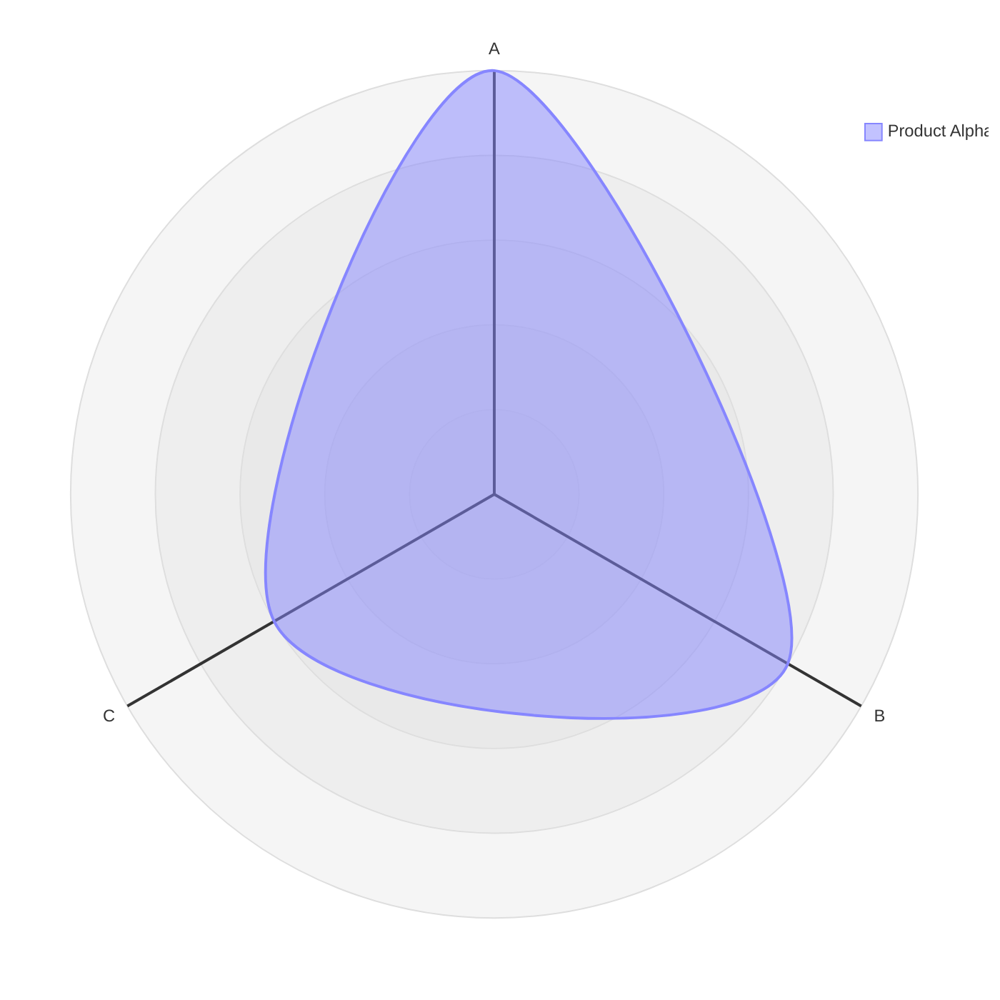
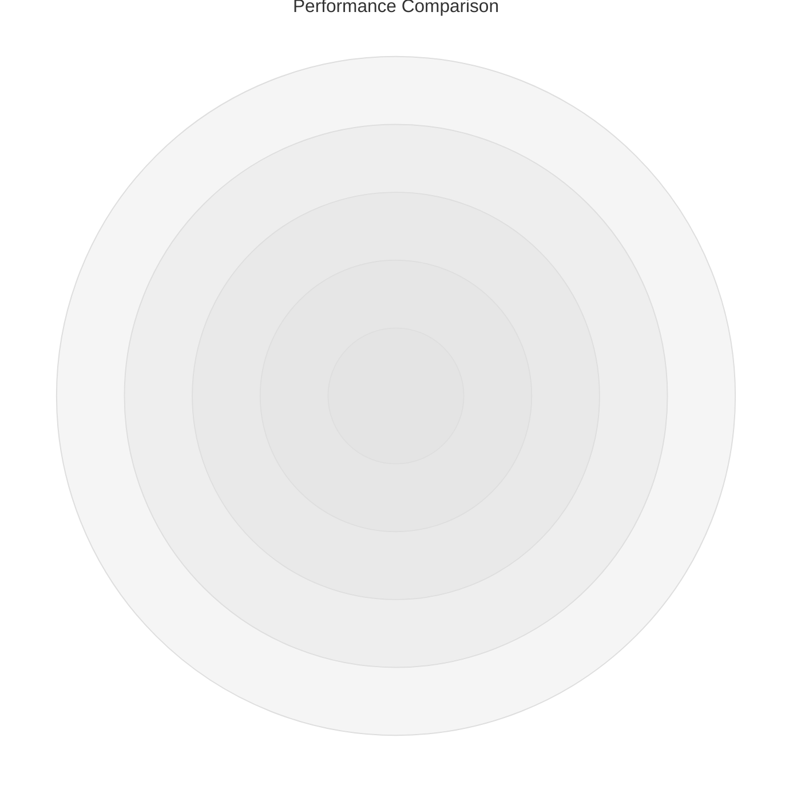

# Radar Charts

**Keyword:** `radar-beta`

**Purpose:** Multi-dimensional data comparison (spider/polar charts).

## Table of Contents
- [Basic Syntax](#basic-syntax)
- [Axis Definition](#axis-definition)
- [Data Curves](#data-curves)
- [Title](#title)
- [Configuration](#configuration)
- [Styling](#styling)
- [Example: Product Comparison](#example-product-comparison)
- [Key Limitations](#key-limitations)
- [When to Use](#when-to-use)

## Basic Syntax



## Axis Definition

**Inline:**


**With labels:**


## Data Curves

**Positional values:**


**Key-value pairs:**


**With labels:**


## Title



## Configuration

**Legend:**
```yaml
---
config:
  radar:
    showLegend: false
---
radar-beta
    curve A{1, 2, 3}
```

**Scale:**
```yaml
config:
  radar:
    min: 0
    max: 10
    ticks: 5
```

**Graticule:**
```yaml
config:
  radar:
    graticule: polygon
```

Options: `circle` (default), `polygon`

## Styling

```yaml
config:
  radar:
    axisColor: '#333333'
    curveOpacity: 0.7
    graticuleStrokeWidth: 1
    legendFontSize: 14
    curveTension: 0.17
```

## Example: Product Comparison


## Key Limitations
- Experimental feature (v11.6.0+)
- Best with 3-8 dimensions
- Overlapping curves may be hard to read

## When to Use
- Product comparisons
- Skill assessments
- Performance metrics
- Multi-criteria analysis
