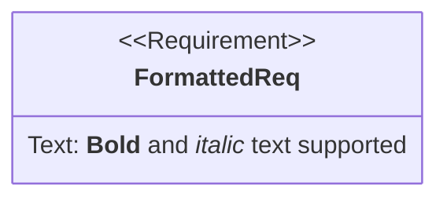

# Requirement Diagrams

**Keyword:** `requirementDiagram`

**Purpose:** Document system requirements and traceability (SysML v1.6).

## Table of Contents
- [Basic Syntax](#basic-syntax)
- [Requirement Types](#requirement-types)
- [Requirement Attributes](#requirement-attributes)
- [Element Definition](#element-definition)
- [Relationships](#relationships)
- [Direction](#direction)
- [Markdown Support](#markdown-support)
- [Key Limitations](#key-limitations)
- [When to Use](#when-to-use)

## Basic Syntax

```mermaid
requirementDiagram
    requirement UserAuth {
        id: REQ-001
        text: Users must authenticate
        risk: High
        verifymethod: Test
    }

    element LoginPage {
        type: Component
        docref: /docs/login
    }

    UserAuth - satisfies -> LoginPage
```

## Requirement Types

- `requirement` - Generic requirement
- `functionalRequirement`
- `interfaceRequirement`
- `performanceRequirement`
- `physicalRequirement`
- `designConstraint`

## Requirement Attributes

```mermaid
requirementDiagram
    functionalRequirement AuthSystem {
        id: FR-001
        text: "System shall support **OAuth 2.0**"
        risk: Medium
        verifymethod: Demonstration
    }
```

**Risk levels:**
- Low
- Medium
- High

**Verification methods:**
- Analysis
- Inspection
- Test
- Demonstration

## Element Definition

```mermaid
requirementDiagram
    element APIGateway {
        type: Service
        docref: https://docs.example.com/api
    }
```

## Relationships

**Syntax:** `source - type -> destination`

**Relationship types:**
- `contains` - Hierarchical containment
- `copies` - Duplication
- `derives` - Derivation
- `satisfies` - Implementation
- `verifies` - Validation
- `refines` - Elaboration
- `traces` - Traceability

**Bidirectional:**
```mermaid
requirementDiagram
    req1 - satisfies -> elem1
    elem2 <- verifies - req2
```

## Direction

```mermaid
%%{init: {'requirementDiagram': {'layoutDirection': 'LR'}}}%%
requirementDiagram
    requirement A
    requirement B
    A - derives -> B
```

Options: `TB`, `BT`, `LR`, `RL`

## Markdown Support



## Key Limitations
- SysML v1.6 specification only
- Limited relationship customization
- Text fields must be quoted for markdown

## When to Use
- Systems engineering
- Requirements traceability
- Compliance documentation
- Design verification
