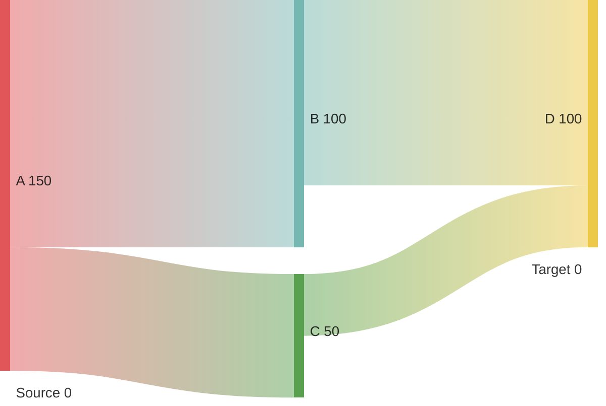
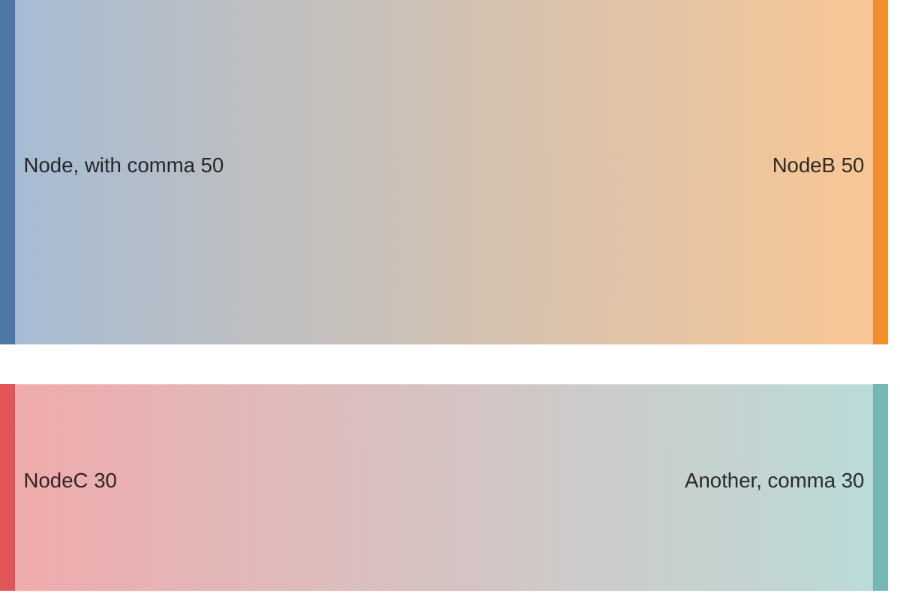

# Sankey Diagrams

**Keyword:** `sankey-beta`

**Purpose:** Visualize flow quantities between nodes.

## Basic Syntax



## CSV Format Requirements

- **3 columns:** source, target, value
- **RFC 4180 compliant** with modifications
- **Empty lines allowed** (without commas)
- **Commas in text:** Wrap in double quotes
- **Double quotes:** Escape by doubling (`""`)

**Example:**


## Configuration

**Link colors:**
```yaml
---
config:
  sankey:
    linkColor: gradient
---
sankey-beta
A,B,100
```

Options:
- `source` - Inherit source node color
- `target` - Inherit target node color
- `gradient` - Smooth transition
- Hex codes: `#ff0000`

**Node alignment:**
```yaml
config:
  sankey:
    nodeAlignment: justify
```

Options: `justify`, `center`, `left`, `right`

**Dimensions:**
```yaml
config:
  sankey:
    width: 800
    height: 600
```

## Key Limitations
- Exactly 3 CSV columns required
- Experimental feature (v10.3.0+)
- Limited customization vs dedicated tools

## When to Use
- Energy flow diagrams
- Material flow analysis
- Budget allocation
- Traffic visualization
