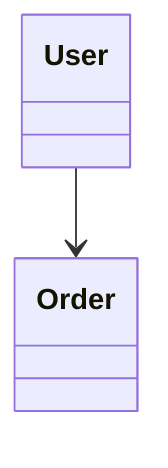
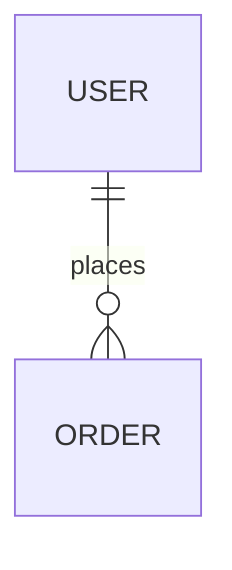
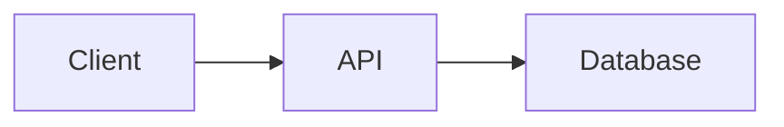
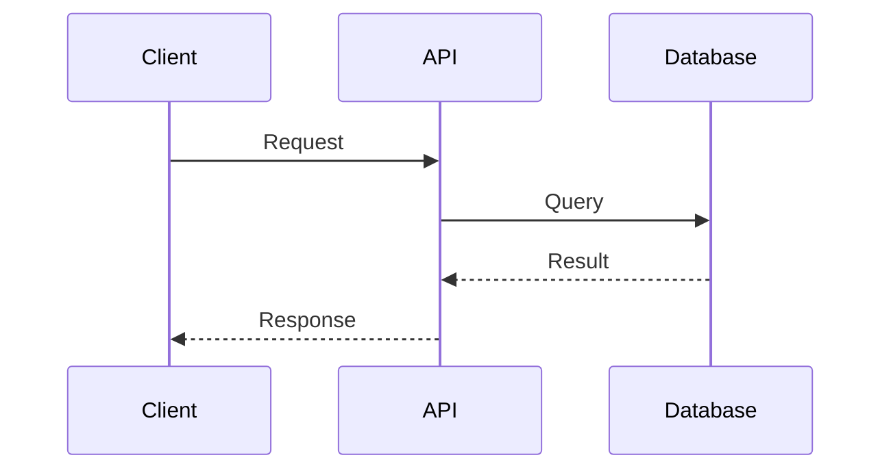
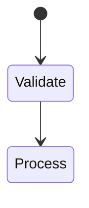
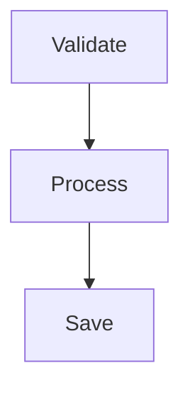

# Diagram Selection Guide

Quick reference for choosing the right Mermaid diagram type.

## Decision Matrix

| I need to show... | Use | Why not alternatives |
|-------------------|-----|---------------------|
| **Database schema** | `erDiagram` | classDiagram is for OOP, not tables |
| **API request/response flow** | `sequenceDiagram` | Shows time progression and actors |
| **Business process workflow** | `flowchart TB` | Shows steps and decisions |
| **Status lifecycle** | `stateDiagram-v2` | Shows valid state transitions |
| **System architecture** | `flowchart` with subgraphs | Groups components into layers |
| **Project timeline** | `gantt` | Shows tasks on calendar |
| **Decision logic** | `flowchart TB` with diamonds | Shows conditional branching |
| **Class hierarchy/OOP** | `classDiagram` | Shows inheritance and methods |
| **Brainstorm/hierarchy** | `mindmap` | Radial layout from center |
| **User journey** | `flowchart LR` or `sequenceDiagram` | Depends on navigation vs interaction |
| **Data pipeline** | `flowchart LR` | Shows transformation stages |
| **Service dependencies** | `flowchart` with subgraphs | Shows service calls |

## Quick Decision Tree

1. **Database tables?** -> `erDiagram`
2. **API calls or messages?** -> `sequenceDiagram`
3. **Status lifecycle?** -> `stateDiagram-v2`
4. **OOP code structure?** -> `classDiagram`
5. **Project schedule?** -> `gantt`
6. **Brainstorming?** -> `mindmap`
7. **Everything else** -> `flowchart`

## Common Wrong Choices

### Don't use classDiagram for databases

### Don't use flowchart for API interactions

### Don't use stateDiagram for processes

## By Use Case Category

### Software Development
| Use Case | Diagram |
|----------|---------|
| API documentation | sequenceDiagram |
| Database design | erDiagram |
| Class design | classDiagram |
| State machines | stateDiagram-v2 |
| Architecture | flowchart + subgraphs |

### Project Management
| Use Case | Diagram |
|----------|---------|
| Timeline | gantt |
| Task boards | kanban |
| Milestones | timeline |
| Process flow | flowchart |

### Data & Analytics
| Use Case | Diagram |
|----------|---------|
| Distribution | pie |
| Priority matrix | quadrantChart |
| Comparisons | radar-beta |
| Flow quantities | sankey-beta |
| Trends | xychart-beta |

## By Complexity

**Simple (Quick to learn):**
- Pie Chart
- Timeline
- User Journey
- Mindmap

**Moderate:**
- Flowchart
- Sequence Diagram
- Class Diagram
- ERD
- Gantt Chart
- State Diagram

**Advanced:**
- C4 Diagram
- Architecture
- ZenUML
- Requirement Diagram
- Block Diagram

## By Maturity

**Stable (Production-ready):**
- Flowchart
- Sequence Diagram
- Class Diagram
- State Diagram
- ERD
- Gantt Chart
- Pie Chart
- GitGraph

**Experimental (May change):**
- C4 Diagram
- ZenUML
- Timeline
- Mindmap (icons)
- Architecture (beta)
- Kanban
- Packet (beta)
- Radar (beta)
- Treemap (beta)
- Sankey (beta)
- XY Chart (beta)
- Block (beta)
- Quadrant Chart
