# Sequence Diagrams

**Keyword:** `sequenceDiagram`

**Purpose:** Show interactions between actors/systems over time.

## Table of Contents
- [Basic Syntax](#basic-syntax)
- [Participants](#participants)
- [Message Types](#message-types)
- [Activation Boxes](#activation-boxes)
- [Control Flow](#control-flow)
- [Notes](#notes)
- [Grouping (Boxes)](#grouping-boxes)
- [Lifecycle](#lifecycle)
- [Key Limitations](#key-limitations)
- [When to Use](#when-to-use)

## Basic Syntax

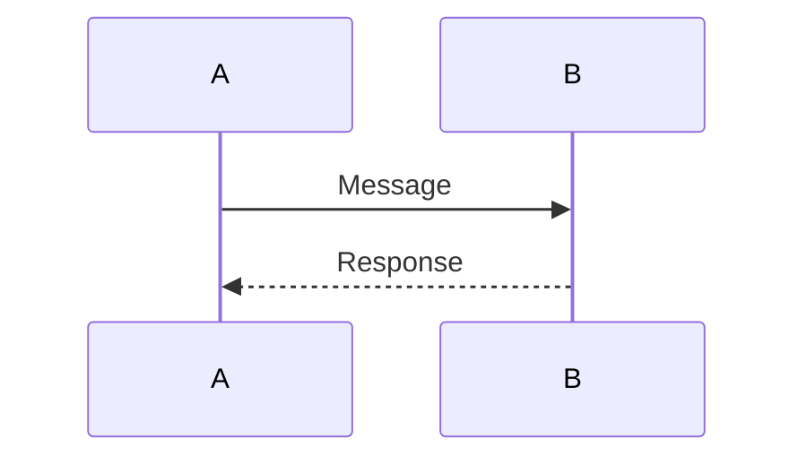

## Participants

**Auto-declaration:** Participants appear in order of first use.

**Explicit ordering:**
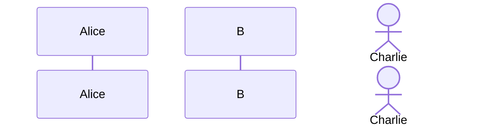

**Actor types** (via JSON config):
- Actor (default rectangle)
- Boundary
- Control
- Entity
- Database
- Collections
- Queue

## Message Types

| Syntax | Line Style | Arrow |
|--------|------------|-------|
| `->` | Solid | None |
| `-->` | Dotted | None |
| `->>` | Solid | Filled |
| `-->>` | Dotted | Filled |
| `-x` | Solid | Cross |
| `--x` | Dotted | Cross |
| `-)` | Solid | Open (async) |
| `--)` | Dotted | Open (async) |

## Activation Boxes

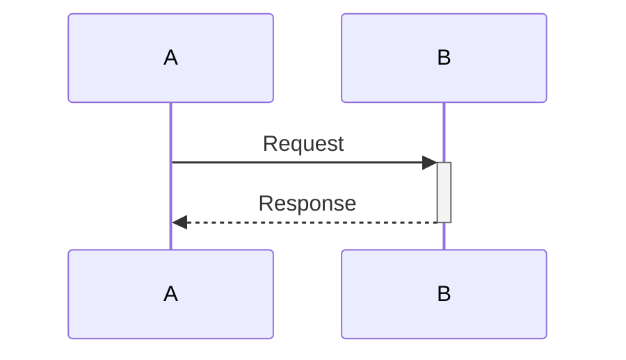

Or explicit:
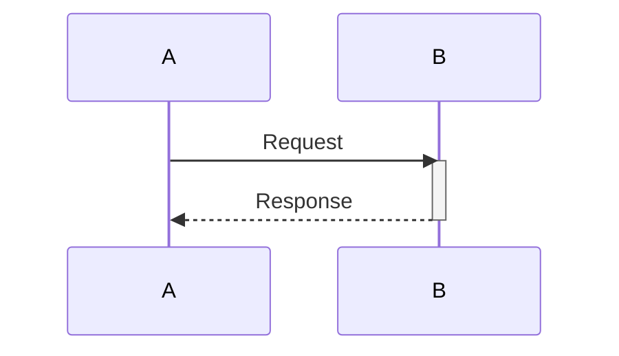

## Control Flow

**Loops:**
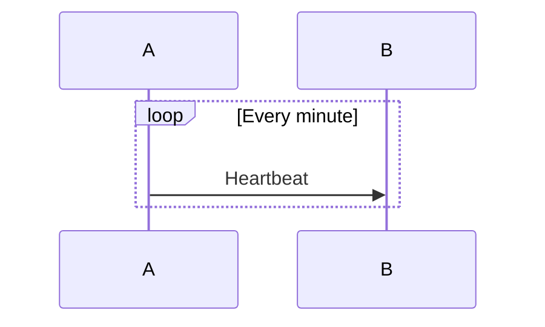

**Alternatives:**
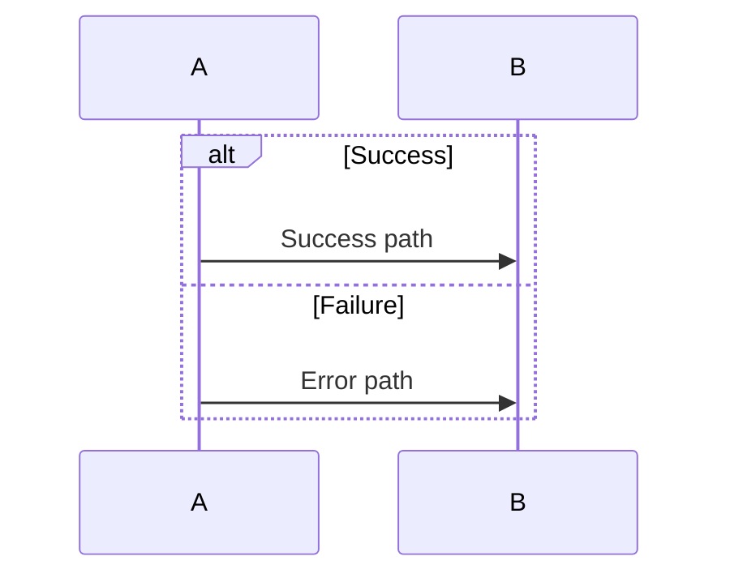

**Optional:**
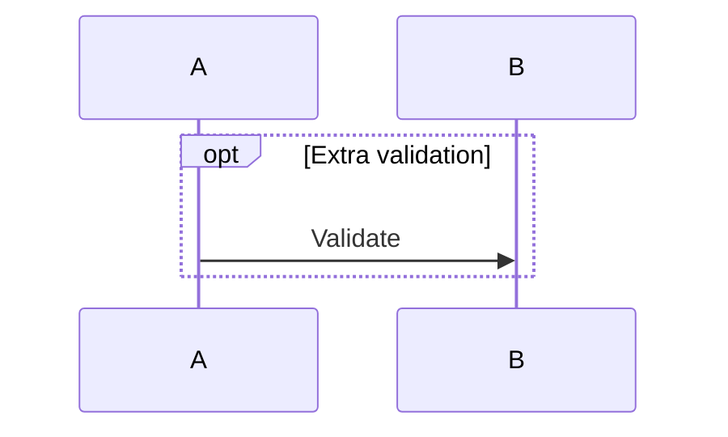

**Parallel:**
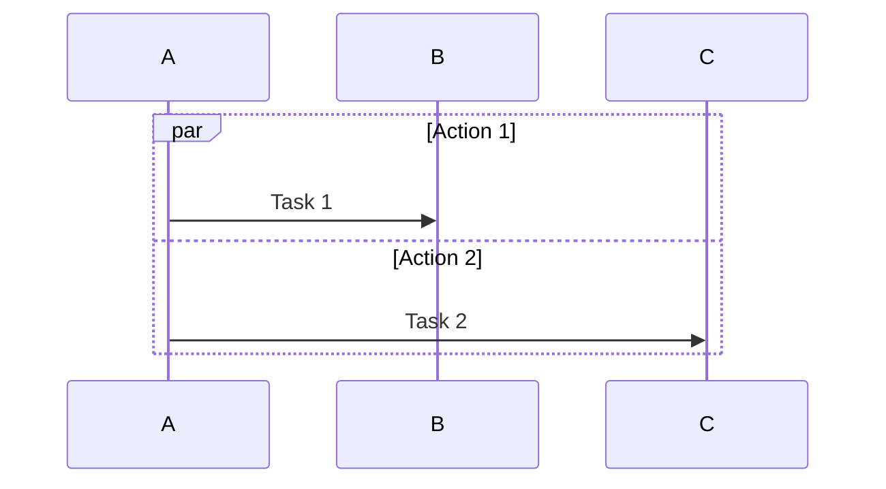

**Critical regions:**
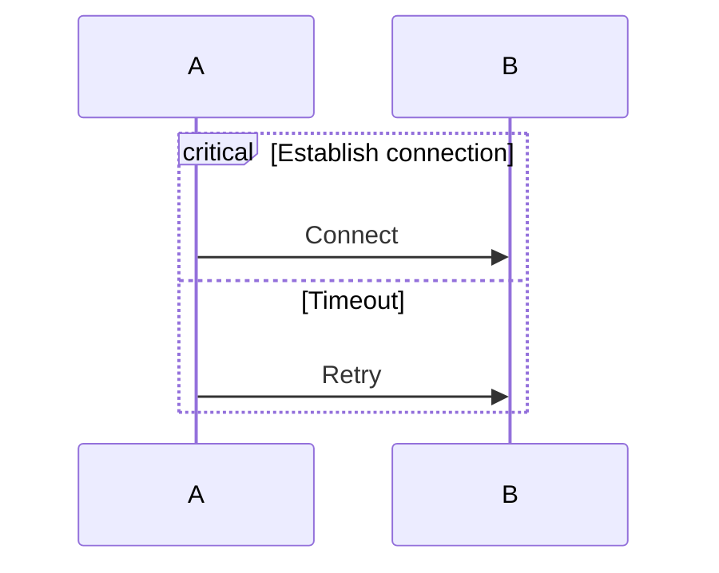

## Notes

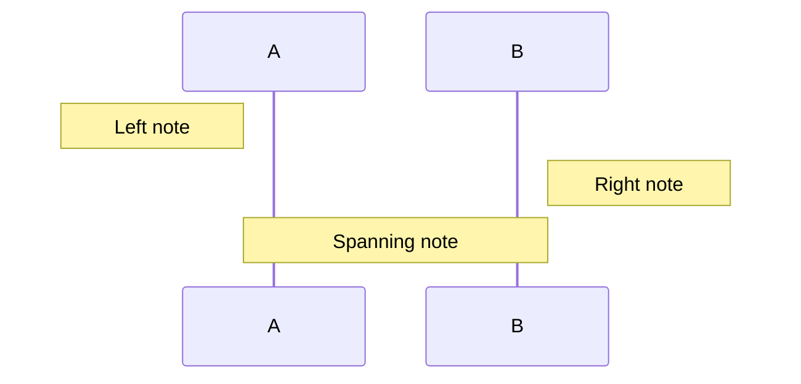

## Grouping (Boxes)

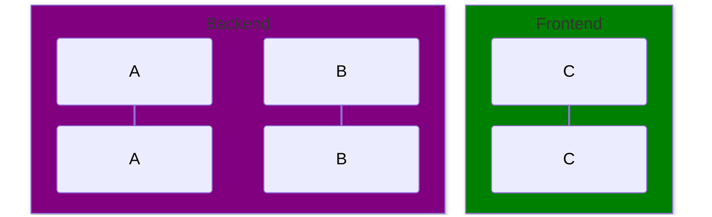

## Lifecycle

```mermaid
sequenceDiagram
    A->>B: Request
    create participant C
    B->>C: Initialize
    destroy C
    B->>A: Done
```

## Key Limitations
- "end" keyword can break diagrams (wrap in quotes)
- Line breaks use `<br/>` HTML tag
- Complex nesting may affect rendering

## When to Use
- API interaction documentation
- Protocol specification
- Message flow analysis
- Use case scenarios
