# State Diagrams

**Keyword:** `stateDiagram-v2` (or legacy `stateDiagram`)

**Purpose:** Model state machines and transitions.

## Table of Contents
- [Basic Syntax](#basic-syntax)
- [State Definitions](#state-definitions)
- [Transitions](#transitions)
- [Start and End States](#start-and-end-states)
- [Composite States](#composite-states)
- [Forks and Joins](#forks-and-joins)
- [Choice Points](#choice-points)
- [Notes](#notes)
- [Concurrency](#concurrency)
- [Direction](#direction)
- [Key Limitations](#key-limitations)
- [When to Use](#when-to-use)

## Basic Syntax

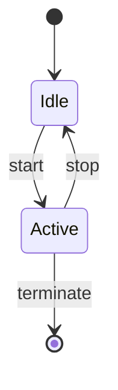

## State Definitions

**Simple ID:**
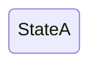

**With description:**
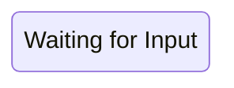

**Colon notation:**
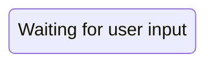

## Transitions

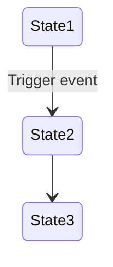

## Start and End States

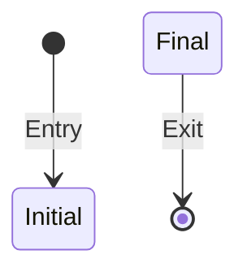

## Composite States

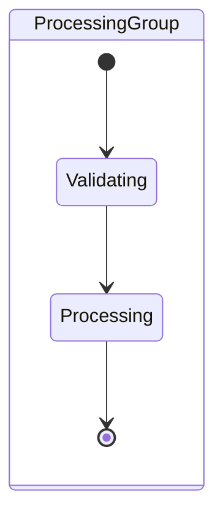

**Multiple nesting:**
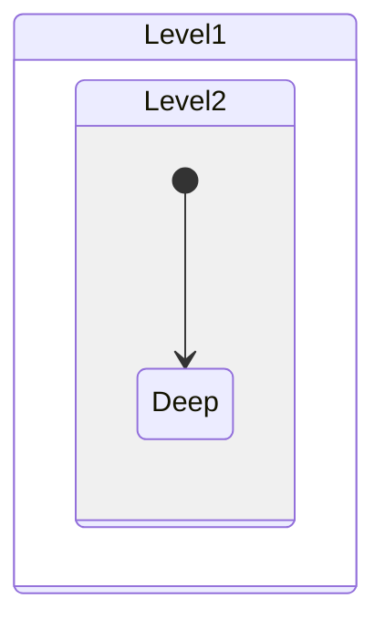

## Forks and Joins

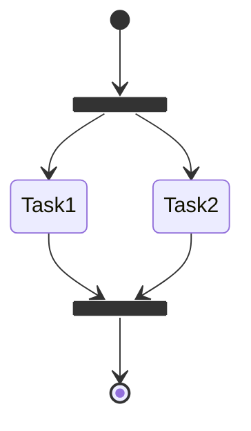

## Choice Points

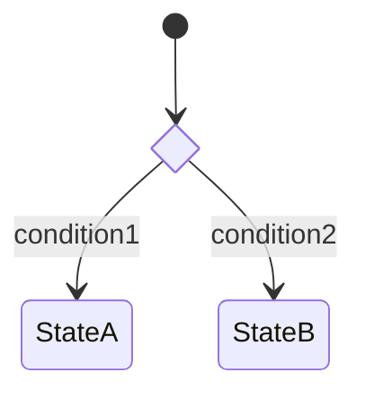

## Notes

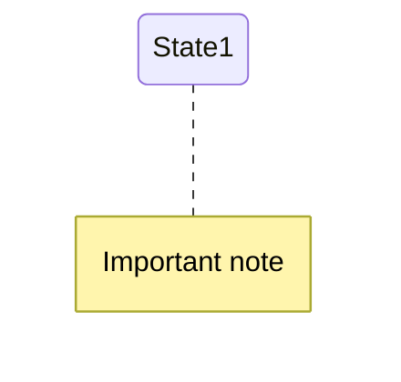

## Concurrency

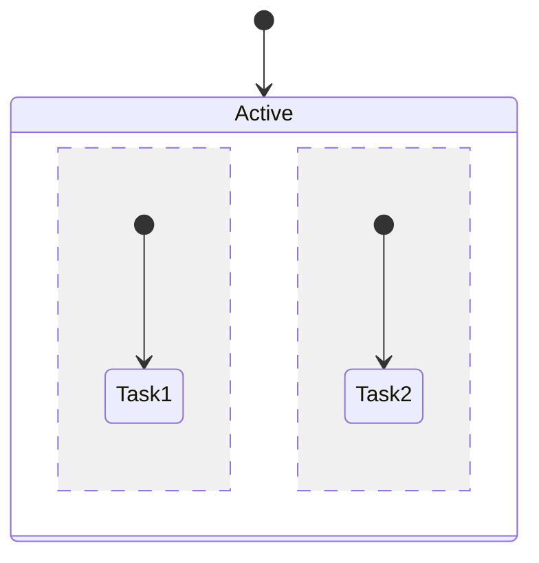

## Direction

```mermaid
stateDiagram-v2
    direction LR
    [*] --> A --> B --> [*]
```

## Key Limitations
- ClassDef styling cannot apply to start/end states
- Composite state styling is in development
- Complex concurrency may affect rendering

## When to Use
- State machine implementation
- Workflow status modeling
- Game state management
- Protocol state tracking
