# Mermaid.js Styling, Theming, and Visual Customization

Comprehensive guide to styling and theming Mermaid.js diagrams with practical examples, customization techniques, and platform compatibility considerations.

## Table of Contents
1. [Built-in Themes](#built-in-themes)
2. [Custom Theme Creation](#custom-theme-creation)
3. [Node Styling](#node-styling)
4. [Edge/Connection Styling](#edgeconnection-styling)
5. [classDef Syntax](#classdef-syntax)
6. [CSS Styling](#css-styling)
7. [Subgraph Styling](#subgraph-styling)
8. [Font Customization](#font-customization)
9. [Theme Variables Reference](#theme-variables-reference)
10. [Style Directives](#style-directives)
11. [Platform Compatibility](#platform-compatibility)
12. [Accessibility Considerations](#accessibility-considerations)
13. [Performance and Layout](#performance-and-layout)

---

## Built-in Themes

Mermaid.js provides five built-in themes optimized for different use cases:

### Available Themes

1. **default** - The standard theme for all diagrams
2. **neutral** - Optimized for black and white documents and printing
3. **dark** - Designed for dark-mode interfaces and dark-colored elements
4. **forest** - Features a green color palette, suitable for lighter backgrounds
5. **base** - The only customizable theme that accepts themeVariables modifications

### Applying Themes

**Diagram-Specific Theme (using init directive):**

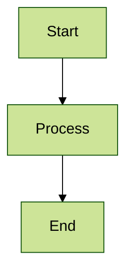

**Site-Wide Theme (JavaScript initialization):**

```javascript
mermaid.initialize({
  securityLevel: 'loose',
  theme: 'dark'
});
```

**Important Notes:**
- Dynamic theme configuration was introduced in Mermaid version 8.7.0
- For site-wide customization, use the `initialize()` method
- For diagram-specific customization, use the `%%init%%` directive
- Only the **base** theme supports full customization via themeVariables

---

## Custom Theme Creation

The **base** theme is the only theme that can be modified. Use themeVariables to create custom themes.

### Basic Custom Theme Example

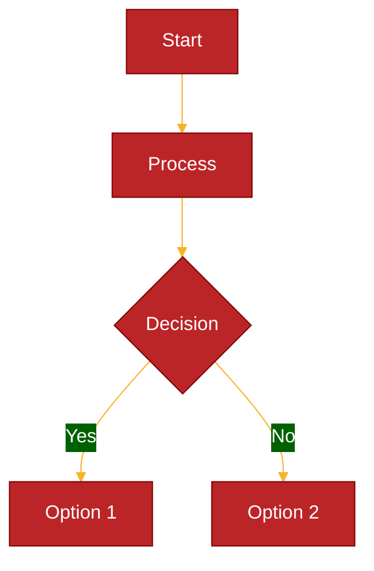

### Derived Color Calculations

To ensure diagram readability, Mermaid automatically derives related colors from base variables:

- `primaryBorderColor` is derived from `primaryColor`
- Adjustments include color inversion, hue changes, darkening/lightening by 10%, etc.
- This ensures visual consistency even when only primary colors are specified

**Color Format Requirements:**
- **Use hexadecimal colors only** (e.g., `#ff0000`)
- **Color names are NOT supported** (e.g., `red` will not work)

### Advanced Custom Theme

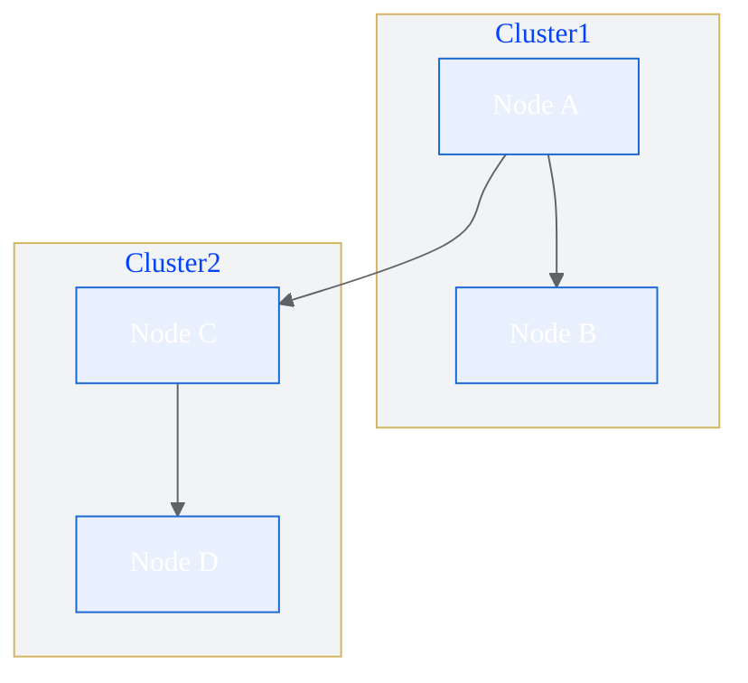

---

## Node Styling

### Inline Node Styling

Style individual nodes using the `style` keyword with SVG-compatible CSS properties:

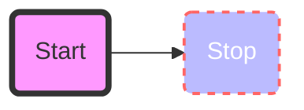

### Available Style Properties

Since Mermaid generates SVG code, use SVG-compatible CSS properties:

| Property | Description | Example |
|----------|-------------|---------|
| `fill` | Background color | `fill:#f9f` |
| `stroke` | Border color | `stroke:#333` |
| `stroke-width` | Border thickness | `stroke-width:4px` |
| `color` | Text color | `color:#fff` |
| `stroke-dasharray` | Dashed border pattern | `stroke-dasharray:5 5` |
| `rx`, `ry` | Border radius (rounded corners) | `rx:4,ry:4` |
| `font-size` | Text size | `font-size:12px` |
| `font-weight` | Text weight | `font-weight:bold` |
| `font-style` | Text style | `font-style:italic` |

### Node Shape Styling Examples

**Input Field Style:**
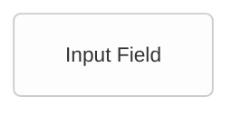

**Button Style:**


**Decision Node Style:**
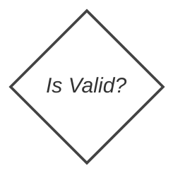

---

## Edge/Connection Styling

### Edge Syntax

Edges connect nodes with arrows or lines:

| Syntax | Description | Example |
|--------|-------------|---------|
| `A-->B` | Arrow | A points to B |
| `A---B` | Line | A connects to B |
| `A---oB` | Circle edge | A connects with circle to B |
| `A---xB` | Cross edge | A connects with cross to B |

### Edge Labels

Add descriptive text to connections:

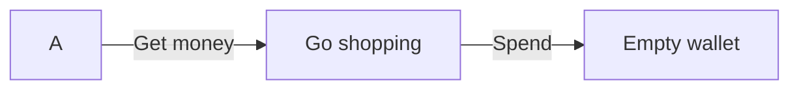

### Styling Specific Links

Style links using their definition order (0-based index):

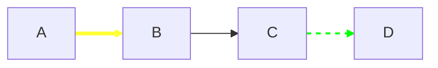

**Styling Multiple Links:**
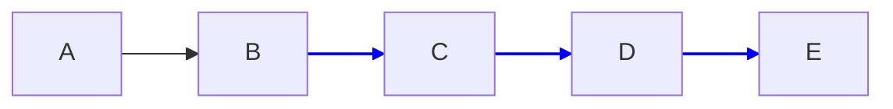

### Edge IDs (Advanced)

Assign IDs to edges for more advanced styling:

```mermaid
flowchart LR
    A -->|label| e1@ B
    style e1 stroke:#f00,stroke-width:3px
```

**Important Notes:**
- The `linkStyle` directive must be added after all link definitions
- When using `stroke-dasharray`, escape commas as `\,` (e.g., `stroke-dasharray:5\,5`)
- There is no easy way to style individual arrow heads or tails independently

### Link Length Control

Control link spanning by adding extra dashes:

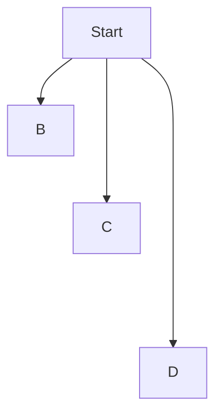

Extra dashes make links span more ranks, useful for layout control.

---

## classDef Syntax

Define reusable style classes to avoid repetition and maintain consistency.

### Basic classDef Syntax

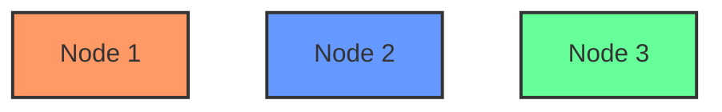

### Applying Classes - Multiple Methods

**Method 1: Using `:::` Operator (Shorthand)**
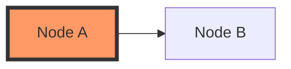

**Method 2: Using `class` Directive**
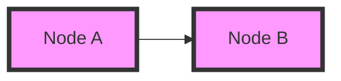

**Method 3: Multiple Nodes, Single Class**
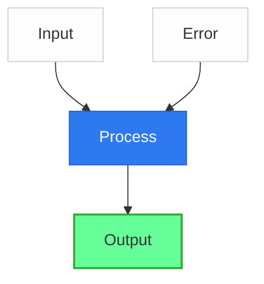

### Default Class

A class named `default` applies to all nodes without specific class definitions:

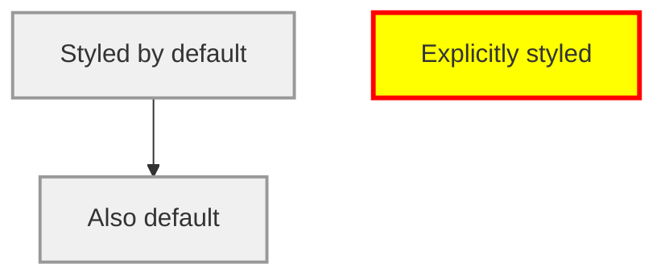

### Practical Example: UI Flow

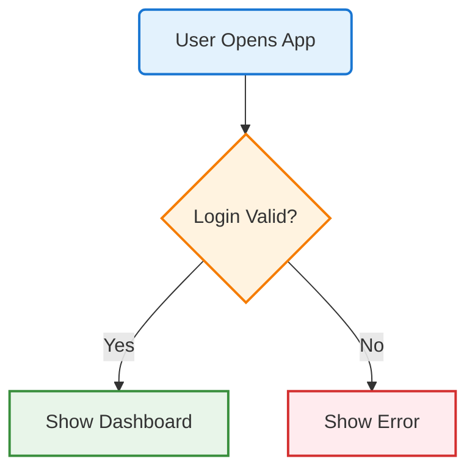

---

## CSS Styling

Declare CSS classes externally and reference them in Mermaid definitions.

### External CSS Approach

**In your stylesheet:**
```css
.client > rect {
  fill: #D5E8D4 !important;
  stroke: #82B366 !important;
  color: #000000 !important;
}

.server > rect {
  fill: #DAE8FC !important;
  stroke: #6C8EBF !important;
}

.database > rect {
  fill: #F8CECC !important;
  stroke: #B85450 !important;
}
```

**In your Mermaid diagram:**
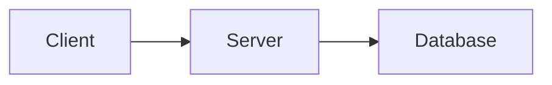

### Important Notes on CSS Styling

1. **The `!important` directive is often required** - Mermaid's CSS takes precedence over external CSS
2. **Target SVG elements** - Use selectors like `> rect`, `> text`, etc.
3. **Shadow DOM limitations** - Some platforms (e.g., MkDocs Material) encapsulate Mermaid in shadow DOMs, preventing CSS overrides

### Using themeCSS

Override theme CSS directly in the init directive:

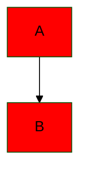

---

## Subgraph Styling

Subgraphs group related nodes and can be styled using classDef.

### Basic Subgraph Styling

```mermaid
flowchart TB
    subgraph Web [Web Tier]
        A[Frontend] --> B[API Gateway]
    end

    subgraph Backend [Backend Services]
        C[Auth Service]
        D[Data Service]
    end

    B --> C
    B --> D

    classDef webClass fill:#e3f2fd,stroke:#1976d2,stroke-width:2px
    classDef backendClass fill:#fff3e0,stroke:#f57c00,stroke-width:2px

    class Web webClass
    class Backend backendClass
```

### Ecosystem-Based Subgraph Styling

```mermaid
flowchart TD
    subgraph AWS [AWS Cloud]
        A[EC2] --> B[RDS]
    end

    subgraph Azure [Azure Cloud]
        C[VM] --> D[SQL Database]
    end

    subgraph OnPrem [On-Premises]
        E[Server] --> F[Database]
    end

    classDef awsClass fill:#FF9900,color:#fff,stroke:#232F3E
    classDef azureClass fill:#0078D4,color:#fff,stroke:#003366
    classDef onpremClass fill:#808080,color:#fff,stroke:#333

    class AWS awsClass
    class Azure azureClass
    class OnPrem onpremClass
```

### Important Notes

- **Multiple subgraphs:** When using comma-delimited class assignments, avoid spurious spaces: `class Servers,Storage blue` (not `Servers, Storage`)
- **CSS variables:** Some platforms use `mermaid-fg-color--lightest` CSS variable for subgraph backgrounds
- **Individual coloring limitation:** No easy way to color each subgraph differently without using classDef or external CSS

---

## Font Customization

### Font Config Properties

Mermaid supports three main font properties:

| Property | Type | Default | Description |
|----------|------|---------|-------------|
| `fontFamily` | string | `"Open Sans", sans-serif` | Font family for diagram text |
| `fontSize` | string or number | 14 | Base font size |
| `fontWeight` | string or number | - | Font weight (normal, bold, 100-900) |

### Using themeVariables for Fonts

```mermaid
%%{init: {
  'theme': 'base',
  'themeVariables': {
    'fontFamily': 'Arial, sans-serif',
    'fontSize': '18px',
    'primaryColor': '#4285f4'
  }
}}%%
flowchart TD
    A[Custom Font Example]
    B[Uses Arial 18px]
    A --> B
```

### Gantt Chart Font Customization

```javascript
mermaid.initialize({
  theme: 'default',
  gantt: {
    fontSize: 16,
    sectionFontSize: 20
  }
});
```

### Inline Font Styling

```mermaid
flowchart TD
    A[Normal Text]
    B[Large Bold Text]

    style B font-size:20px,font-weight:bold
```

### Font Calculators (Advanced)

Mermaid uses JavaScript font calculator functions for diagram-specific typography:

```javascript
boundaryFont: function () {
  return {
    fontFamily: this.boundaryFontFamily,
    fontSize: this.boundaryFontSize,
    fontWeight: this.boundaryFontWeight,
  };
}
```

### Known Issues

- **Default fontSize override:** Mermaid v10+ includes `fontSize: 16` on root config, which may override specific diagram font sizes
- **Workaround:** Call `mermaid.mermaidAPI.updateSiteConfig({fontSize: undefined})` to restore old behavior

---

## Theme Variables Reference

Comprehensive list of available themeVariables for the **base** theme.

### Universal Variables

These apply across all diagram types:

```javascript
{
  // Core Colors
  'darkMode': false,              // Affects color calculations
  'background': '#ffffff',        // Diagram background
  'primaryColor': '#fff4dd',      // Primary node background
  'primaryTextColor': 'calculated', // Primary node text
  'primaryBorderColor': 'calculated', // Primary node border
  'secondaryColor': 'calculated', // Secondary elements
  'secondaryBorderColor': 'calculated',
  'secondaryTextColor': 'calculated',
  'tertiaryColor': 'calculated',  // Tertiary elements
  'tertiaryBorderColor': 'calculated',
  'tertiaryTextColor': 'calculated',

  // Typography
  'fontFamily': 'trebuchet ms, verdana, arial',
  'fontSize': '16px',

  // General Elements
  'lineColor': 'calculated',      // Diagram lines
  'textColor': 'calculated',      // General text
  'mainBkg': 'calculated',        // Main background
  'errorBkgColor': 'calculated',  // Error states
  'errorTextColor': 'calculated',

  // Notes
  'noteBkgColor': 'calculated',
  'noteTextColor': 'calculated',
  'noteBorderColor': 'calculated'
}
```

### Flowchart Variables

```javascript
{
  'nodeBorder': 'calculated',       // Node border color
  'clusterBkg': 'calculated',       // Subgraph background
  'clusterBorder': 'calculated',    // Subgraph border
  'edgeLabelBackground': 'calculated', // Edge label background
  'titleColor': 'calculated'        // Title color
}
```

### Sequence Diagram Variables

```javascript
{
  // Actors
  'actorBkg': 'calculated',
  'actorBorder': 'calculated',
  'actorTextColor': 'calculated',
  'actorLineColor': 'calculated',

  // Signals/Messages
  'signalColor': 'calculated',
  'signalTextColor': 'calculated',

  // Labels
  'labelBoxBkgColor': 'calculated',
  'labelBoxBorderColor': 'calculated',
  'labelTextColor': 'calculated',
  'loopTextColor': 'calculated',

  // Activation
  'activationBorderColor': 'calculated',
  'activationBkgColor': 'calculated',

  // Sequence Numbers
  'sequenceNumberColor': 'calculated'
}
```

### Pie Chart Variables

```javascript
{
  'pie1': 'calculated',   // Section 1 fill
  'pie2': 'calculated',   // Section 2 fill
  'pie3': 'calculated',   // Section 3 fill
  'pie4': 'calculated',   // Section 4 fill
  'pie5': 'calculated',   // Section 5 fill
  'pie6': 'calculated',   // Section 6 fill
  'pie7': 'calculated',   // Section 7 fill
  'pie8': 'calculated',   // Section 8 fill
  'pie9': 'calculated',   // Section 9 fill
  'pie10': 'calculated',  // Section 10 fill
  'pie11': 'calculated',  // Section 11 fill
  'pie12': 'calculated',  // Section 12 fill
  'pieStrokeColor': 'calculated',  // Pie stroke
  'pieTitleTextColor': 'calculated',
  'pieSectionTextColor': 'calculated',
  'pieLegendTextColor': 'calculated'
}
```

### State Diagram Variables

```javascript
{
  'labelColor': 'calculated',
  'altBackground': 'calculated'  // Composite state backgrounds
}
```

### Class Diagram Variables

```javascript
{
  'classText': 'calculated'  // Class diagram text color
}
```

### User Journey Variables

```javascript
{
  'fillType0': 'calculated',  // Journey section fills
  'fillType1': 'calculated',
  'fillType2': 'calculated',
  'fillType3': 'calculated',
  'fillType4': 'calculated',
  'fillType5': 'calculated',
  'fillType6': 'calculated',
  'fillType7': 'calculated'
}
```

### Complete Custom Theme Example

```mermaid
%%{init: {
  'theme': 'base',
  'themeVariables': {
    'primaryColor': '#4285f4',
    'primaryTextColor': '#ffffff',
    'primaryBorderColor': '#1967d2',
    'secondaryColor': '#34a853',
    'secondaryBorderColor': '#188038',
    'tertiaryColor': '#fbbc04',
    'tertiaryBorderColor': '#f29900',
    'lineColor': '#5f6368',
    'textColor': '#202124',
    'mainBkg': '#ffffff',
    'fontFamily': 'Google Sans, Arial, sans-serif',
    'fontSize': '14px',
    'noteBkgColor': '#fff9c4',
    'noteBorderColor': '#f9a825',
    'noteTextColor': '#000000'
  }
}}%%
flowchart TD
    A[Primary Node] --> B[Secondary Node]
    B --> C[Tertiary Node]

    note1[This is a note]
```

---

## Style Directives

### init Directive Syntax

The `%%init%%` directive configures theme, styling, and behavior at the diagram level.

**Basic Syntax:**
```mermaid
%%{init: {'theme':'forest'}}%%
flowchart TD
    A --> B
```

**With Theme Variables:**
```mermaid
%%{init: {'theme': 'base', 'themeVariables': {'primaryColor': '#ff0000'}}}%%
flowchart TD
    A --> B
```

**With Diagram-Specific Config:**
```mermaid
%%{init: {'theme': 'forest', 'flowchart': {'curve': 'basis'}}}%%
flowchart LR
    A --> B --> C
```

### Curve Styles

Control edge curves at the diagram or edge level:

| Curve Type | Description |
|------------|-------------|
| `basis` | Smooth curved lines |
| `cardinal` | Cardinal spline curves |
| `linear` | Straight lines |
| `stepBefore` | Step before target |
| `stepAfter` | Step after source |

**Example:**
```mermaid
%%{init: {'flowchart': {'curve': 'stepAfter'}}}%%
flowchart LR
    A --> B --> C --> D
```

### Using themeCSS Directive

Override specific CSS in the theme:

```mermaid
%%{init: {
  'theme': 'base',
  'themeCSS': `
    .node rect { fill: #ff0000; }
    .edgeLabel { background-color: yellow; }
  `
}}%%
flowchart TD
    A --> B
```

---

## Platform Compatibility

Mermaid.js theme behavior varies across platforms due to implementation differences.

### Supported Platforms

| Platform | Native Support | Theme Support | Notes |
|----------|---------------|---------------|-------|
| **GitHub Markdown** | Yes | Auto-adapts | Detects light/dark mode automatically |
| **Obsidian** | Yes | Limited | Use `merm` codeblock for custom themes |
| **Notion** | Yes | Limited | Embedded diagrams may not honor custom themes |
| **Confluence** | Via Plugin | Limited | May not preserve Obsidian styling |
| **Observable** | Yes | Full | Full theming support |
| **VS Code** | Via Extension | Full | Markdown Preview Mermaid Support extension |
| **MkDocs Material** | Yes | Shadow DOM | CSS override limitations due to shadow DOM |

### GitHub Markdown Best Practices

**Do NOT specify themes in GitHub:**

```mermaid
<!-- AVOID: This breaks dark mode -->
%%{init: {'theme':'forest'}}%%
flowchart TD
    A --> B
```

**Instead, use default theme:**

```mermaid
<!-- RECOMMENDED: Auto-adapts to light/dark mode -->
flowchart TD
    A --> B
```

GitHub automatically:
- Detects if dark mode is enabled
- Adjusts diagram colors to work with the detected background
- Ensures readability in both light and dark modes

**Problem:** Specifying a theme overrides this behavior, causing diagrams to be unreadable in dark mode.

### Obsidian Theme Customization

Obsidian reserves the `mermaid` code fence, so custom themes require alternate syntax.

**Using mermaid-themes plugin:**

````markdown
```merm
%%{init: {'theme':'forest'}}%%
flowchart TD
    A --> B
```
````

**Known Issues:**
- Custom CSS variables like `var(--background-primary)` cause "Unsupported color format" errors
- Must use hex colors only

### Confluence Integration

When uploading diagrams from Obsidian to Confluence:
- Styling may differ from Obsidian rendering
- Confluence does not adopt Obsidian vault styling
- Consider using neutral or default theme for portability

### Shadow DOM Limitations

Some platforms (MkDocs Material) encapsulate Mermaid diagrams in shadow DOMs:
- Prevents CSS override from external stylesheets
- Prevents duplicate ID conflicts
- Limits customization options to init directives only

---

## Accessibility Considerations

### WCAG Contrast Requirements

| Level | Text Contrast | Large Text | Graphics/UI Components |
|-------|---------------|------------|------------------------|
| **AA** (Minimum) | 4.5:1 | 3:1 | 3:1 |
| **AAA** (Enhanced) | 7:1 | 4.5:1 | 3:1 |

**Large text** = 18pt (24px) or 14pt (18.66px) bold

### Known Issues with Mermaid.js

1. **Color contrast problems:** All built-in themes have some color contrast issues
2. **GitHub Issue #3691:** Open request to ensure all themes pass WCAG AA contrast checks in both light and dark modes
3. **Screen reader limitations:** Mermaid doesn't communicate node connections to assistive technology

### Accessibility Best Practices

**1. Include Accessible Descriptions**

```mermaid
%%{init: {'theme':'base'}}%%
%%{accDescr: 'Flowchart showing user authentication process with login, validation, and dashboard steps'}%%
flowchart TD
    A[User Login] --> B{Valid?}
    B -->|Yes| C[Dashboard]
    B -->|No| D[Error]
```

**2. Avoid Relying Solely on Color**

Bad (information only in color):
```mermaid
flowchart LR
    A[Start] --> B[Process]
    style A fill:#0f0
    style B fill:#f00
```

Good (information in labels and color):
```mermaid
flowchart LR
    A[Start: Ready] --> B[Error: Failed]
    style A fill:#0f0,stroke:#000,stroke-width:2px
    style B fill:#f00,stroke:#000,stroke-width:2px
```

**3. Use High-Contrast Colors**

```mermaid
%%{init: {
  'theme': 'base',
  'themeVariables': {
    'primaryColor': '#0066cc',      // High contrast blue
    'primaryTextColor': '#ffffff',  // White text
    'primaryBorderColor': '#003366', // Dark blue border
    'lineColor': '#000000'          // Black lines
  }
}}%%
flowchart TD
    A[High Contrast Example]
```

**4. Test with Contrast Checkers**

- **WebAIM Contrast Checker:** https://webaim.org/resources/contrastchecker/
- **Firefox DevTools:** Accessibility panel
- **Chrome DevTools:** Elements > Accessibility tab

**5. Provide Text Descriptions**

Always provide a detailed text description of your diagram outside the Mermaid code block:

```markdown
The following flowchart illustrates the user authentication process:
1. User enters credentials
2. System validates credentials
3. If valid, user is redirected to dashboard
4. If invalid, user sees error message

[Mermaid diagram here]
```

**6. Use Color Blindness Simulators**

Test diagrams with color blindness simulators:
- Protanopia (red-blind)
- Deuteranopia (green-blind)
- Tritanopia (blue-blind)

**7. Avoid Default Theme Override in GitHub**

Let GitHub auto-detect light/dark mode for optimal contrast in both modes.

---

## Performance and Layout

### Layout Algorithms

Mermaid supports two layout engines:

| Engine | Description | Best For | Availability |
|--------|-------------|----------|--------------|
| **dagre** (default) | Standard layout | Most diagrams | Built-in |
| **elk** (experimental) | Advanced layout | Large/complex diagrams | Requires separate integration |

**Using elk layout:**

```mermaid
%%{init: {'flowchart': {'defaultRenderer': 'elk'}}}%%
flowchart TD
    A --> B --> C --> D
    E --> F --> G --> H
    A --> E
    D --> H
```

**Benefits of elk:**
- Better for larger diagrams
- More optimized arrangement
- Reduces overlapping
- Improves readability for complex graphs

### Performance Considerations

1. **O(n²) rendering limits:** Performance degrades with very large graphs
2. **Responsive flag:** Controls scaling behavior
   - `true` - Height/width set to 100%, scales with available space
   - `false` - Uses absolute space required

**Configuration:**
```javascript
mermaid.initialize({
  flowchart: {
    useMaxWidth: true,
    htmlLabels: true,
    curve: 'basis'
  }
});
```

### Layout Direction Impact

Choose layout direction based on diagram structure:

| Direction | Code | Best For |
|-----------|------|----------|
| Top to Bottom | `TD` or `TB` | Deep hierarchies, org charts |
| Left to Right | `LR` | Wide trees, process flows |
| Bottom to Top | `BT` | Reverse hierarchies |
| Right to Left | `RL` | RTL language support |

**Poor layout choices impact readability:**
- Using TD for wide trees reduces readability
- Using LR for deep hierarchies causes excessive horizontal scrolling

**Example:**
```mermaid
flowchart LR
    A[Start] --> B[Step 1]
    B --> C[Step 2]
    C --> D[Step 3]
    D --> E[Step 4]
    E --> F[End]
```

### Diagram Size Configuration

Control rendered flowchart width:

```javascript
mermaid.flowchartConfig = {
  width: '100%'
};
```

Or use CLI with JSON configuration file.

### Lightweight Version

Mermaid Tiny is approximately half the size of the full library:

**Included:**
- Flowcharts
- Sequence diagrams
- Class diagrams
- State diagrams
- ER diagrams
- User journey
- Gantt charts
- Pie charts
- Git graphs

**Excluded:**
- Mindmap diagrams
- Architecture diagrams
- KaTeX rendering
- Lazy loading

Use Mermaid Tiny when bundle size is critical and advanced features aren't needed.

---

## Common Styling Patterns

### Pattern 1: Status-Based Node Styling

```mermaid
flowchart TD
    A[Pending Task]:::pending
    B[In Progress Task]:::inProgress
    C[Completed Task]:::completed
    D[Blocked Task]:::blocked

    A --> B --> C
    A -.-> D

    classDef pending fill:#fff3cd,stroke:#856404,stroke-width:2px
    classDef inProgress fill:#cfe2ff,stroke:#084298,stroke-width:2px
    classDef completed fill:#d1e7dd,stroke:#0a3622,stroke-width:2px
    classDef blocked fill:#f8d7da,stroke:#58151c,stroke-width:2px
```

### Pattern 2: System Architecture Layers

```mermaid
flowchart TD
    subgraph Presentation [Presentation Layer]
        A[Web UI]
        B[Mobile App]
    end

    subgraph Business [Business Logic Layer]
        C[API Gateway]
        D[Service Layer]
    end

    subgraph Data [Data Layer]
        E[Database]
        F[Cache]
    end

    A --> C
    B --> C
    C --> D
    D --> E
    D --> F

    classDef presentation fill:#e3f2fd,stroke:#1976d2,stroke-width:2px
    classDef business fill:#fff3e0,stroke:#f57c00,stroke-width:2px
    classDef data fill:#f3e5f5,stroke:#7b1fa2,stroke-width:2px

    class Presentation presentation
    class Business business
    class Data data
```

### Pattern 3: Traffic Light Status

```mermaid
flowchart LR
    A[Service A]:::green
    B[Service B]:::yellow
    C[Service C]:::red

    classDef green fill:#4caf50,stroke:#2e7d32,color:#fff,stroke-width:2px
    classDef yellow fill:#ffeb3b,stroke:#f57f17,color:#000,stroke-width:2px
    classDef red fill:#f44336,stroke:#c62828,color:#fff,stroke-width:2px
```

### Pattern 4: Priority Levels

```mermaid
flowchart TD
    A[Critical Priority]:::p1
    B[High Priority]:::p2
    C[Medium Priority]:::p3
    D[Low Priority]:::p4

    classDef p1 fill:#d32f2f,stroke:#b71c1c,color:#fff,stroke-width:3px,font-weight:bold
    classDef p2 fill:#f57c00,stroke:#e65100,color:#fff,stroke-width:2px
    classDef p3 fill:#fbc02d,stroke:#f57f17,color:#000,stroke-width:2px
    classDef p4 fill:#388e3c,stroke:#2e7d32,color:#fff,stroke-width:1px
```

### Pattern 5: Data Flow with Annotations

```mermaid
flowchart LR
    A[Source]:::source -->|REST API| B[Processor]:::process
    B -->|JSON| C[Storage]:::storage
    B -.->|Error Logs| D[Monitoring]:::monitor

    classDef source fill:#e1f5fe,stroke:#01579b,stroke-width:2px
    classDef process fill:#fff9c4,stroke:#f57f17,stroke-width:2px
    classDef storage fill:#f3e5f5,stroke:#4a148c,stroke-width:2px
    classDef monitor fill:#ffebee,stroke:#b71c1c,stroke-width:2px

    linkStyle 0 stroke:#1976d2,stroke-width:2px
    linkStyle 1 stroke:#388e3c,stroke-width:2px
    linkStyle 2 stroke:#d32f2f,stroke-width:1px,stroke-dasharray:5 5
```

---

## Sources

- [Mermaid Theme Configuration](https://mermaid.js.org/config/theming.html)
- [Mermaid Flowchart Syntax](https://mermaid.js.org/syntax/flowchart.html)
- [Mermaid Config Schema](https://mermaid.js.org/config/schema-docs/config.html)
- [Mermaid Font Config](https://mermaid.js.org/config/schema-docs/config-defs-font-config.html)
- [Accessible Mermaid Charts in GitHub Markdown](https://pulibrary.github.io/2023-03-29-accessible-mermaid)
- [WebAIM Contrast and Color Accessibility](https://webaim.org/articles/contrast/)
- [WCAG Understanding Use of Color](https://www.w3.org/WAI/WCAG21/Understanding/use-of-color.html)
- [Mermaid GitHub Issue #3691 - WCAG Contrast](https://github.com/mermaid-js/mermaid/issues/3691)
- [Stack Overflow: Mermaid Node Styling](https://stackoverflow.com/questions/74894540/mermaid-js-flow-chart-full-list-of-available-options-to-style-a-node)
- [Stack Overflow: Global Mermaid Styles](https://stackoverflow.com/questions/64594220/global-or-document-wide-styles-in-mermaid)
- [Stack Overflow: Change Mermaid Theme in Markdown](https://stackoverflow.com/questions/49535327/change-mermaid-theme-in-markdown)
