# Mermaid Diagram Core Syntax and Best Practices

## Overview

Mermaid.js is a JavaScript-based diagramming library that renders Markdown-inspired text definitions to create diagrams dynamically. This reference guide covers official syntax, best practices, common pitfalls, and performance considerations for creating maintainable Mermaid diagrams.

## Table of Contents

1. [Core Syntax](#core-syntax)
2. [Diagram Types](#diagram-types)
3. [Best Practices](#best-practices)
4. [Common Pitfalls](#common-pitfalls)
5. [Performance Considerations](#performance-considerations)
6. [Version Compatibility](#version-compatibility)
7. [Advanced Features](#advanced-features)

---

## Core Syntax

### Diagram Declaration

All diagram definitions begin with a type declaration followed by the diagram content.

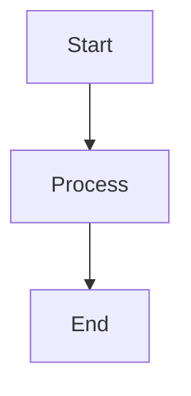

**Supported diagram types:**
- `flowchart` / `graph` - Flowcharts and graphs
- `sequenceDiagram` - Sequence diagrams
- `classDiagram` - Class diagrams
- `stateDiagram` / `stateDiagram-v2` - State diagrams
- `erDiagram` - Entity relationship diagrams
- `gantt` - Gantt charts
- `journey` - User journey diagrams
- `gitGraph` - Git graph diagrams
- `pie` - Pie charts
- `quadrantChart` - Quadrant charts
- `requirementDiagram` - Requirement diagrams
- `c4Diagram` - C4 architecture diagrams

### Comment Syntax

Use `%%` for line comments:

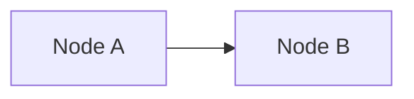

**Warning:** Comments with curly braces `%%{` can be mistaken for directives and cause errors.

### Frontmatter Configuration

Add YAML metadata at the start of diagram code using triple dashes:

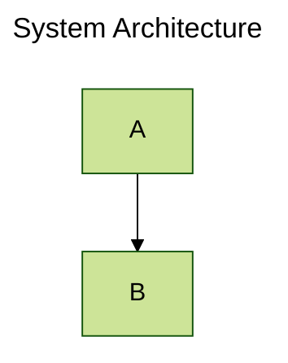

**Important rules:**
- Triple dash `---` must be the only character on first line
- Requires consistent indentation
- Settings are case-sensitive
- Misspellings are silently ignored
- Malformed parameters break the diagram

### Direction Options

Flowcharts support five orientation options:

- `TB` / `TD` - Top to Bottom / Top Down (default)
- `BT` - Bottom to Top
- `LR` - Left to Right
- `RL` - Right to Left

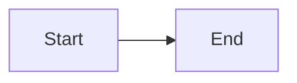

---

## Diagram Types

### Flowcharts

#### Node Shapes

**Standard shapes:**

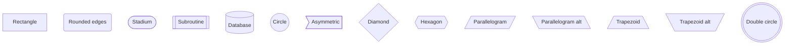

**Expanded shapes (v11.3.0+):**

Use syntax `A@{ shape: rect }` for 30+ new shapes including semantic representations.

#### Edge Types

**Basic connections:**

```mermaid
flowchart LR
    A-->B       %% Arrow
    C---D       %% Open link
    E-->|text|F %% Text on arrow
    G-- text -->H %% Alternative text syntax
    I-.->J      %% Dotted arrow
    K-. text .->L %% Dotted with text
    M==>N       %% Thick arrow
    O== text ==>P %% Thick with text
    Q~~~R       %% Invisible link
```

**Special arrows:**

```mermaid
flowchart LR
    A--oB       %% Circle edge
    C--xD       %% Cross edge
```

#### Subgraphs

Group related elements logically:

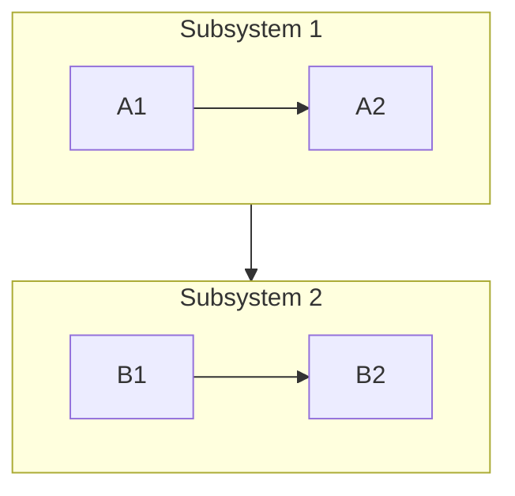

#### Styling

**Direct styling:**

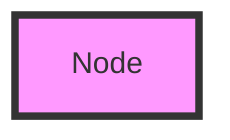

**Class-based styling:**

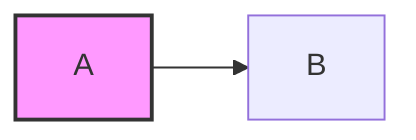

**Link styling (zero-indexed):**

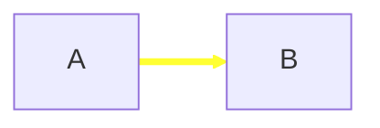

### Sequence Diagrams

Document interactions between system components:

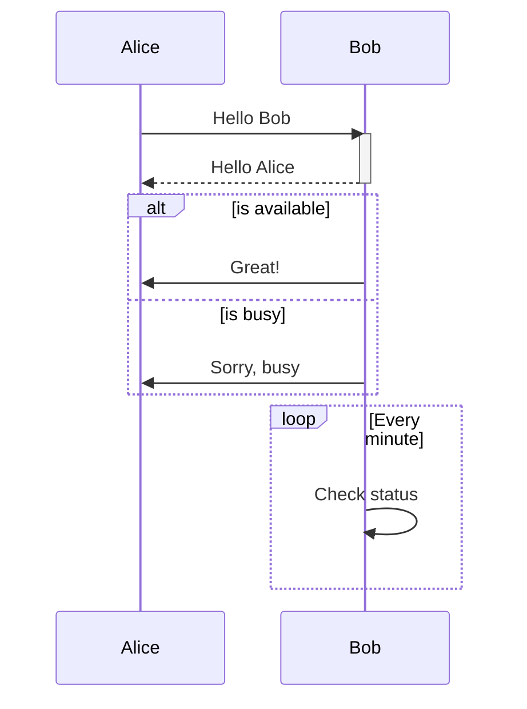

### Class Diagrams

Model object-oriented architecture:

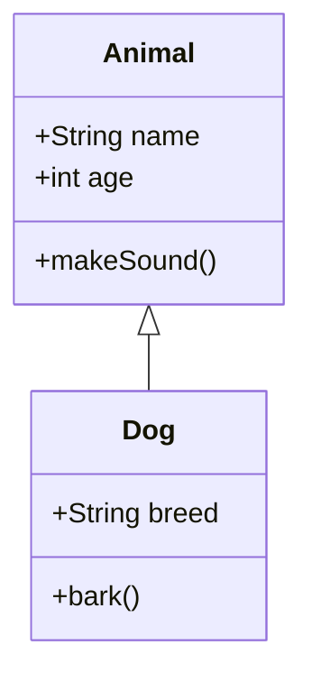

**Visibility modifiers:**
- `+` Public
- `-` Private
- `#` Protected
- `~` Package/Internal

**Relationship types:**
- `<|--` Inheritance
- `*--` Composition
- `o--` Aggregation
- `-->` Association
- `--` Link (solid)
- `..>` Dependency
- `..|>` Realization

### Entity Relationship Diagrams (ERD)

Define database schemas:

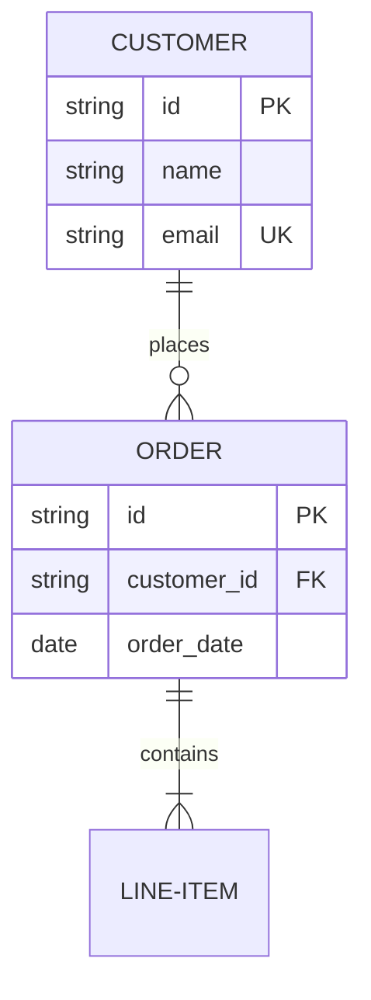

**Cardinality notation:**
- `||--||` Exactly one
- `||--o{` Zero or more
- `||--|{` One or more
- `}o--||` Zero or one

### Gantt Charts

Display project timelines:

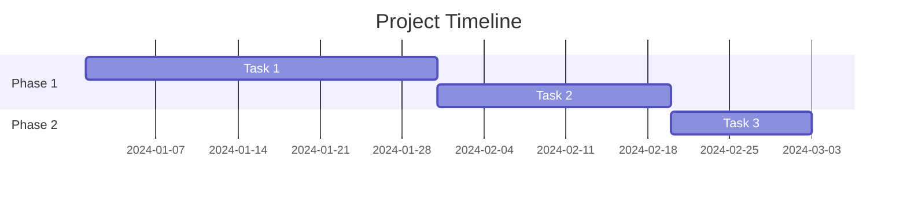

---

## Best Practices

### 1. Simplicity First

Focus on essential elements only. Avoid overloading diagrams with excessive detail.

**Good:**
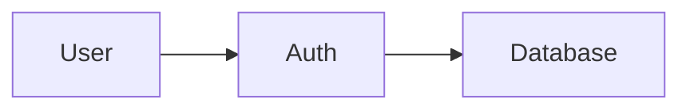

**Bad:**
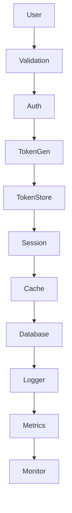

**Better approach:** Break complex diagrams into multiple focused diagrams.

### 2. Clear and Consistent Labeling

Use meaningful, descriptive labels that align with codebase terminology.

**Good:**
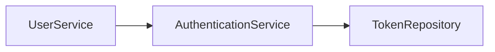

**Bad:**
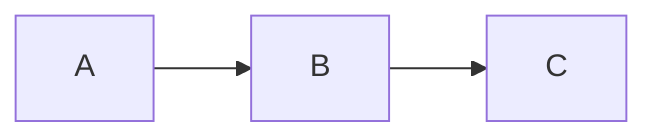

### 3. Strategic Grouping with Subgraphs

Organize related components logically:

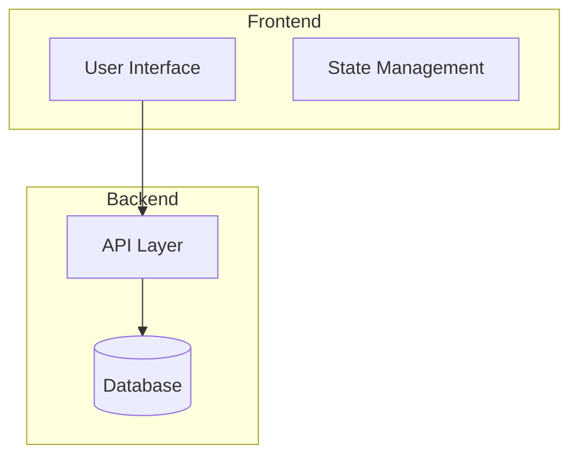

### 4. Consistent Naming Conventions

Maintain uniformity across all diagrams in your project:

- Use PascalCase or camelCase consistently
- Match terminology used in code
- Standardize abbreviations (API vs Api vs api)

### 5. Documentation Integration

Diagrams should complement written documentation, not replace it:

- Reference diagrams in code comments
- Update diagrams alongside system changes
- Include context and explanations
- Store diagram source in version control

### 6. Version Control Best Practices

- Store Mermaid source code in repositories
- Include diagrams in code reviews
- Track changes with meaningful commit messages
- Document diagram updates in changelogs

### 7. Color Usage

Use color strategically for visual hierarchy:

```mermaid
flowchart LR
    A[Start]:::startClass --> B[Process]:::processClass
    B --> C[End]:::endClass

    classDef startClass fill:#90EE90,stroke:#333
    classDef processClass fill:#87CEEB,stroke:#333
    classDef endClass fill:#FFB6C1,stroke:#333
```

Avoid excessive colors that reduce readability.

### 8. Accessibility Considerations

- Use sufficient color contrast
- Don't rely solely on color to convey meaning
- Provide text labels for all nodes
- Test diagrams with screen readers when possible

---

## Common Pitfalls

### 1. Reserved Word "end"

The word "end" (lowercase) breaks flowcharts and sequence diagrams.

**Problem:**
```mermaid
flowchart LR
    start-->end  %% BREAKS!
```

**Solution:**
```mermaid
flowchart LR
    start-->End  %% Capitalize
    start-->"end"  %% Or quote
```

### 2. Node IDs Starting with "o" or "x"

When node IDs begin with these letters, add space or capitalize.

**Problem:**
```mermaid
flowchart LR
    A---oB  %% Interpreted as circle edge
```

**Solution:**
```mermaid
flowchart LR
    A--- oB  %% Add space
    A---OB   %% Or capitalize
```

### 3. Nested Shapes Without Quotes

Complex text in shapes requires quotation marks.

**Problem:**
```mermaid
flowchart LR
    A[Text with [brackets]]  %% BREAKS!
```

**Solution:**
```mermaid
flowchart LR
    A["Text with [brackets]"]
```

### 4. innerHTML vs innerText in JavaScript

When integrating Mermaid programmatically, use innerHTML, not innerText.

**Problem:**
```javascript
element.innerText = 'graph TD\nA-->B';  // Inserts <br> tags
```

**Solution:**
```javascript
element.innerHTML = 'graph TD\nA-->B';
```

### 5. Syntax Validation

Small syntax errors cause rendering failures. Use Mermaid Live Editor or `mermaid.parse()` to validate.

```javascript
const isValid = mermaid.parse('graph TD\nA-->B');
// Returns { diagramType: 'flowchart' } if valid
```

### 6. Security Level Configuration

Incorrect security settings can block functionality.

**For development:**
```javascript
mermaid.initialize({
    securityLevel: 'loose'  // Allows HTML and clicks
});
```

**For production:**
```javascript
mermaid.initialize({
    securityLevel: 'strict'  // Encodes HTML, disables clicks
});
```

### 7. Cross-Browser Compatibility

Test diagrams in target browsers (Chrome, Firefox, Edge, Safari). Export to PNG/PDF for guaranteed compatibility.

### 8. Error Messages

Recent versions (>8.6.0) display error messages. Earlier versions fail silently.

**Error handling:**
```javascript
try {
    mermaid.parse(diagramCode, { suppressErrors: true });
} catch (error) {
    console.error('Diagram syntax error:', error);
}
```

---

## Performance Considerations

### 1. Diagram Complexity Limits

Large diagrams (50+ nodes) can cause performance issues:

- Break into multiple focused diagrams
- Use subgraphs to organize content
- Consider ELK renderer for complex layouts

### 2. Lazy Loading

Implement on-demand rendering to improve page load:

```javascript
// Only render visible diagrams
const observer = new IntersectionObserver((entries) => {
    entries.forEach(entry => {
        if (entry.isIntersecting) {
            mermaid.run({ nodes: [entry.target] });
        }
    });
});

document.querySelectorAll('.mermaid').forEach(el => observer.observe(el));
```

### 3. Renderer Selection

**Dagre (default):** Balanced performance, suitable for most diagrams.

**ELK (v9.4+):** Better for large and complex diagrams.

Enable ELK via frontmatter:
```yaml
---
config:
  layout: elk
  elk:
    mergeEdges: true
    nodePlacementStrategy: LINEAR_SEGMENTS
---
```

Or directive:
```
%%{init: {"flowchart": {"defaultRenderer": "elk"}} }%%
```

**ELK Configuration Options:**
- `mergeEdges`: Combine edge paths (prettier but potentially harder to read)
- `nodePlacementStrategy`:
  - `SIMPLE` - Basic placement
  - `NETWORK_SIMPLEX` - Optimized layout
  - `LINEAR_SEGMENTS` - Linear arrangement
  - `BRANDES_KOEPF` - Default, balanced approach

**Note:** ELK requires `@mermaid-js/layout-elk` package and is not available on all platforms (e.g., GitHub).

### 4. Server-Side Rendering

Offload processing from client browsers:

```bash
# Using mermaid-cli
npm install -g @mermaid-js/mermaid-cli
mmdc -i input.mmd -o output.svg
```

### 5. Caching Static Diagrams

Pre-render diagrams that rarely change and serve as static images.

### 6. Font Loading

Wait for fonts to load before rendering:

```javascript
document.addEventListener('DOMContentLoaded', () => {
    document.fonts.ready.then(() => {
        mermaid.run();
    });
});
```

### 7. Reusability

Build a library of reusable diagram components:

```mermaid
%% Save common patterns
flowchart LR
    subgraph AuthFlow
        Login-->Validate-->Token
    end
```

---

## Version Compatibility

### Major Version Changes

#### Version 11.x (Latest)

**Breaking changes:**
- ESBuild replaces UMD with IIFE bundle
- `useMaxWidth` defaults to `true` for git and sankey diagrams

**New features:**
- Kanban diagrams
- Architecture diagrams
- Additional flowchart shapes (30+ new shapes)

#### Version 10.x

**Breaking changes:**
- ES modules (ESM) only - no more UMD builds
- `mermaid.init()` deprecated - use `mermaid.run()` instead

**Migration:**
```javascript
// Old (deprecated)
mermaid.init();

// New (v10+)
mermaid.run();
```

**Security update:**
- DOMPurify updated to address CVE-2025-26791

#### Version 9.4

**New features:**
- ELK layout renderer introduced
- Better support for complex diagrams

#### Version 9.0

**Breaking changes:**
- gitGraph diagram syntax changes

#### Version 8.6

**New features:**
- Error message display improvements

#### Version 8.2

**New features:**
- Security levels introduced to prevent malicious use

### Dependency Updates

**Recent important updates:**
- `marked` package reverted to ^16.0.0 for compatibility
- `dagre-d3-es` updated to 7.0.13 (security fix GHSA-cc8p-78qf-8p7q)

### Platform Compatibility Notes

Different platforms support different Mermaid versions:

- **GitHub:** Supports Mermaid in markdown (no ELK support)
- **GitLab:** Supports Mermaid with configuration options
- **MkDocs Material:** Requires careful version management
- **Lucidchart:** May lag behind latest versions
- **Discourse:** Community-managed updates

**Check platform documentation** before using advanced features.

---

## Advanced Features

### 1. Configuration Methods

**JavaScript initialization (preferred):**
```javascript
mermaid.initialize({
    startOnLoad: true,
    theme: 'forest',
    flowchart: {
        curve: 'basis',
        htmlLabels: true
    },
    securityLevel: 'strict'
});
```

**Directive syntax:**
```mermaid
%%{init: {'theme':'forest', 'themeVariables': { 'primaryColor':'#ff0000'}}}%%
graph TD
    A-->B
```

**Frontmatter (YAML):**
```yaml
---
config:
  theme: forest
  themeVariables:
    primaryColor: '#ff0000'
---
```

### 2. Themes

Built-in themes:
- `default` - Standard theme
- `forest` - Green tones
- `dark` - Dark mode
- `neutral` - Grayscale
- `base` - Minimal styling

Custom theme variables:
```javascript
mermaid.initialize({
    theme: 'base',
    themeVariables: {
        primaryColor: '#BB2528',
        primaryTextColor: '#fff',
        primaryBorderColor: '#7C0000',
        lineColor: '#F8B229',
        secondaryColor: '#006100',
        tertiaryColor: '#fff'
    }
});
```

### 3. Interactive Features

**Click events:**
```mermaid
flowchart LR
    A[Click me]
    click A "https://example.com" "Tooltip text"
```

**JavaScript callbacks:**
```mermaid
flowchart LR
    A[Click me]
    click A callback "Tooltip"
```

```javascript
function callback() {
    alert('Node clicked!');
}
```

**Note:** Requires `securityLevel: 'loose'` or `'antiscript'`.

### 4. Custom Styling

**Flowchart curves:**
- `basis` - Smooth curves
- `linear` - Straight lines
- `cardinal` - Rounded curves
- `monotoneX` / `monotoneY` - Monotone curves
- `step` / `stepBefore` / `stepAfter` - Step functions

```javascript
mermaid.initialize({
    flowchart: {
        curve: 'basis'
    }
});
```

### 5. Accessibility Features

**Title and description:**
```mermaid
%%{init: {'theme':'base'}}%%
flowchart TD
    accTitle: System Architecture
    accDescr: High-level overview of system components

    A[Frontend] --> B[Backend]
```

### 6. Error Handling

**Parse validation:**
```javascript
const result = mermaid.parse(diagramCode);
if (result) {
    console.log('Valid diagram:', result.diagramType);
} else {
    console.error('Invalid diagram syntax');
}
```

**Custom error handler:**
```javascript
mermaid.parseError = function(err, hash) {
    console.error('Mermaid parse error:', err);
    // Custom error handling logic
};
```

### 7. Type Detection

```javascript
const type = mermaid.detectType('graph TD\nA-->B');
console.log(type); // 'flowchart'
```

---

## Quick Reference Cheat Sheet

### Common Patterns

**Basic flowchart:**
```mermaid
flowchart LR
    A[Start] --> B{Decision}
    B -->|Yes| C[Action 1]
    B -->|No| D[Action 2]
    C --> E[End]
    D --> E
```

**Sequence diagram:**
```mermaid
sequenceDiagram
    User->>+API: Request
    API->>+DB: Query
    DB-->>-API: Data
    API-->>-User: Response
```

**Class diagram:**
```mermaid
classDiagram
    Parent <|-- Child
    Parent : +field
    Parent : +method()
    Child : +childMethod()
```

**ERD:**
```mermaid
erDiagram
    PARENT ||--|{ CHILD : has
    PARENT {
        int id PK
    }
    CHILD {
        int id PK
        int parent_id FK
    }
```

### Essential Commands

```javascript
// Initialize
mermaid.initialize({ startOnLoad: true });

// Render
mermaid.run();

// Parse
const valid = mermaid.parse(code);

// Detect type
const type = mermaid.detectType(code);
```

---

## Additional Resources

### Official Documentation
- [Mermaid Official Documentation](https://mermaid.js.org/intro/syntax-reference.html)
- [Mermaid Live Editor](https://mermaid.live/)
- [GitHub Repository](https://github.com/mermaid-js/mermaid)
- [Flowchart Syntax Guide](https://docs.mermaidchart.com/mermaid-oss/syntax/flowchart.html)
- [Mermaid Examples](https://mermaid.js.org/syntax/examples.html)

### Best Practices & Guides
- [Mermaid.js Complete Guide - Swimm](https://swimm.io/learn/mermaid-js/mermaid-js-a-complete-guide)
- [Mastering Mermaid.js - Antoine Griffard](https://antoinegriffard.com/posts/mermaid-js-comprehensive-guide/)
- [Complete Guide to Mermaid Diagrams - Youqing Han](https://hanyouqing.com/blog/2025/08/mermaid-diagram-guide/)
- [Mermaid Diagrams Guide - Miro](https://miro.com/diagramming/what-is-mermaid/)

### Troubleshooting
- [MkDocs-Mermaid2 Troubleshooting](https://mkdocs-mermaid2.readthedocs.io/en/latest/troubleshooting/)
- [GitHub Issues](https://github.com/mermaid-js/mermaid/issues)
- [Stack Overflow - Mermaid Tag](https://stackoverflow.com/questions/tagged/mermaid)

### Platform-Specific Documentation
- [GitLab Mermaid Layouts](https://handbook.gitlab.com/handbook/tools-and-tips/mermaid/)
- [Draw.io Mermaid ELK Layout](https://www.drawio.com/blog/mermaid-elk-layout)
- [MkDocs Material ELK Support](https://github.com/squidfunk/mkdocs-material/issues/8129)

### Releases & Changelog
- [Mermaid Releases](https://github.com/mermaid-js/mermaid/releases)
- [NPM Package](https://www.npmjs.com/package/mermaid)

---

## Conclusion

Mermaid.js provides a powerful text-based approach to creating diagrams that integrate seamlessly with documentation workflows. By following the syntax guidelines, best practices, and performance considerations outlined in this guide, you can create maintainable, professional diagrams that enhance your technical documentation.

Key takeaways:
1. Keep diagrams simple and focused
2. Use consistent naming and styling
3. Validate syntax before publishing
4. Test across target platforms
5. Version control diagram source code
6. Consider performance for large diagrams
7. Stay aware of version compatibility

For the most current information, always refer to the official Mermaid documentation at https://mermaid.js.org.

---

**Document Version:** 1.0
**Last Updated:** 2025-12-04
**Mermaid Version Coverage:** 8.x - 11.x
