# Validated Mermaid Templates

Tested and working Mermaid templates for GitHub, GitLab, and VS Code. All templates use simple structures (under 10 nodes) and proven syntax.

## 1. Simple Flowcharts

### Basic Vertical Flow (TB Direction)

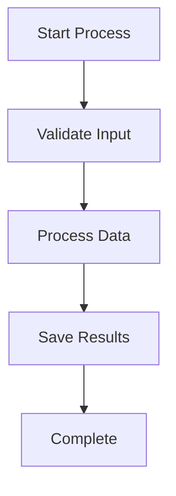
```mermaid
flowchart TB
    Start[Start Process] --> Step1[Validate Input]
    Step1 --> Step2[Process Data]
    Step2 --> Step3[Save Results]
    Step3 --> End[Complete]
```

**Customize by:**
- Replace node text between brackets
- Change node shapes: `[]` rectangle, `()` rounded, `([])` stadium, `[[]]` subroutine
- TB (top-bottom), LR (left-right), BT (bottom-top), RL (right-left)

**Platform notes:** Works everywhere. TB direction recommended for narrow viewports.

---

### Flow with Styled Nodes

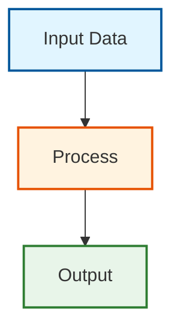
```mermaid
flowchart TB
    A[Input Data]:::input --> B[Process]:::process
    B --> C[Output]:::output

    classDef input fill:#e1f5ff,stroke:#01579b,stroke-width:2px
    classDef process fill:#fff3e0,stroke:#e65100,stroke-width:2px
    classDef output fill:#e8f5e9,stroke:#2e7d32,stroke-width:2px
```

**Customize by:**
- Define classDef with fill, stroke, stroke-width
- Apply with `:::className` after node text
- Use hex colors for consistency

---

## 2. Decision Trees

### If/Then Branching

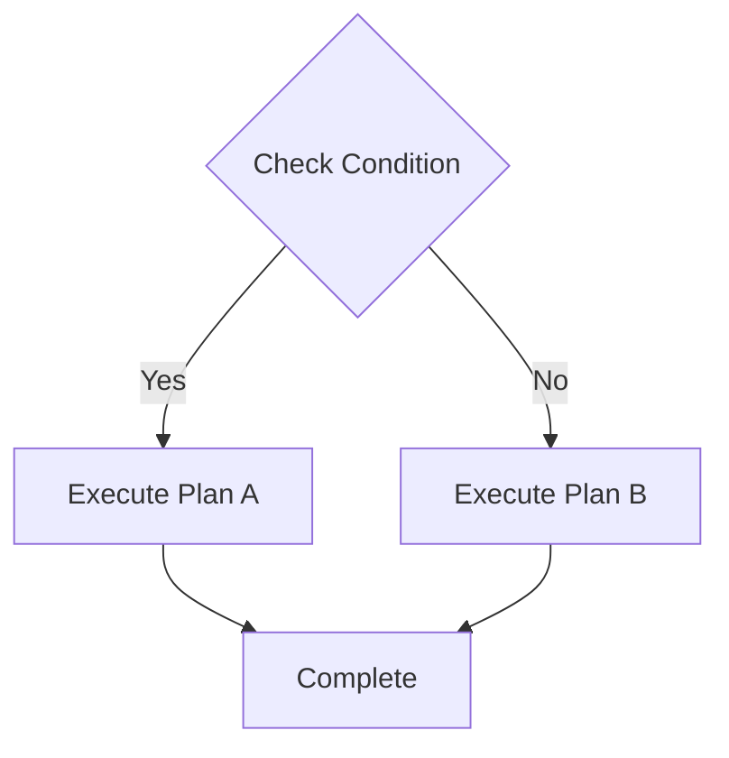
```mermaid
flowchart TB
    Start{Check Condition}
    Start -->|Yes| ActionA[Execute Plan A]
    Start -->|No| ActionB[Execute Plan B]
    ActionA --> End[Complete]
    ActionB --> End
```

**Customize by:**
- Diamond shape `{}` for decisions
- Arrow labels with `|text|`
- Multiple conditions per decision node

---

### Multi-Level Decision

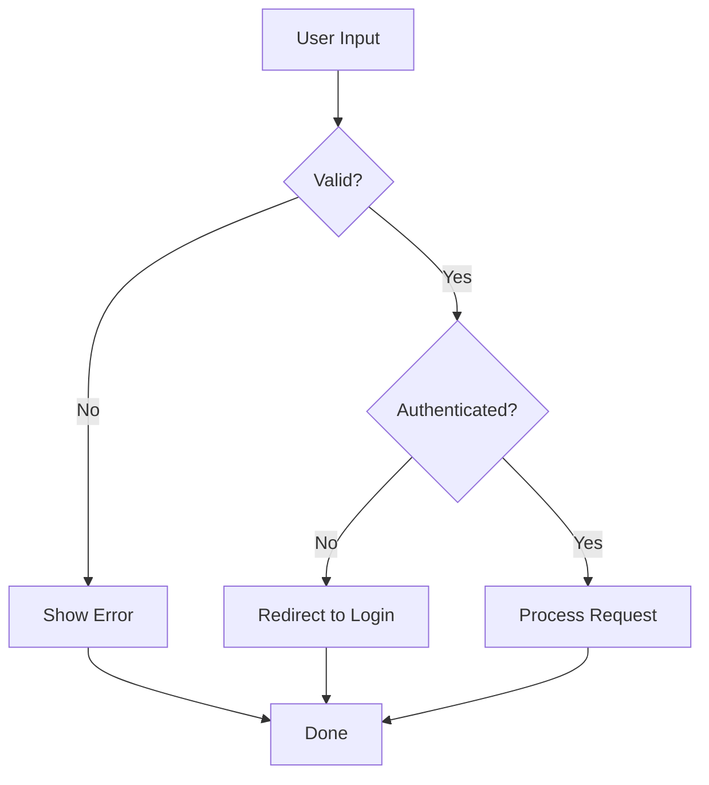
```mermaid
flowchart TB
    Input[User Input] --> Valid{Valid?}
    Valid -->|No| Error[Show Error]
    Valid -->|Yes| Auth{Authenticated?}
    Auth -->|No| Login[Redirect to Login]
    Auth -->|Yes| Process[Process Request]
    Error --> End[Done]
    Login --> End
    Process --> End
```

**Customize by:**
- Add more decision levels
- Combine with styled nodes
- Use consistent Yes/No labels

---

## 3. Process Flows

### Multi-Step Workflow

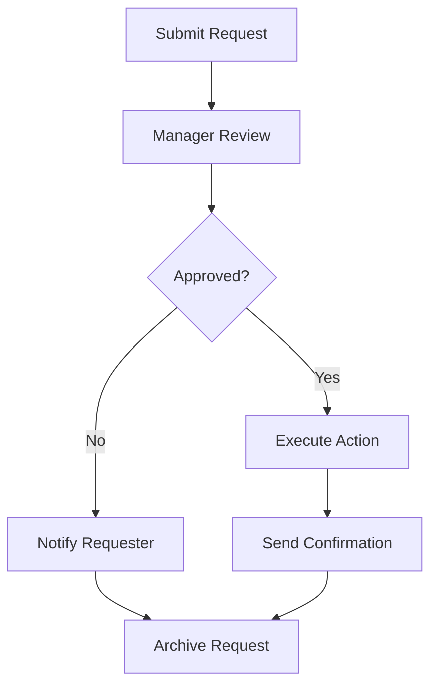
```mermaid
flowchart TB
    Submit[Submit Request] --> Review[Manager Review]
    Review --> Approved{Approved?}
    Approved -->|Yes| Execute[Execute Action]
    Approved -->|No| Reject[Notify Requester]
    Execute --> Notify[Send Confirmation]
    Reject --> Archive[Archive Request]
    Notify --> Archive
```

**Customize by:**
- Add parallel paths with multiple arrows from one node
- Use consistent naming (verbs for actions)
- Keep decision diamonds for choices only

---

### Parallel Processing

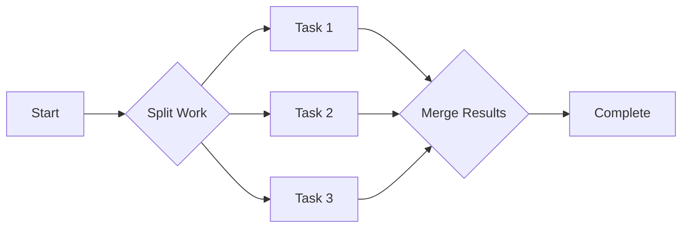
```mermaid
flowchart LR
    Start[Start] --> Split{Split Work}
    Split --> Task1[Task 1]
    Split --> Task2[Task 2]
    Split --> Task3[Task 3]
    Task1 --> Merge{Merge Results}
    Task2 --> Merge
    Task3 --> Merge
    Merge --> End[Complete]
```

**Customize by:**
- LR direction for wide layouts
- Add more parallel tasks
- Use different merge logic

---

## 4. System Architecture

### Component Boxes with Connections

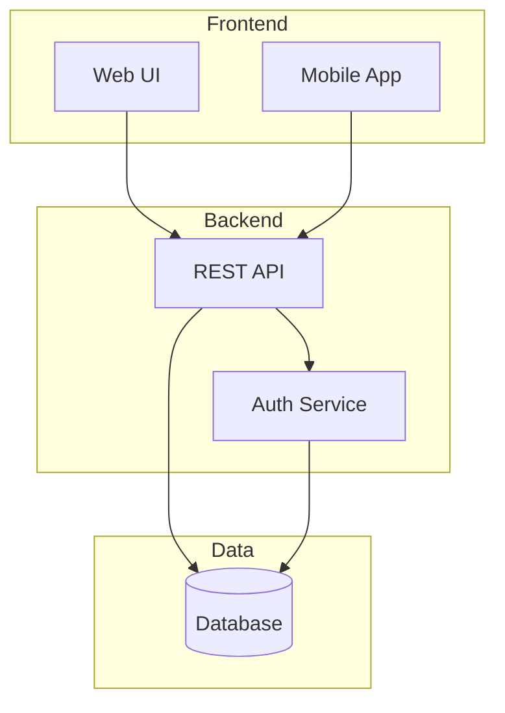
```mermaid
flowchart TB
    subgraph Frontend
        UI[Web UI]
        Mobile[Mobile App]
    end

    subgraph Backend
        API[REST API]
        Auth[Auth Service]
    end

    subgraph Data
        DB[(Database)]
    end

    UI --> API
    Mobile --> API
    API --> Auth
    API --> DB
    Auth --> DB
```

**Customize by:**
- Add/remove subgraphs for layers
- Use `[()]` for database cylinder shape
- Connect components across layers

**Platform notes:** Subgraphs work on all platforms but may render slightly differently.

---

### Microservices Architecture

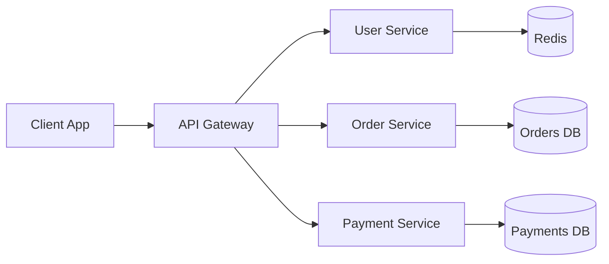
```mermaid
flowchart LR
    Client[Client App] --> Gateway[API Gateway]
    Gateway --> Service1[User Service]
    Gateway --> Service2[Order Service]
    Gateway --> Service3[Payment Service]
    Service1 --> Cache[(Redis)]
    Service2 --> DB1[(Orders DB)]
    Service3 --> DB2[(Payments DB)]
```

**Customize by:**
- Add more services
- Show message queues with different shapes
- Use subgraphs for service boundaries

---

## 5. Database ERD

### Basic Entity Relationships

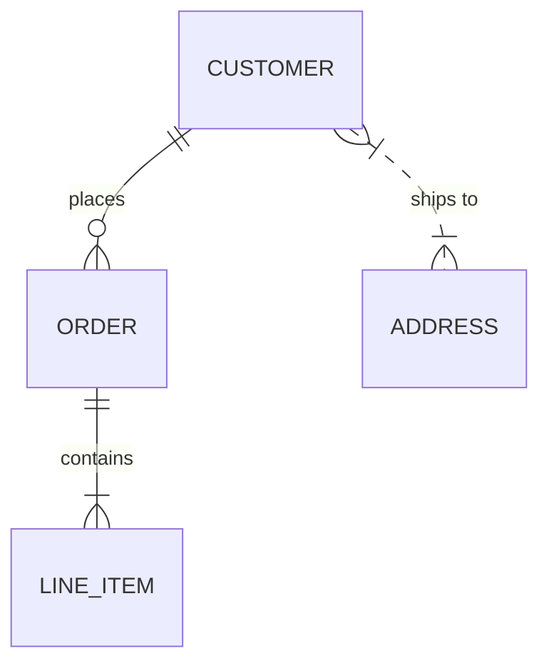
```mermaid
erDiagram
    CUSTOMER ||--o{ ORDER : places
    ORDER ||--|{ LINE_ITEM : contains
    CUSTOMER }|..|{ ADDRESS : "ships to"
```

**Customize by:**
- `||--||` one-to-one
- `||--o{` one-to-many
- `}o--o{` many-to-many
- `||--|{` one-to-one-or-more
- Solid line (--) for identifying, dotted (..) for non-identifying

**Platform notes:** Added in GitLab 16.0. Fully supported on GitHub and VS Code.

---

### ERD with Attributes

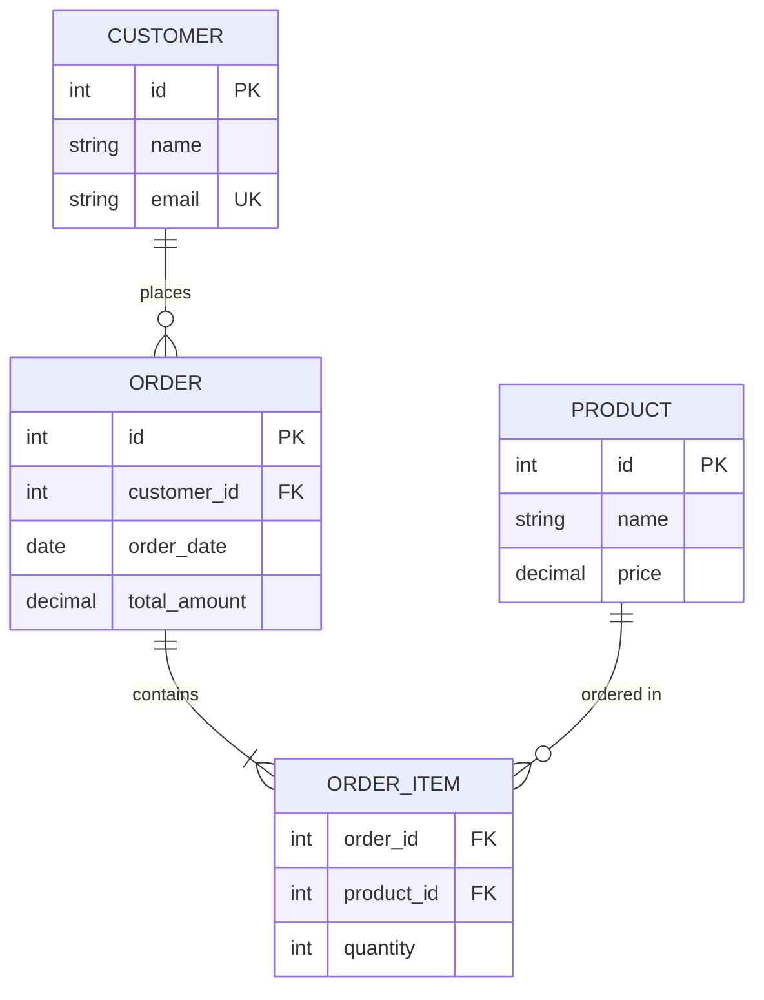
```mermaid
erDiagram
    CUSTOMER {
        int id PK
        string name
        string email UK
    }
    ORDER {
        int id PK
        int customer_id FK
        date order_date
        decimal total_amount
    }
    PRODUCT {
        int id PK
        string name
        decimal price
    }
    ORDER_ITEM {
        int order_id FK
        int product_id FK
        int quantity
    }

    CUSTOMER ||--o{ ORDER : places
    ORDER ||--|{ ORDER_ITEM : contains
    PRODUCT ||--o{ ORDER_ITEM : "ordered in"
```

**Customize by:**
- Add PK (primary key), FK (foreign key), UK (unique key) after field names
- Use common data types: int, string, date, decimal, boolean
- Keep entity names singular and uppercase

---

## 6. Sequence Diagrams

### API Call Flow

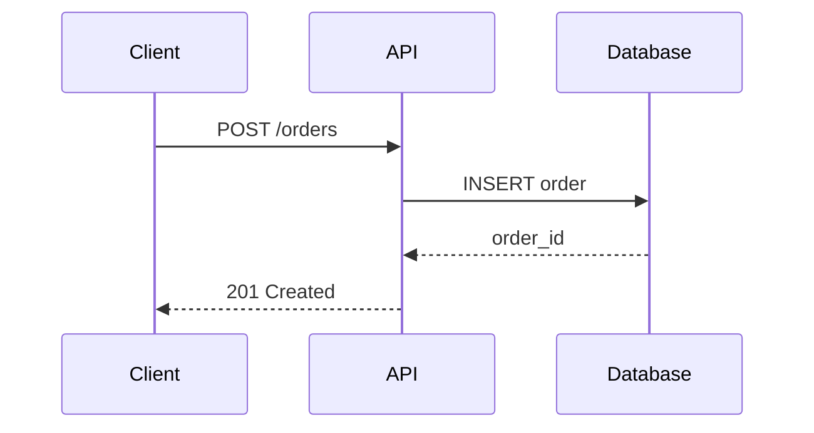
```mermaid
sequenceDiagram
    participant Client
    participant API
    participant Database

    Client->>API: POST /orders
    API->>Database: INSERT order
    Database-->>API: order_id
    API-->>Client: 201 Created
```

**Customize by:**
- `->>` solid arrow (request)
- `-->>` dotted arrow (response)
- Add activation boxes with `activate`/`deactivate`
- Use `Note` for comments

---

### Authentication Flow

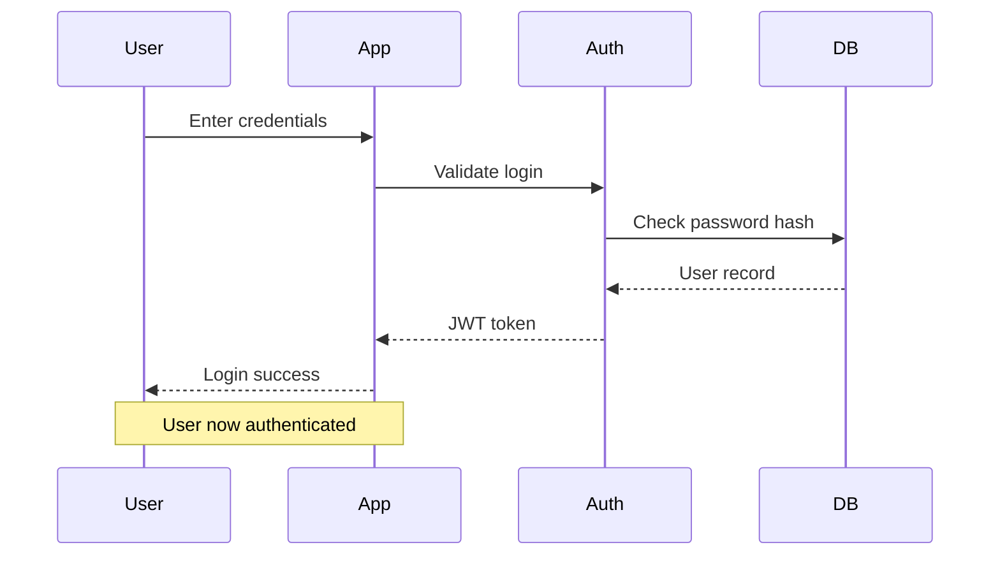
```mermaid
sequenceDiagram
    participant User
    participant App
    participant Auth
    participant DB

    User->>App: Enter credentials
    App->>Auth: Validate login
    Auth->>DB: Check password hash
    DB-->>Auth: User record
    Auth-->>App: JWT token
    App-->>User: Login success

    Note over User,App: User now authenticated
```

**Customize by:**
- Add alt/else blocks for error handling
- Use loop for retries
- Add activation boxes for processing

---

### Sequence with Alt/Else

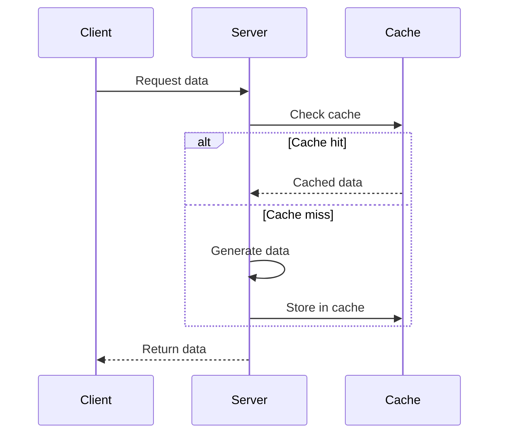
```mermaid
sequenceDiagram
    participant Client
    participant Server
    participant Cache

    Client->>Server: Request data
    Server->>Cache: Check cache

    alt Cache hit
        Cache-->>Server: Cached data
    else Cache miss
        Server->>Server: Generate data
        Server->>Cache: Store in cache
    end

    Server-->>Client: Return data
```

**Customize by:**
- Add more alt branches
- Nest alt blocks
- Use opt for optional steps

---

## 7. State Machines

### Status Transitions

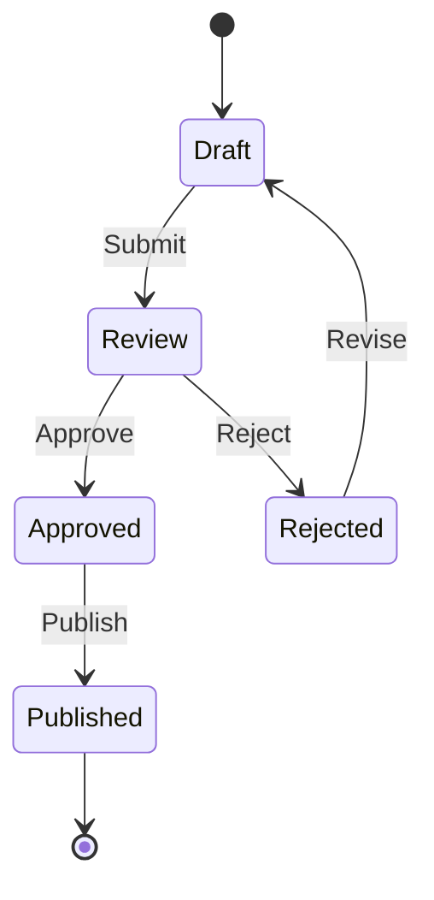
```mermaid
stateDiagram-v2
    [*] --> Draft
    Draft --> Review : Submit
    Review --> Approved : Approve
    Review --> Rejected : Reject
    Rejected --> Draft : Revise
    Approved --> Published : Publish
    Published --> [*]
```

**Customize by:**
- `[*]` for start/end states
- Add transition labels after `:`
- Use meaningful state names

---

### Complex State Machine

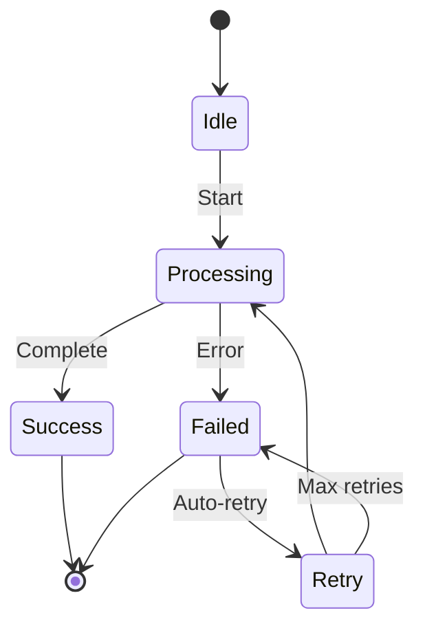
```mermaid
stateDiagram-v2
    [*] --> Idle
    Idle --> Processing : Start
    Processing --> Success : Complete
    Processing --> Failed : Error
    Failed --> Retry : Auto-retry
    Retry --> Processing
    Retry --> Failed : Max retries
    Success --> [*]
    Failed --> [*]
```

**Customize by:**
- Add state descriptions
- Show concurrent states with `--`
- Add notes with `note`

---

## 8. Class Diagrams

### Simple OOP Structure

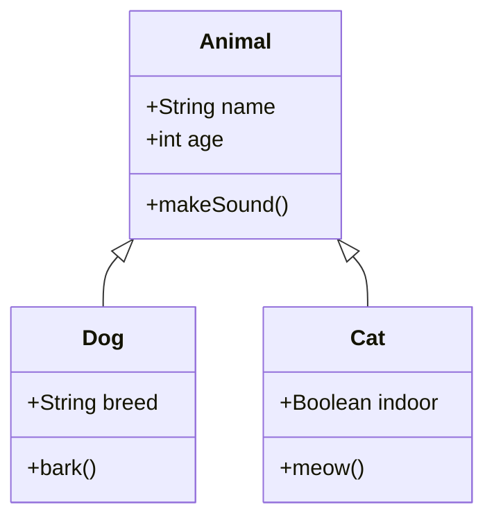
```mermaid
classDiagram
    class Animal {
        +String name
        +int age
        +makeSound()
    }
    class Dog {
        +String breed
        +bark()
    }
    class Cat {
        +Boolean indoor
        +meow()
    }

    Animal <|-- Dog
    Animal <|-- Cat
```

**Customize by:**
- `+` public, `-` private, `#` protected
- `<|--` inheritance
- `*--` composition
- `o--` aggregation
- `-->` association

**Platform notes:** Fully supported. Avoid overly complex hierarchies.

---

### Interface Implementation

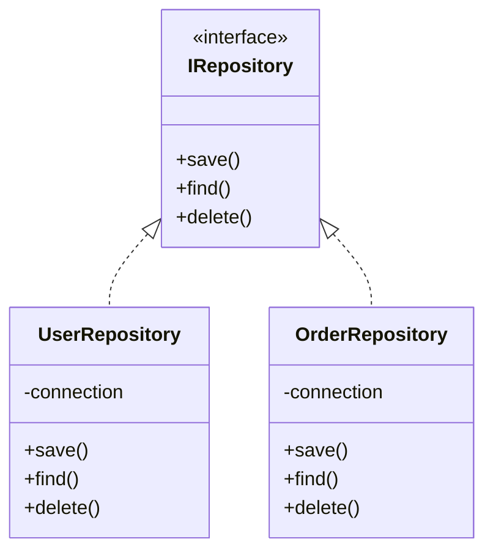
```mermaid
classDiagram
    class IRepository {
        <<interface>>
        +save()
        +find()
        +delete()
    }
    class UserRepository {
        -connection
        +save()
        +find()
        +delete()
    }
    class OrderRepository {
        -connection
        +save()
        +find()
        +delete()
    }

    IRepository <|.. UserRepository
    IRepository <|.. OrderRepository
```

**Customize by:**
- `<<interface>>` for interfaces
- `<|..` for implementation
- Add method parameters: `+save(entity)`

---

## 9. Gantt Charts

### Project Timeline

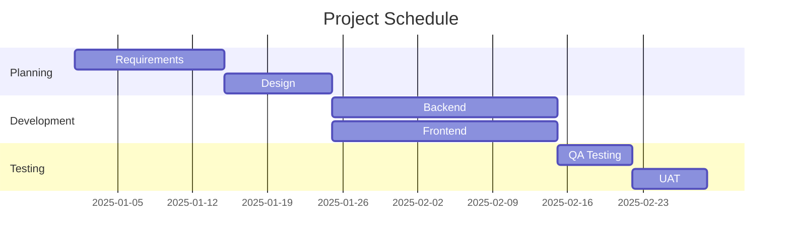
```mermaid
gantt
    title Project Schedule
    dateFormat YYYY-MM-DD

    section Planning
    Requirements    :a1, 2025-01-01, 14d
    Design         :a2, after a1, 10d

    section Development
    Backend        :b1, after a2, 21d
    Frontend       :b2, after a2, 21d

    section Testing
    QA Testing     :c1, after b1, 7d
    UAT            :c2, after c1, 7d
```

**Customize by:**
- dateFormat controls date parsing
- Use `after taskID` for dependencies
- Duration in days: `7d`, weeks: `2w`
- Add milestones with `:milestone`

**Platform notes:** Works well on all platforms. Keep task names short.

---

### Simple Gantt

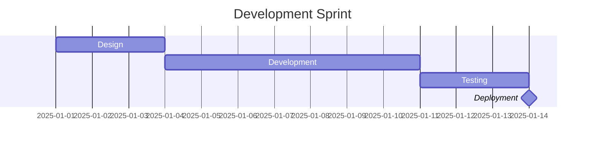
```mermaid
gantt
    title Development Sprint
    dateFormat YYYY-MM-DD

    Design         :2025-01-01, 3d
    Development    :2025-01-04, 7d
    Testing        :2025-01-11, 3d
    Deployment     :milestone, 2025-01-14, 0d
```

**Customize by:**
- Absolute dates or relative (after)
- Add sections for grouping
- Use milestone for key dates

---

## 10. Mindmaps

### Hierarchical Brainstorm

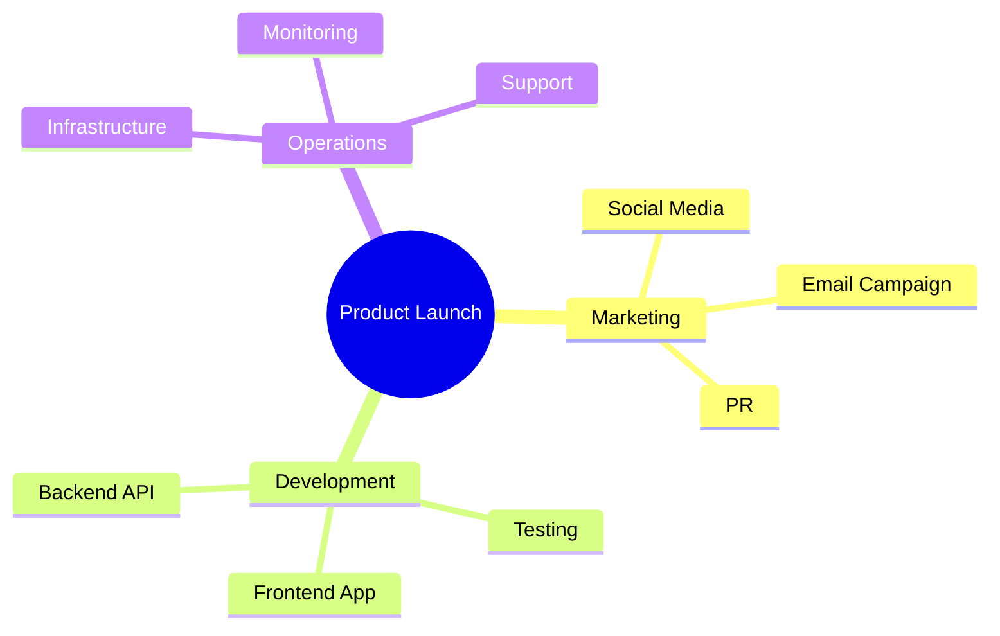
```mermaid
mindmap
  root((Product Launch))
    Marketing
      Social Media
      Email Campaign
      PR
    Development
      Backend API
      Frontend App
      Testing
    Operations
      Infrastructure
      Monitoring
      Support
```

**Customize by:**
- `root((text))` for center node
- Indent for hierarchy
- Keep 2-3 levels max for clarity

**Platform notes:** Added in GitLab 16.0. May not render in older viewers.

---

### Simple Concept Map

```mermaid
mindmap
  root((Learning Strategy))
    Online Courses
      Video Tutorials
      Interactive Labs
    Books
      Technical Books
      Case Studies
    Practice
      Personal Projects
      Code Reviews
```

**Customize by:**
- Focus on clear hierarchy
- Use consistent naming
- Avoid deep nesting (max 3-4 levels)

---

## General Tips

1. **Test in Live Editor:** Use [mermaid.live](https://mermaid.live/) before committing
2. **Direction Matters:** TB fits narrow screens, LR fits wide dashboards
3. **Node Limits:** Keep diagrams under 20 nodes for readability
4. **Naming:** Use clear, consistent labels (verbs for actions, nouns for entities)
5. **Colors:** Define custom styles with classDef for branded diagrams
6. **Platform Testing:** Check rendering in target platform (GitHub/GitLab/VS Code)

## Common Issues

- **"end" keyword:** Wrap in quotes/brackets: `[end]`, `(end)`, `"end"`
- **Special characters:** Escape with quotes: `["Label with: colon"]`
- **Long labels:** Break into multiple nodes or use subgraphs
- **Git graphs:** Inconsistent across platforms, avoid for critical docs

## References

- [Mermaid.js Official Docs](https://mermaid.js.org/)
- [Mermaid Live Editor](https://mermaid.live/)
- [GitLab Mermaid Guide](https://handbook.gitlab.com/handbook/tools-and-tips/mermaid/)
- [GitHub Mermaid Support](https://github.blog/2022-02-14-include-diagrams-markdown-files-mermaid/)
