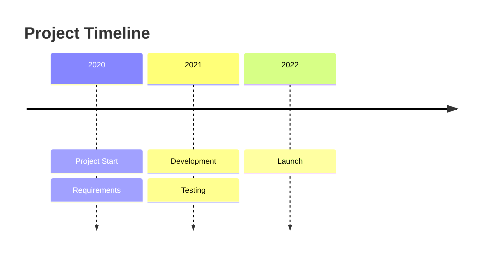
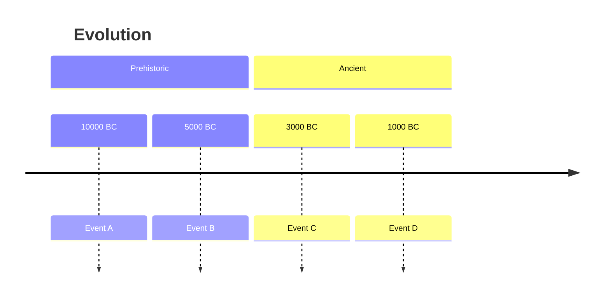
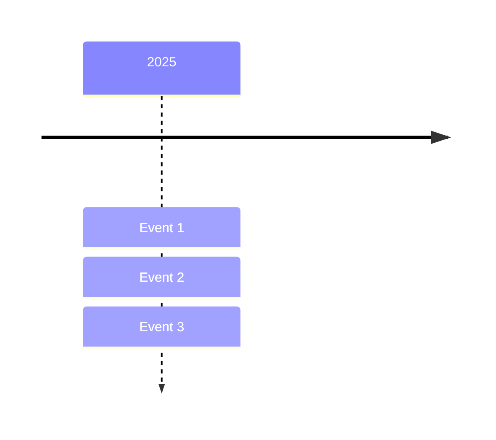
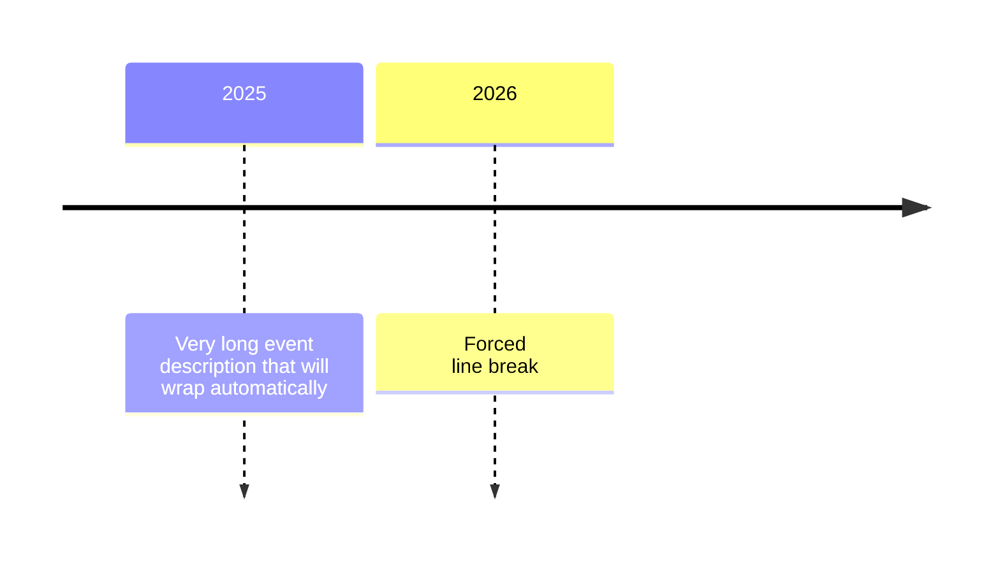

# Timeline Diagrams

**Keyword:** `timeline`

**Purpose:** Chronological event visualization.

## Basic Syntax



## Sections/Ages



## Multiple Events per Period

**Inline:**


**Vertical:**


## Text Wrapping



## Color Customization

**Multi-color (default):**
Each time period gets unique color.

**Disable multi-color:**
```yaml
---
config:
  timeline:
    disableMulticolor: true
---
timeline
    2020 : Event A
    2021 : Event B
```

**Custom colors:**
```yaml
---
config:
  themeVariables:
    cScale0: '#ff0000'
    cScale1: '#00ff00'
    cScale2: '#0000ff'
    cScaleLabel0: '#ffffff'
---
timeline
    Period 1 : Event
```

## Key Limitations (Experimental)
- Syntax may change in future releases
- Icon integration experimental
- Limited formatting options

## When to Use
- Historical timelines
- Project milestones
- Product roadmaps
- Event chronologies
