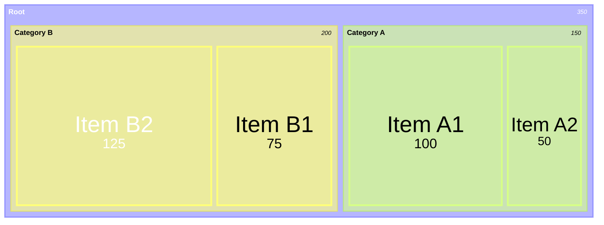
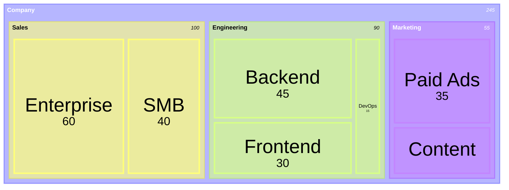
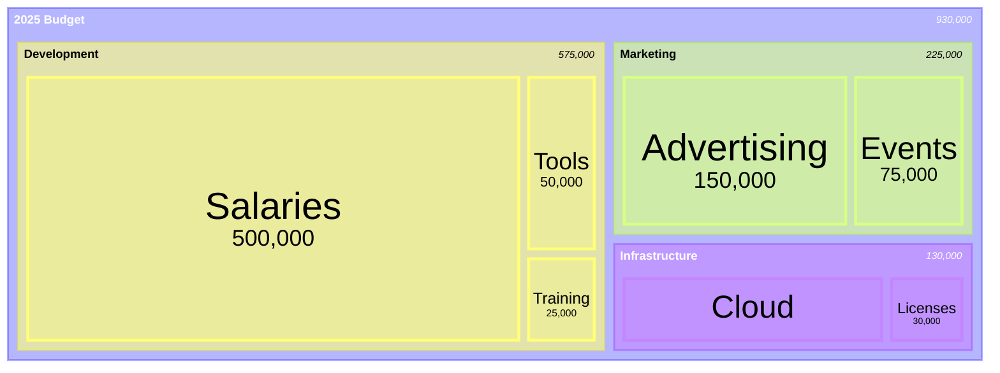

# Treemap Diagrams

**Keyword:** `treemap-beta`

**Purpose:** Hierarchical data as nested rectangles.

## Table of Contents
- [Basic Syntax](#basic-syntax)
- [Node Types](#node-types)
- [Hierarchy with Indentation](#hierarchy-with-indentation)
- [Styling](#styling)
- [Configuration](#configuration)
- [Value Formatting](#value-formatting)
- [Example: Budget Allocation](#example-budget-allocation)
- [Key Limitations](#key-limitations)
- [When to Use](#when-to-use)

## Basic Syntax



## Node Types

**Sections (parent nodes):**
```mermaid
"Section Name"
```

**Leaf nodes (with values):**
```mermaid
"Leaf Name": value
```

## Hierarchy with Indentation



## Styling

**Class-based:**


## Configuration

```yaml
---
config:
  treemap:
    useMaxWidth: true
    padding: 10
    showValues: true
    valueFontSize: 12
    labelFontSize: 14
    valueFormat: ','
---
treemap-beta
"Data"
    "A": 1000
    "B": 2500
```

**Options:**
- `useMaxWidth` - Scale to 100% width (default: true)
- `padding` - Space between nodes (default: 10)
- `showValues` - Display values (default: true)
- `valueFontSize` - Value text size (default: 12)
- `labelFontSize` - Label text size (default: 14)
- `valueFormat` - D3 format specifier (default: ',')

## Value Formatting

**D3 Specifiers:**
```yaml
valueFormat: '$,.2f'  # $1,234.56
valueFormat: '.1%'    # 45.6%
valueFormat: ',.0f'   # 1,234
```

**Common formats:**
- `,` - Thousands separator
- `$` - Dollar prefix
- `.2f` - Two decimals
- `.1%` - Percentage with one decimal

## Example: Budget Allocation



## Key Limitations
- Experimental feature
- Limited visual customization
- Best for 2-4 hierarchy levels

## When to Use
- Budget visualization
- Disk usage analysis
- Portfolio allocation
- Organizational structure
