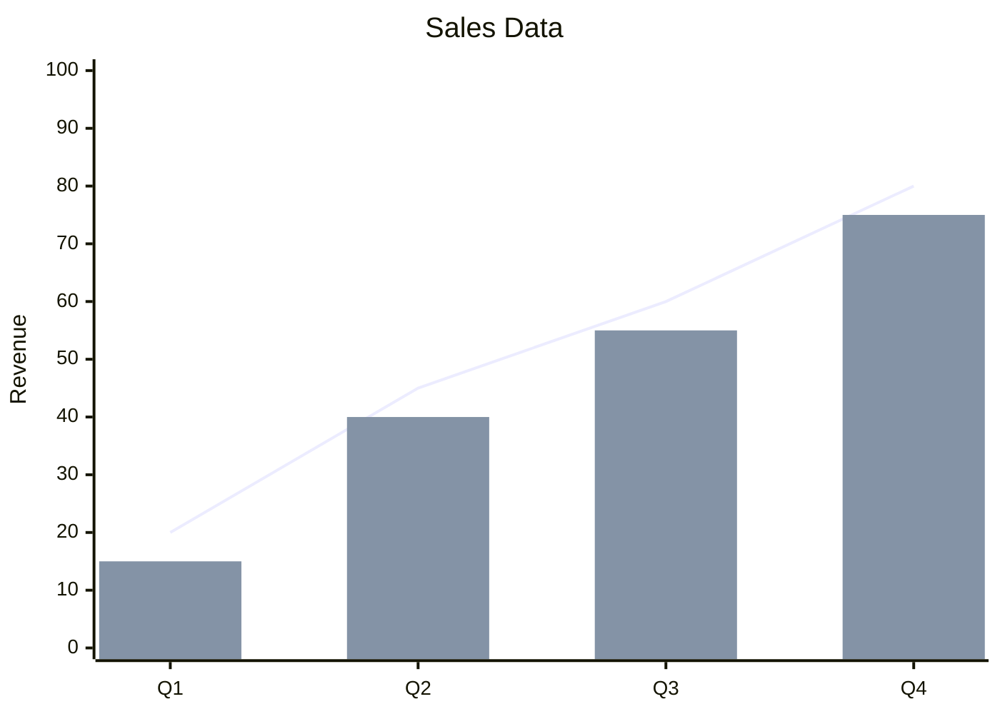
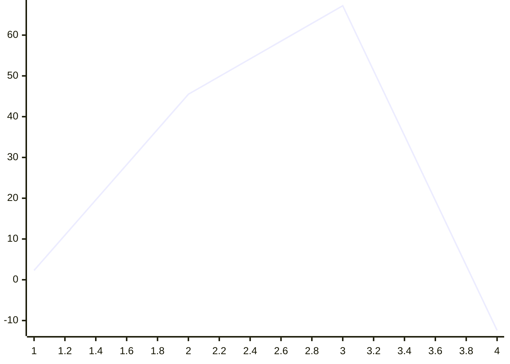
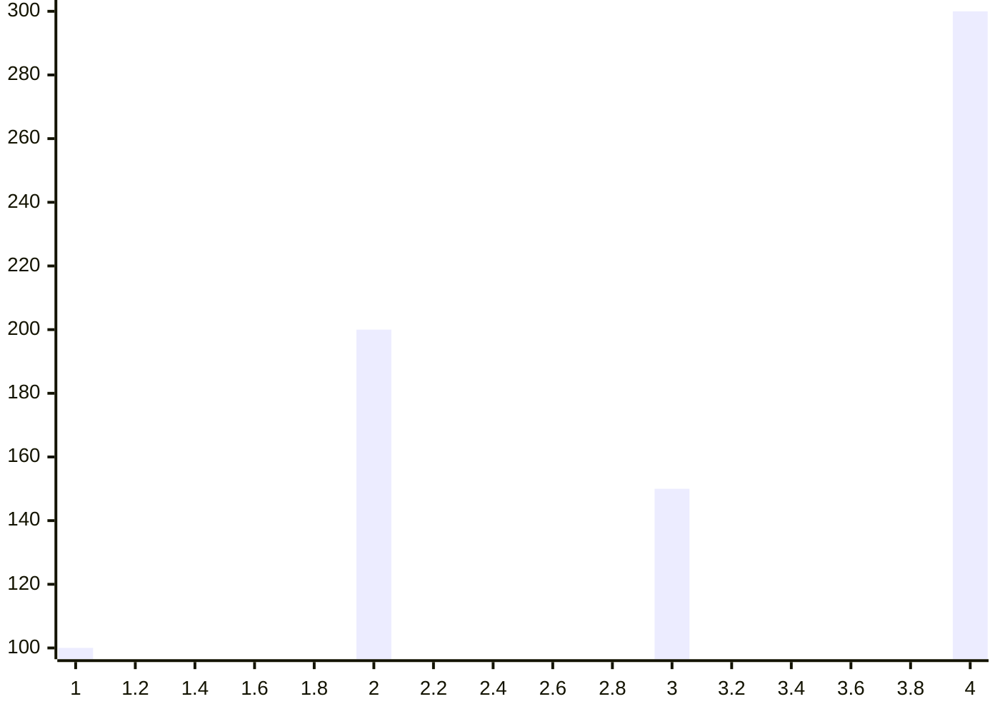
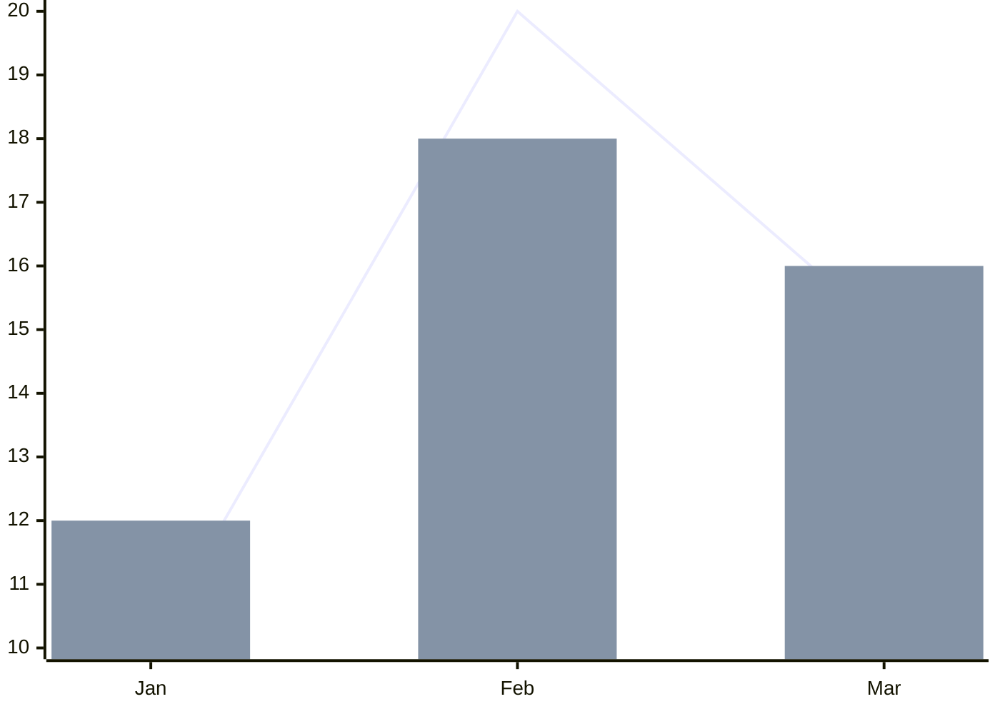
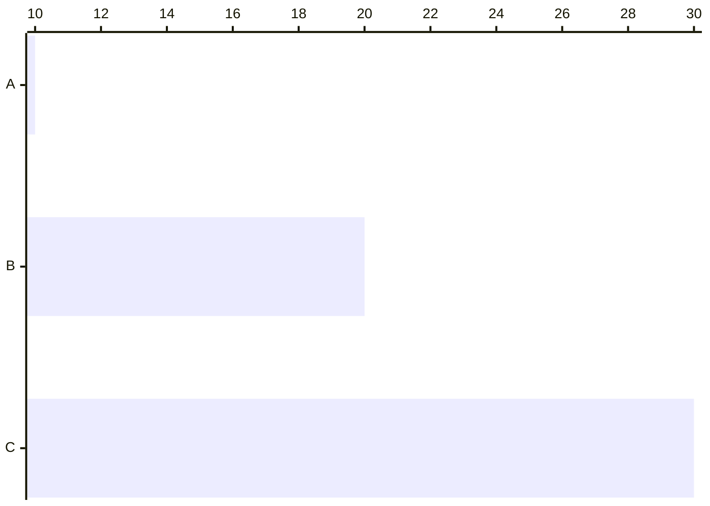

# XY Charts

**Keyword:** `xychart-beta`

**Purpose:** Plot data on X/Y axes (line and bar charts).

## Basic Syntax



## Chart Types

**Line chart:**


**Bar chart:**


**Combined:**


## Axis Configuration

**X-axis (categorical):**
```mermaid
x-axis "Month" [Jan, "Feb 2025", Mar]
```

**X-axis (numeric range):**
```mermaid
x-axis "Time (s)" 0 --> 100
```

**Y-axis (always numeric):**
```mermaid
y-axis "Temperature (C)" -20 --> 40
```

**Auto-range:**
```mermaid
y-axis "Auto-scaled"
```

## Orientation

**Horizontal:**


## Title

```mermaid
xychart-beta
    title "Chart Title"
```

Multi-word titles require quotes.

## Key Limitations
- Only line and bar charts supported
- Y-axis cannot have categorical values (numeric only)
- X-axis supports categorical OR numeric (not mixed)
- Limited advanced charting features

## When to Use
- Simple data visualization
- Embedded charts in documentation
- Quick trend analysis
- Comparative bar charts
