# ZenUML (Alternative Sequence Diagrams)

**Keyword:** `zenuml`

**Purpose:** Programming-like syntax for sequence diagrams.

## Table of Contents
- [Basic Syntax](#basic-syntax)
- [Message Types](#message-types)
- [Control Flow](#control-flow)
- [Participants](#participants)
- [Comments](#comments)
- [Key Differences from Standard Sequence Diagrams](#key-differences-from-standard-sequence-diagrams)
- [Key Limitations](#key-limitations)
- [When to Use](#when-to-use)

## Basic Syntax

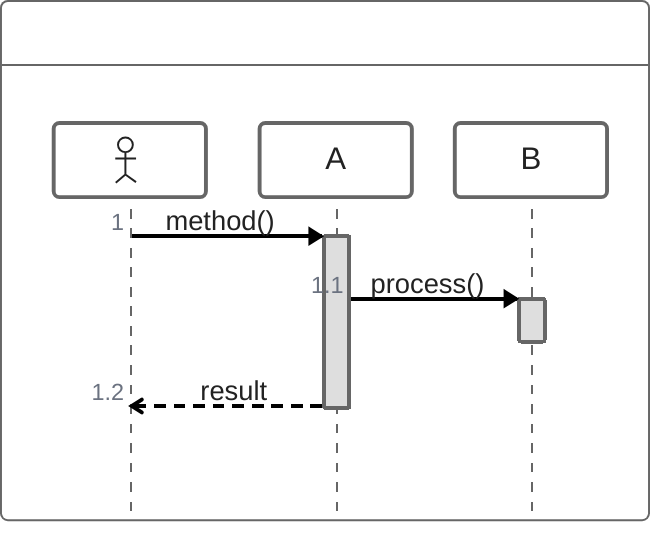

## Message Types

**Sync (blocking):**
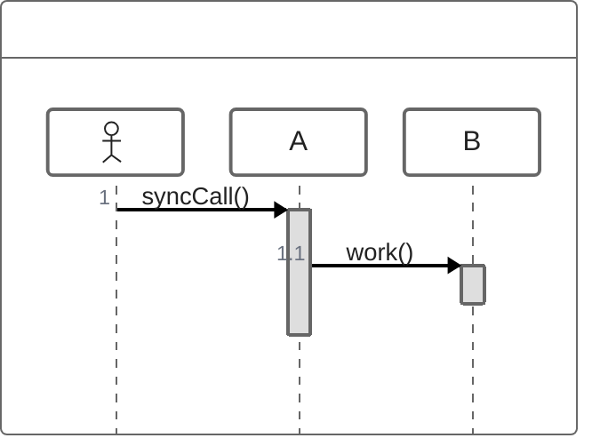

**Async (non-blocking):**
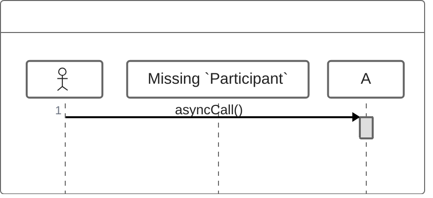

**Creation:**
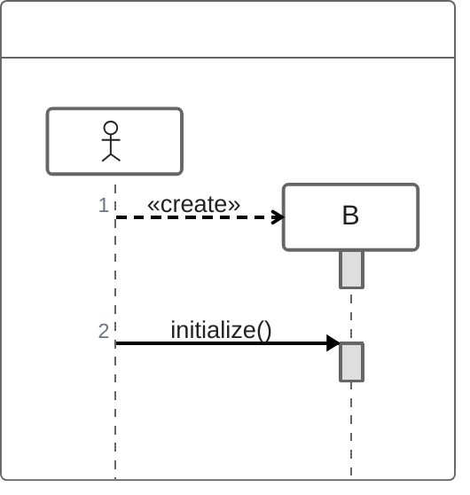

**Reply:**
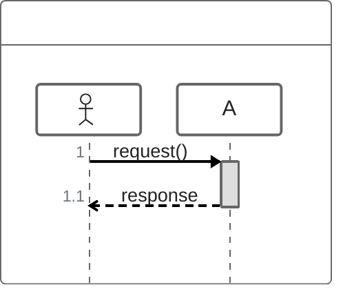

## Control Flow

**Loops:**
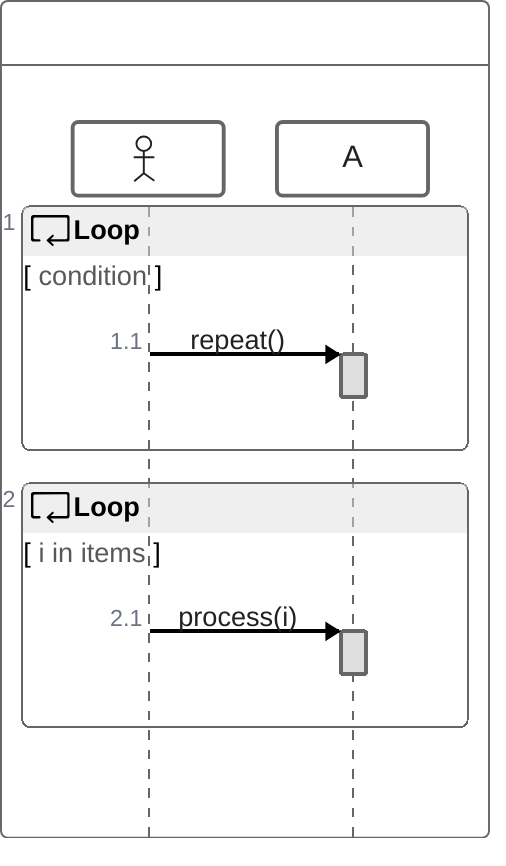

**Conditionals:**
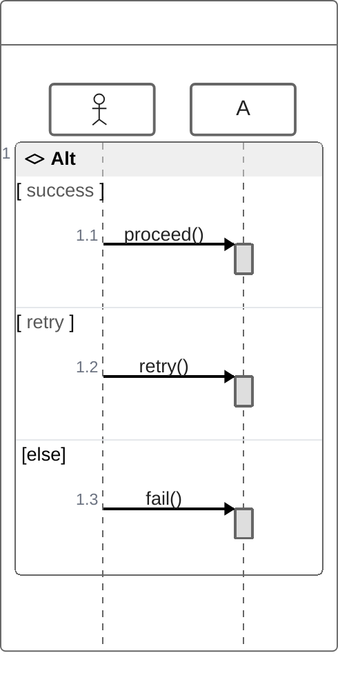

**Parallel:**
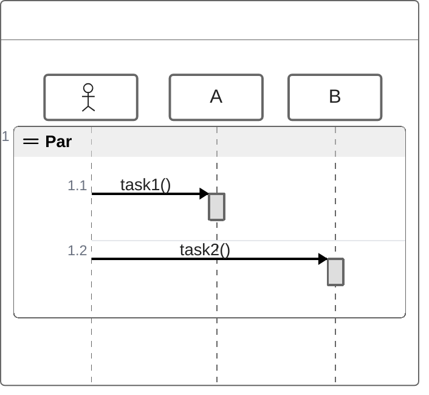

**Optional:**
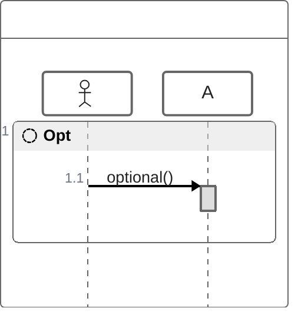

**Exception handling:**
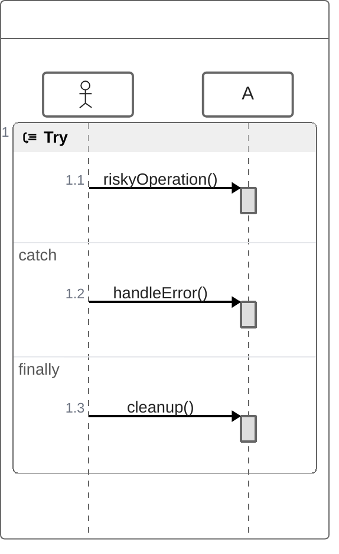

## Participants

**Annotators:**
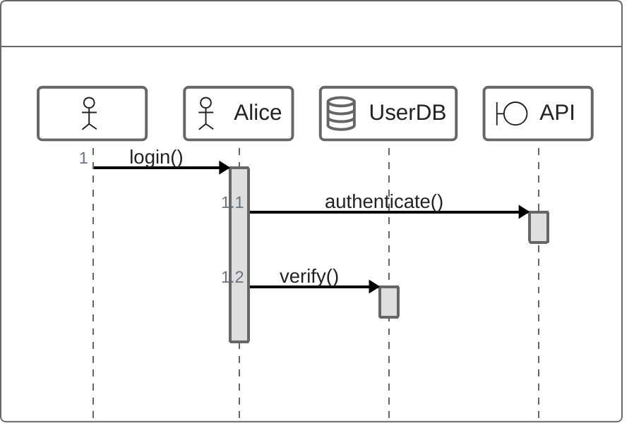

**Aliases:**
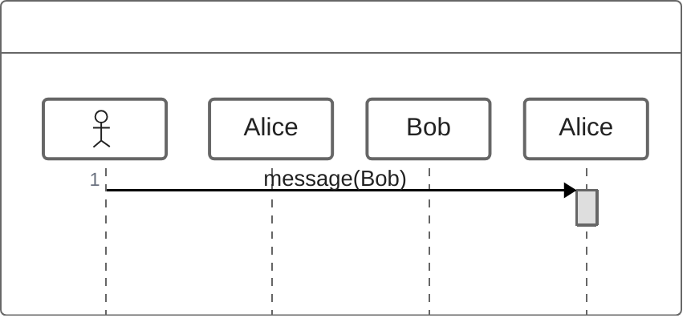

## Comments

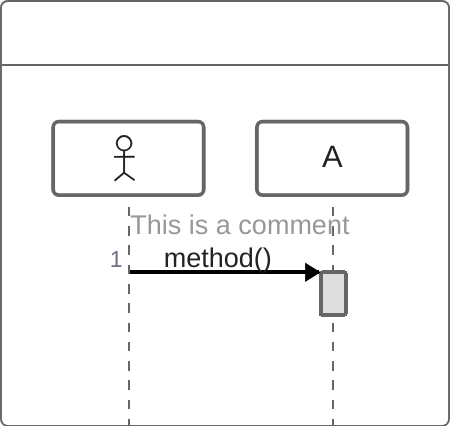

**Supports markdown in comments.**

## Key Differences from Standard Sequence Diagrams

- Programming-like syntax (curly braces)
- Implicit participant declaration
- Natural nesting with `{}`
- Different control flow syntax
- `new` keyword for creation

## Key Limitations (Experimental)
- Uses lazy loading & async rendering
- Syntax may change
- Limited compared to mature sequence diagram

## When to Use
- Developers preferring code-like syntax
- Complex nested interactions
- Programming language flow documentation
- Alternative to standard sequence diagrams
