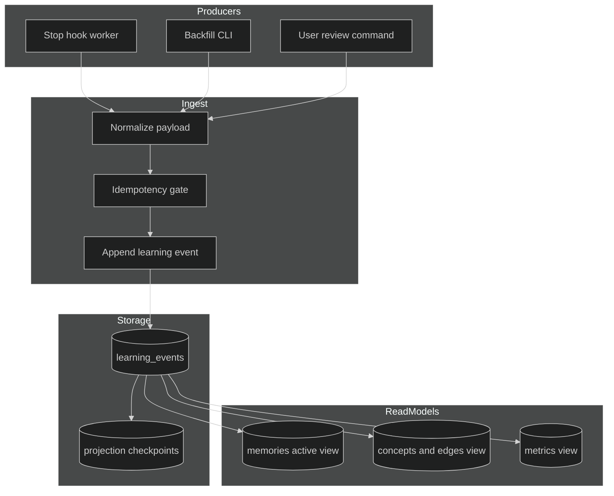
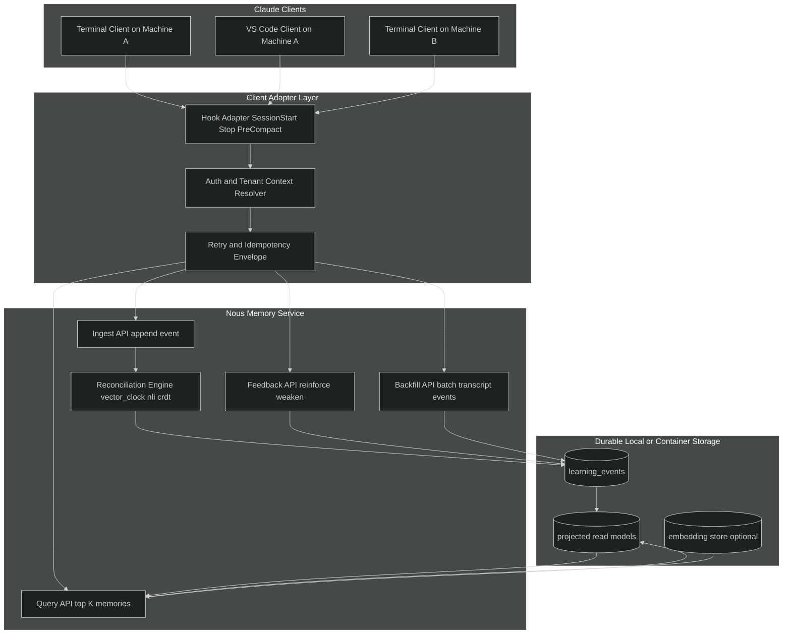

# Nous v2 Associative Memory: Peer Review and Recommendations

**Date**: February 2026  
**Primary proposal reviewed**: `docs/roadmap/nous-v2-associative-memory.md`

## Scope

This review evaluates the v2 proposal against the practical runtime mechanics of Claude Code hooks and session processing, with a focus on:

- Portability (local-first, minimal mandatory dependencies)
- Long-term scaling across many projects
- Correctness under concurrent and delayed ingestion paths
- Operability (replay, audit, recovery, migration)

Explicit product decisions from the owner (February 12, 2026):

1. Advanced reconciliation is **required in v1** (not deferred).
2. The system should run locally but expose a clean service boundary so containerized infrastructure can serve multiple clients and mediums (terminal and VS Code, machine A and machine B).
3. Event history in `learning_events` is retained indefinitely; pruning applies only to projections/read models.

Skill usage notes:

- `markdown-mermaid` used for architecture visualization guidance.
- `@aeo-claude` was requested but is not installed as a global skill in this session; review used local `aeo-claude` plugin skill/docs as fallback sources.

## Executive Verdict

The proposed direction is strong and the architectural center of gravity is correct:

1. Event sourcing is justified for this system.
2. SQLite plus projected read models is the right portability anchor.
3. Dual-path ingestion (live stop-hook and historical backfill) is a major strategic advantage.

Main challenge: v1 now requires advanced reconciliation (vector clocks, CRDT merge behavior, contradiction handling), so delivery risk must be managed through strict contracts and testable interfaces rather than scope reduction.

Recommendation: keep advanced reconciliation in v1, but isolate it behind explicit interfaces and phased hardening so correctness is preserved while shipping.

## Claude Eventing Mechanics and Why Event Sourcing Fits

Evidence from this repository indicates a hook/event runtime with asynchronous and partially ordered behavior:

- Hooks are event-driven and ephemeral (`Stop`, `SubagentStop`, `UserPromptSubmit`, `PreCompact`, etc.) in `aeo-claude` SDK references.
- Hook guidance explicitly prioritizes low-latency handlers ("keep hooks lightweight and fast"), which discourages heavy inline mutation logic.
- `aeo-nous` `Stop` handling spawns detached extraction workers and returns quickly; write completion happens later (`aeo-nous/hooks/nous.py`).
- Hook payloads provide `session_id`, `transcript_path`, and `cwd`, enabling durable event metadata capture.
- Historical backfill introduces a second producer path that emits logically equivalent learnings at a different transaction time.

This is exactly the shape where append-only events plus replayable projections provide safer semantics than direct CRUD updates.



## Confirmations

The following proposal decisions should be preserved:

1. **SQLite first**: strong choice for a portable single-file store with FTS5 and transactional guarantees.
2. **Bi-temporal fields**: useful for stale-fact filtering and historical reasoning (`transaction_time` vs validity window).
3. **Event log plus materialized projection**: best fit for corrections, replay, and backfill.
4. **Hybrid retrieval direction**: keyword plus concept plus graph plus reinforcement is sound.
5. **Historical ingestion as first-class path**: solves cold start and increases long-term value.
6. **Reinforcement/access logging loop**: practical mechanism to improve injection relevance over time.

## Challenges and Corrections

### A. Event contract inconsistency

The document mixes event names (`Extracted` vs `LearningExtracted`; `Contradicted` vs `LearningContradicted`). Projection logic, reconciliation logic, and backfill examples are not yet one canonical enum.

Recommendation:

- Define one authoritative event taxonomy and versioned schema.
- Reject unknown event types at ingestion.

### B. Deterministic projection ordering

Projection pseudocode orders by `transaction_time`. Equal timestamps can produce non-determinism.

Recommendation:

- Order replay by `event_id` (monotonic primary key), not timestamp.
- Treat timestamps as data, not ordering authority.

### C. Idempotency and duplicate suppression

Dual-path ingestion and retries imply at-least-once delivery. A unique idempotency key contract is needed.

Recommendation:

- Add `idempotency_key` unique index.
- Standard key format: `sha256(source + session_id + transcript_chunk + event_type + canonical_payload)`.

### D. Undefined/partial fields in examples

Backfill pseudocode references `chunk_index` without defining it. The schema comparison table references `scope` but the core schema diagram omits it.

Recommendation:

- Resolve undefined fields in the design doc before implementation.
- Keep schema snippets and narrative tables synchronized.

### E. Retrieval complexity sequencing

Current proposal introduces many axes at once (FTS5, concepts, edges, vectors, temporal, reinforcement, recurrence, vector clocks, NLI, CRDT merges).

Recommendation:

- Phase delivery by risk and dependency while keeping advanced reconciliation in v1 scope.
- Build advanced conflict logic as a required module with clear fallback behavior when NLI/classifier confidence is low (defer action, do not mutate truth state).

### F. Portability risk from optional dependencies

`sqlite-vec`, local embedding models, and cloud embeddings are useful but should remain optional for first deployability.

Recommendation:

- Baseline engine: local event store + projectors + reconciliation pipeline.
- Keep embedding provider pluggable (local or cloud) and keep runtime transport pluggable (embedded process, local container, remote service).

## Recommended Unified Architecture (Portable First)

### Core (mandatory)

1. `learning_events` append-only store
2. Incremental projectors (`memories`, `concepts_edges`, `metrics`)
3. FTS5 plus concept Jaccard retrieval
4. Reinforcement/access logging
5. Backfill CLI with idempotent ingestion
6. Temporal reconciliation with vector-clock causality checks
7. Contradiction handling with NLI classifier and explicit confidence policy
8. CRDT-aligned merge policy for concept tags and conflicting single-valued facts

### Optional extensions

1. Dense vectors via `sqlite-vec`
2. Community detection and advanced process mining
3. Cloud embedding provider for higher-quality semantic similarity

## Agent-Service Interface Architecture (Required for v1)

To support local execution and containerized multi-client deployments, define a stable interface between Claude-side agents/hooks and the memory service.



### Required Interface Contracts

1. **Identity envelope** on every request:
   - `tenant_id`, `workspace_id`, `project_id`, `session_id`, `client_id`, `event_source`.
2. **Idempotency envelope** on every write:
   - `idempotency_key`, `occurred_at`, `schema_version`.
3. **Query contract** for injection:
   - input: context fingerprint, active concepts, top-k, project scope.
   - output: ranked memories plus rationale fields (score components, contradiction status).
4. **Feedback contract** for reinforcement:
   - `memory_id`, `signal_type` (`useful`, `corrected`, `ignored`), `session_outcome`.
5. **Transport profile**:
   - local mode: unix domain socket or localhost HTTP.
   - container/shared mode: mTLS or signed token auth with tenant isolation.

### Deployment Modes

1. **Embedded local**: service runs in-process with Claude hook adapter.
2. **Local container sidecar**: one service per developer machine, shared by terminal and VS Code clients.
3. **Shared infrastructure**: centralized service with strict tenant/workspace isolation for multiple clients in parallel.

### Multi-Client Correctness Rules

1. At-least-once delivery assumed from clients.
2. Service guarantees effectively-once mutation through idempotency keys.
3. Projection ordering uses `event_id` only.
4. Conflicts are resolved by reconciliation policy, not client-side mutation.
5. Cross-device session events remain auditable by source and client identity.

### Retention Policy (Required for v1)

1. `learning_events` is append-only and retained indefinitely.
2. Projection/read-model tables may be pruned, compacted, or rebuilt from event history.
3. Any storage-management job must preserve replayability and auditability of the full event stream.
4. Retention configuration must never delete immutable event records unless explicitly exported and archived with verifiable integrity.

## Minimal Event Schema Recommendation

```sql
CREATE TABLE learning_events (
    event_id INTEGER PRIMARY KEY AUTOINCREMENT,
    event_uuid TEXT NOT NULL UNIQUE,
    learning_id TEXT NOT NULL,
    event_type TEXT NOT NULL,
    transaction_time TEXT NOT NULL,
    valid_from TEXT,
    valid_until TEXT,
    session_id TEXT,
    project_id TEXT NOT NULL,
    source TEXT NOT NULL,
    idempotency_key TEXT NOT NULL UNIQUE,
    schema_version INTEGER NOT NULL,
    payload_json TEXT NOT NULL,
    parent_event_id INTEGER,
    FOREIGN KEY(parent_event_id) REFERENCES learning_events(event_id)
);
```

Also add:

1. `projection_checkpoints(projector_name, last_event_id)` for incremental replay.
2. `event_type_registry` (or code enum) to enforce allowed types.

## Delivery Plan (Adjusted)

1. **P0 Correctness and migration safety**
   - Canonical event contract
   - Interface contract for agent-to-service API
   - Idempotency keys
   - Deterministic replay
   - Dual-write JSONL plus SQLite transition

2. **P1 Local retrieval and required reconciliation v1**
   - Concept extraction and FTS5 ranking
   - Reinforcement plus recency plus temporal scoring
   - Vector-clock causality checks
   - NLI contradiction classification with confidence policy
   - CRDT merge rules for conflicting updates
   - Injection quality metrics (`precision_at_k`, recurrence rate)

3. **P2 Multi-client and containerization hardening**
   - Adapter support for terminal and VS Code clients
   - Local sidecar container deployment profile
   - Shared service tenancy and auth hardening
   - Observability and SLOs for query and ingest latency

4. **P3 Scale optimization**
   - Optional vectors (`sqlite-vec`)
   - Community detection
   - Cross-project global layer policy with tenant controls
   - Suggested-target automation

## Acceptance Criteria for the Intended Goal

For a "portable local skill with ongoing learning across projects," success should mean:

1. New install can backfill 90 days of sessions without duplicate events.
2. Replay from empty projections rebuilds the same active memory state deterministically.
3. Injection remains fast and useful at 1k to 10k memories.
4. Advanced reconciliation is active in v1: causality, contradiction detection, and merge policy are all enforced.
5. Baseline mode works locally with no mandatory cloud memory infrastructure.
6. Sidecar container mode supports multiple local clients on the same machine.
7. Shared service mode supports multiple machines and client mediums with tenant isolation.
8. Optional components (vectors, cloud embeddings) can be enabled without schema redesign.
9. Conflicts and corrections remain auditable end-to-end through event history.
10. Event history is retained indefinitely while projection/read-model pruning remains safe and reversible via replay.

## Final Position

Proceed with the unified architecture. The proposal is directionally right and technically defensible for the stated goal. The key to successful execution is strict sequencing:

1. lock the event contract,
2. lock the agent-to-service interface contract,
3. ship deterministic local-first core with required reconciliation in v1,
4. then scale via containerized multi-client deployment modes and performance tuning.
