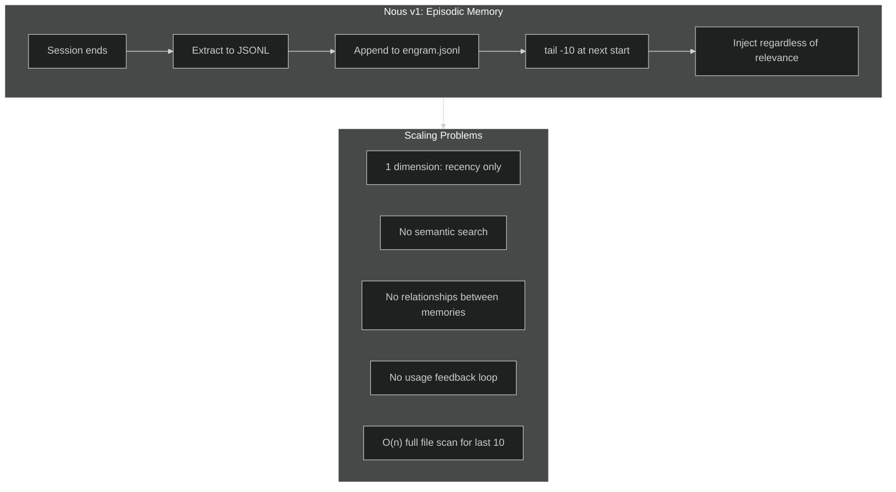
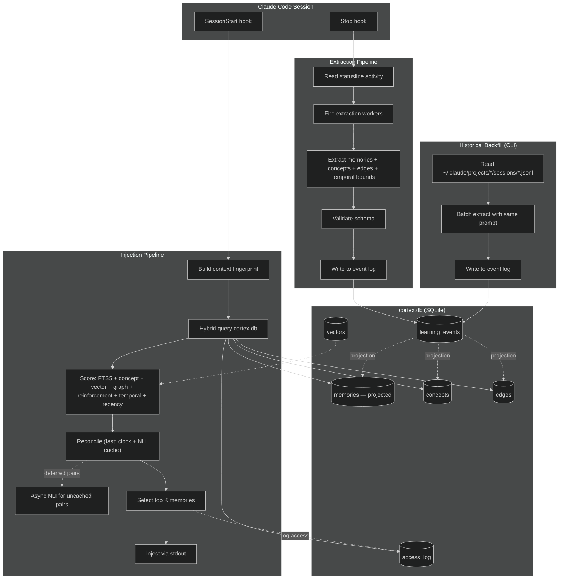
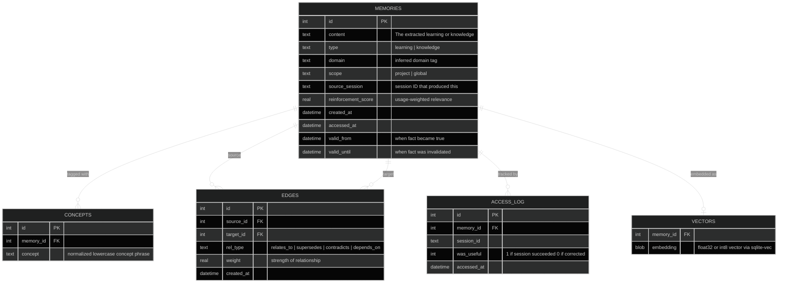
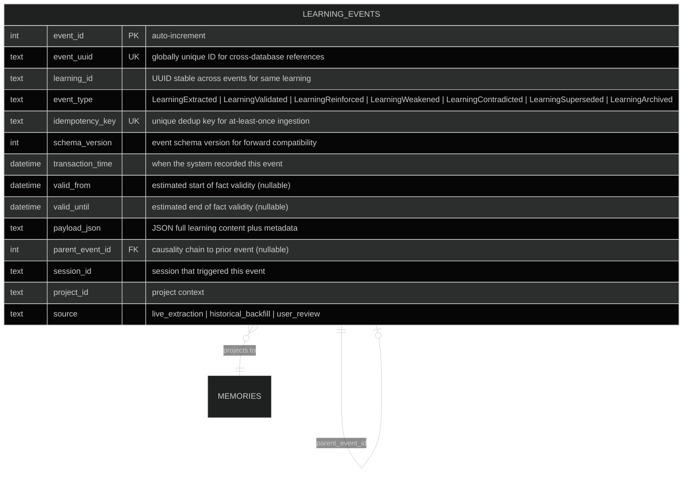
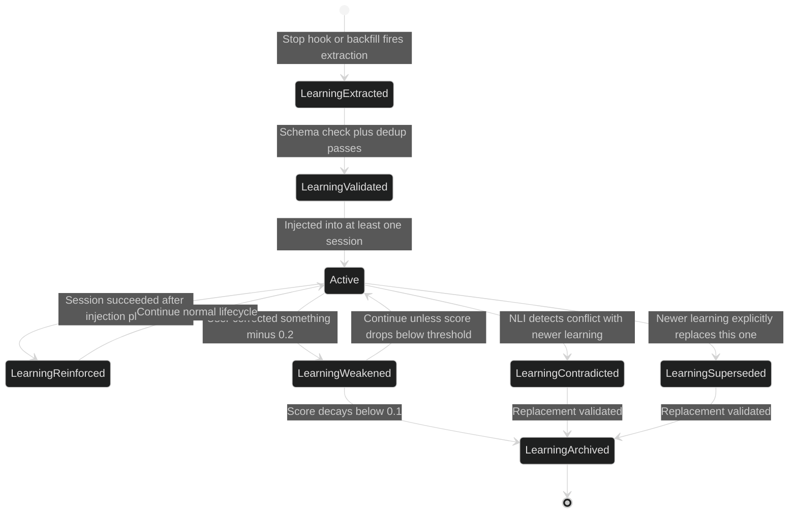
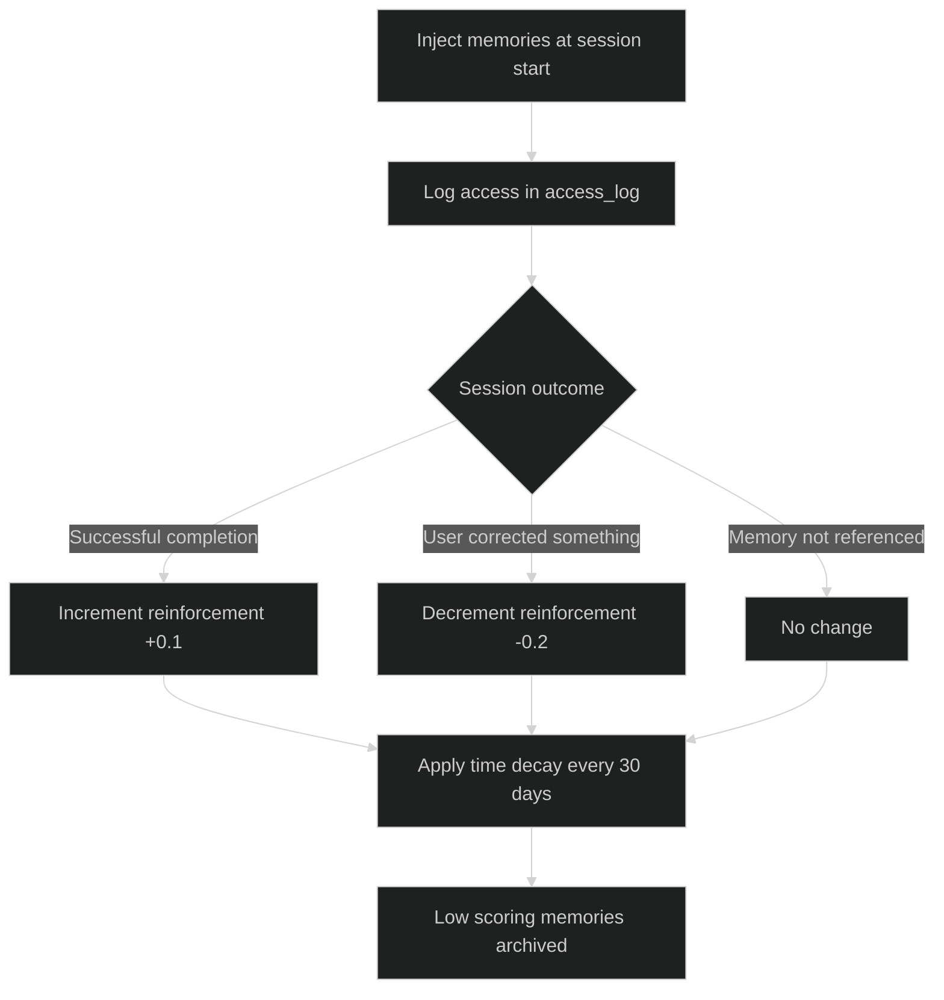
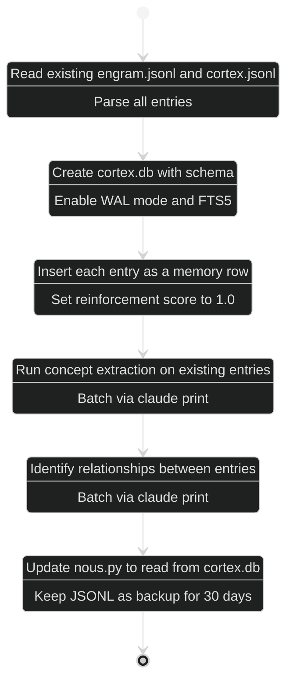
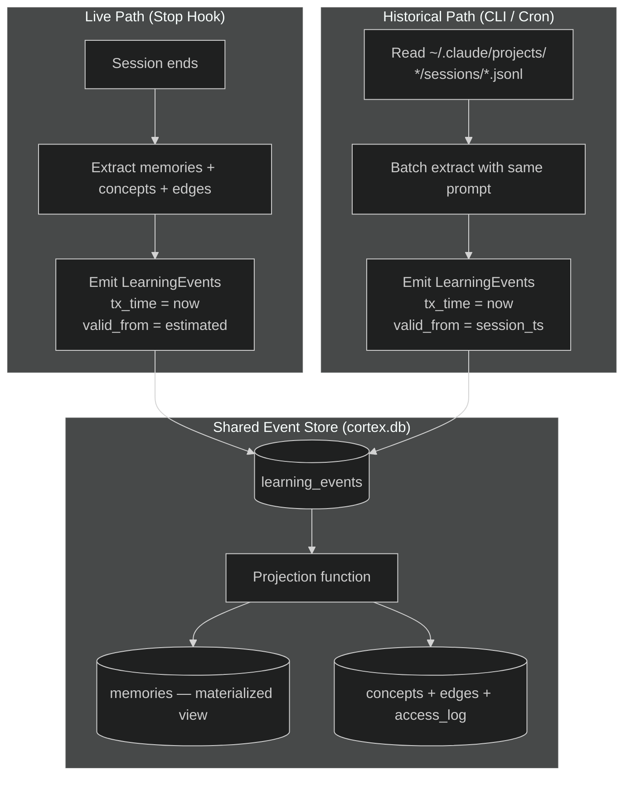
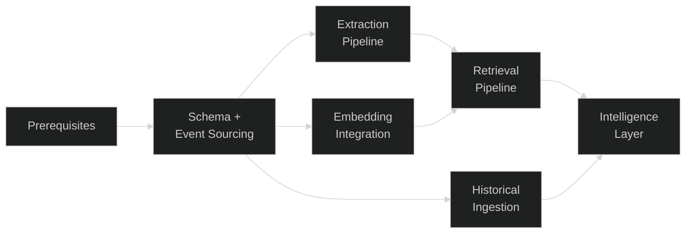
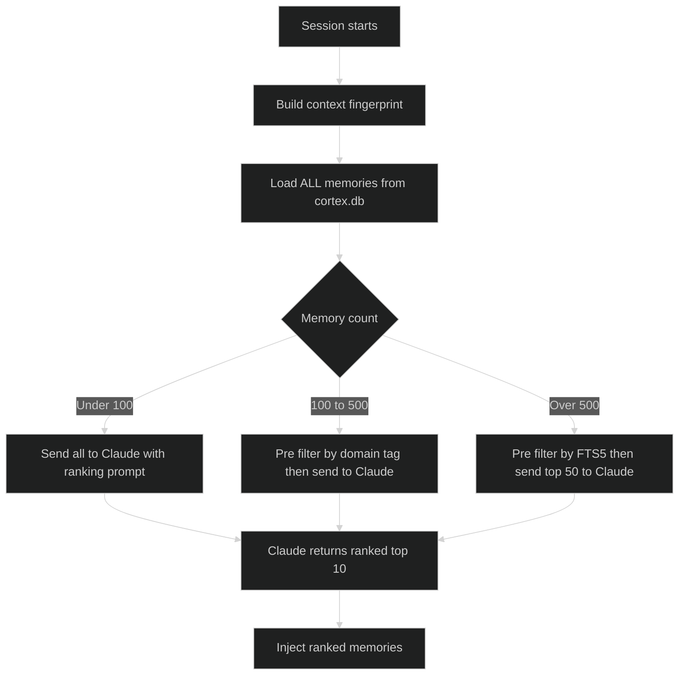

# Nous v2: Associative Memory Architecture

**Date**: February 2026
**Version**: 0.2.0 (proposed)
**Predecessor**: [nous-architecture-review.md](nous-architecture-review.md) (v1 whitepaper)

---

## Executive Summary

Nous v1 solved compaction-induced memory loss with a parallel extraction pipeline: structured learnings and knowledge extracted from sessions, persisted as JSONL, injected on next start. It works. But it stores memories as a flat, time-ordered log and retrieves by recency alone. This is **episodic memory** — it remembers *what happened recently*, not *what's relevant to what I'm doing now*.

This document proposes the evolution to **Associative Memory**: retrieval by content, context, and connection rather than by timestamp. The architecture replaces JSONL with SQLite, adds concept-tagged semantic search, introduces a lightweight knowledge graph via edge tables, implements reinforcement scoring so memories that prove useful rise to the top, and introduces a **bi-temporal event-sourced model** that tracks both when facts were true and when the system learned about them — enabling historical session ingestion, cross-session contradiction detection, and retroactive corrections.

The key insights from current research (MAGMA, Graphiti, HybridRAG, Helland): the industry is converging on **multi-dimensional hybrid retrieval** — combining keyword search, vector similarity, graph traversal, temporal weighting, and bi-temporal validity. Independent agent sessions are temporal islands that produce knowledge asynchronously; reconciliation through immutable, timestamped events is the path to coherent long-term memory. We adapt these patterns for an embedded, serverless context with zero mandatory external dependencies.

**Naming**: We call this pattern **Associative Memory** rather than "GraphRAG" because:
- It is not RAG (no external document retrieval — it retrieves from its own extracted memories)
- The neuroscience parallel is exact: the transition from episodic memory (time-ordered events) to semantic/associative memory (content-addressed knowledge with relational links)
- The brain's associative cortex links different types of memory — precisely what the edge table does

---

## The Scaling Challenge

### Why Flat JSONL Hits a Ceiling



Nous v1 has **one retrieval dimension**: time. A frontend CSS session gets injected with backend database learnings simply because they are newest. There is no way to ask "what do I know about React hooks?" or "what's connected to this API pattern I'm using?".

At small scale (~50 entries), recency is a reasonable proxy for relevance. At hundreds of entries across diverse work, it breaks down.

### What the Industry Learned (Feb 2026)

Research converged on seven principles for agent memory:

| Principle | Source | Implication for Nous |
|-----------|--------|---------------------|
| **Multi-graph retrieval** | MAGMA (Jan 2026) — semantic, temporal, causal, entity graphs. 45.5% higher reasoning accuracy | Memories need multiple relationship types, not just timestamps |
| **Bi-temporal data** | Graphiti/Zep — tracks both "when fact was true" and "when we learned it" ([Fowler](https://martinfowler.com/articles/bitemporal-history.html)) | Extraction timestamps alone are insufficient; validity windows drive retrieval and enable historical backfill |
| **Event sourcing** | [Fowler](https://martinfowler.com/eaaDev/EventSourcing.html), [Datomic](https://blog.datomic.com/2014/08/stuff-happens-fixing-bad-data-in-datomic.html) — immutable event log with projections | Mutations as events, not CRUD; enables retroactive corrections and full audit trail |
| **Temporal reconciliation** | [Helland](https://queue.acm.org/detail.cfm?id=3415014) — independent services generate facts in their own temporal domains | Sessions are temporal islands; reconciliation via CRDTs and NLI contradiction detection at injection time |
| **Hybrid search** | HybridRAG (NVIDIA/BlackRock) — vector + graph outperforms either alone | No single retrieval method is sufficient; fuse keyword + vector + graph + temporal |
| **Incremental construction** | LightRAG, Fast GraphRAG — upsert-based, no full recomputation | Graph must grow with each extraction, not be rebuilt |
| **Process mining** | [van der Aalst](https://link.springer.com/book/10.1007/978-3-662-49851-4) — discover operational patterns from event logs | Re-learning detection signals injection failures vs naturally important knowledge |

---

## Architecture Overview



### Storage Schema



### Bi-Temporal Model

The schema includes `valid_from` and `valid_until` on the memories table, but these fields require an explicit **population strategy** and **scoring integration** to be architecturally meaningful. The bi-temporal model tracks two independent time axes per fact:

| Axis | Column(s) | Meaning | Set By |
|------|----------|---------|--------|
| **Transaction time** | `created_at` | When the system learned this fact | Automatic (extraction timestamp) |
| **Valid time** | `valid_from` / `valid_until` | When this fact was true in the real world | Extraction prompt (estimated) + `temporal_confidence` |

**Population Strategy**: The extraction prompt asks Claude to estimate temporal bounds for each learning:

```
For each extracted learning, also output:
- valid_from: when did this fact become true? (ISO 8601 or "unknown")
- valid_until: is this still true? (ISO 8601 if expired, "current" if still valid, "unknown" if uncertain)
- temporal_confidence: low | medium | high
```

Most learnings will output `valid_from = session_date, valid_until = "current", confidence = medium`. Version-specific facts (e.g., "React 18 uses createRoot") receive bounded validity windows. The extraction worker normalizes "unknown" to NULL and "current" to NULL (open-ended validity). Cost: ~30-50 additional output tokens per learning on the already-running extraction worker.

**Query Patterns** ([Fowler, "Bitemporal History"](https://martinfowler.com/articles/bitemporal-history.html)):

- **"As of" (transaction time)**: What did the system know at time T? `WHERE created_at <= T` — useful for debugging extraction quality and replaying knowledge state.
- **"As at" (valid time)**: What is true at time T? `WHERE valid_from <= T AND (valid_until IS NULL OR valid_until > T)` — useful for filtering stale knowledge at injection time.
- **Bitemporal intersection**: What did the system know at time T1 that was true at time T2? Combines both axes — useful for historical analysis and the backfill pipeline.

**Scoring Integration**: Valid-time overlap with the current project state adds a sixth scoring dimension. Expired memories receive a staleness penalty; fresh knowledge post-dating the project's last activity is boosted:

```python
def s_temporal(memory, project_context):
    """Temporal relevance score [0, 1]."""
    now = datetime.utcnow()
    if memory.valid_until and memory.valid_until < now:
        return 0.2  # Expired — still potentially relevant as context
    if memory.valid_from and memory.valid_from > project_context.last_activity:
        return 1.0  # Fresh knowledge, post-dates last project activity
    if memory.temporal_confidence == "low":
        return 0.5  # Uncertain temporal bounds — neutral score
    return 0.8  # Valid and within bounds
```

This replaces the five-dimension scoring function with seven dimensions:

```python
return (
    0.15 * s_text          # FTS5 keyword match
  + 0.15 * s_concept       # Concept Jaccard overlap
  + 0.15 * s_vector        # Cosine similarity via sqlite-vec (0.0 if no embeddings)
  + 0.15 * s_graph         # Edge distance to active memories
  + 0.15 * s_reinforce     # Proven useful (access_log)
  + 0.15 * s_temporal      # Bi-temporal validity relevance
  + 0.10 * s_recency       # Freshness decay
)
```

### Immutable Event Log

Direct mutation of the `memories` table (CRUD) loses history. If a memory is updated, there is no record of what it previously said or why it changed. **Event sourcing** solves this: all state changes are recorded as immutable events in a `learning_events` table, and the `memories` table becomes a **materialized projection** rebuilt from events ([Fowler, "Event Sourcing"](https://martinfowler.com/eaaDev/EventSourcing.html)).



### Learning Lifecycle

Each learning progresses through a state machine driven by events. The current state is **derived**, not stored — it emerges from replaying the event stream ([Event-Driven.io, "Projections and Read Models"](https://event-driven.io/en/projections_and_read_models_in_event_driven_architecture/)).



**Projection Function**: The `memories` table is materialized by replaying events in `event_id` order (monotonic auto-increment — never by `transaction_time`, which can have ties):

```python
def project_memories(events: list[LearningEvent]) -> dict[str, Memory]:
    """Replay events to derive current memory state."""
    state = {}
    for event in sorted(events, key=lambda e: e.event_id):
        lid = event.learning_id
        if event.event_type == "LearningExtracted":
            state[lid] = Memory.from_event(event)
        elif event.event_type == "LearningReinforced":
            state[lid].reinforcement_score += event.payload["reinforcement_delta"]
        elif event.event_type == "LearningWeakened":
            state[lid].reinforcement_score += event.payload["reinforcement_delta"]  # negative
        elif event.event_type in ("LearningContradicted", "LearningSuperseded"):
            state[lid].reinforcement_score *= 0.5
            state[lid].valid_until = event.transaction_time
        elif event.event_type == "LearningArchived":
            del state[lid]  # Remove from active set
    return state
```

In practice, the projection runs **incrementally**: on startup, replay only events with `event_id > last_projected_event_id`. Full replay is reserved for consistency checks and migration.

**Correction Patterns** ([Fowler, "Retroactive Event"](https://martinfowler.com/eaaDev/RetroactiveEvent.html); [Datomic, "Stuff Happens"](https://blog.datomic.com/2014/08/stuff-happens-fixing-bad-data-in-datomic.html)):

| Pattern | Mechanism | Nous Use Case |
|---------|-----------|---------------|
| **Compensating event** | New event negates a previous one | "Python 3.12 removed distutils" corrects "use distutils for setup" |
| **Retroactive event** | Event with `valid_from` backdated | Historical backfill discovers a learning that was true since last month |
| **Tombstone** | `Archived` event with explicit reason | User manually invalidates a learning via `/nous:review` |

### Key Design Decisions

| Decision | Choice | Rationale |
|----------|--------|-----------|
| **Storage engine** | SQLite (stdlib `sqlite3`) | Zero deps, single file, ACID transactions, FTS5 built-in |
| **Temporal model** | Bi-temporal (valid time + transaction time) | Distinguishes "when true" from "when learned"; enables as-of/as-at queries and historical backfill |
| **Mutation strategy** | Event-sourced with materialized projection | Full audit trail, retroactive corrections, enables dual-path ingestion (live + historical) |
| **Graph representation** | Adjacency table (`edges`) | Lightweight, queryable with standard SQL, no graph DB needed |
| **Concept extraction** | Claude via `--print` at extraction time | Already running extraction workers; marginal token cost |
| **Edge extraction** | Claude via `--print` at extraction time | Same worker, same cost; outputs relationship tuples |
| **Vector storage** | `sqlite-vec` (2MB pure C extension) | cosine/L2/hamming distance, works with stdlib sqlite3, `pip install sqlite-vec` |
| **Primary search** | SQLite FTS5 over concepts + content | Zero deps, built into SQLite, good enough for <10k memories |
| **Reinforcement** | `access_log` table + decay function | Tracks which memories actually help; decays unused ones |

---

## Embedding Strategy

The core question: how do we get semantic similarity without external infrastructure?

### Concept Tags (Always Active, Zero Dependencies)

The extraction worker already calls `claude --print`. Add to the prompt:

```
Also output a "concepts" field: a list of 5-10 normalized lowercase
concept phrases that capture the semantic content. Example:
["sqlite", "connection pooling", "python async", "error handling"]

And an "edges" field: relationships to existing memories (provided as context).
Example: [{"target_id": 42, "rel_type": "supersedes", "weight": 0.9}]
```

Similarity becomes **Jaccard over concept sets** + FTS5 keyword matching. Two memories sharing 4/6 concepts are clearly related. Cost: ~50-100 extra output tokens per extraction on an already-running Sonnet worker. Concept tags are always extracted regardless of which embedding alternative is chosen below.

### Architectural Alternatives for Dense Embeddings

When the corpus grows past ~500 memories and concept overlap alone becomes insufficient, dense vector embeddings stored in `sqlite-vec` provide cosine similarity search. Choose **one** of the following alternatives.

#### Alternative A: Local Embeddings

Run embedding inference on the local machine. Zero cost, fully offline, data never leaves the device.

| Model | Size | Dimensions | Dependencies | Latency | Quality |
|-------|------|-----------|--------------|---------|---------|
| **Model2Vec** (potion-base-8M) | ~8MB | 256 | numpy only | <50ms | ~92% of MiniLM |
| **FastEmbed** (bge-small-en-v1.5) | ~33MB | 384 | onnxruntime | ~200ms | MiniLM-class |

**Recommended default**: Model2Vec for its extraordinary lightness (8MB, numpy-only, 500x faster than sentence-transformers). FastEmbed as the quality upgrade when the ~33MB model + onnxruntime dependency is acceptable.

```python
# Model2Vec example
from model2vec import StaticModel

model = StaticModel.from_pretrained("minishlab/potion-base-8M")
embedding = model.encode(memory.content)  # numpy array, 256d

# Store in sqlite-vec virtual table
db.execute(
    "INSERT INTO vectors(memory_id, embedding) VALUES (?, ?)",
    [memory.id, serialize_float32(embedding)]
)
```

| Advantage | Disadvantage |
|-----------|--------------|
| Zero ongoing cost | Lower quality than cloud models |
| Works offline / air-gapped | Model2Vec 256d limits fine-grained similarity |
| Data never leaves device | FastEmbed adds ~33MB + onnxruntime dep |
| Sub-50ms latency (Model2Vec) | No matryoshka dimension reduction |
| No API keys to manage | CPU-bound on large batch re-embeds |

#### Alternative B: OpenAI Embeddings

Use OpenAI's embedding API. Higher quality vectors, matryoshka dimension reduction, requires network + API key.

| Model | Max Dimensions | Price/M tokens | Batch (50% off) | Use Case |
|-------|---------------|----------------|-----------------|----------|
| **text-embedding-3-small** | 1536 (shortable) | $0.02 | $0.01 | Default for nous — best cost/quality |
| **text-embedding-3-large** | 3072 (shortable) | $0.13 | $0.065 | Maximum quality when cost is secondary |

Both models support **matryoshka dimension reduction** — you can request fewer dimensions (e.g., 256 or 512) and the leading dimensions remain meaningful. This lets you tune the storage/quality tradeoff without re-embedding.

```python
from openai import OpenAI

client = OpenAI()  # Uses OPENAI_API_KEY env var
response = client.embeddings.create(
    input=[memory.content],
    model="text-embedding-3-small",
    dimensions=512  # Matryoshka: use fewer dims to save storage
)
embedding = response.data[0].embedding

# Store in sqlite-vec virtual table
db.execute(
    "INSERT INTO vectors(memory_id, embedding) VALUES (?, ?)",
    [memory.id, serialize_float32(embedding)]
)
```

**Batch API** available for bulk re-embedding: 50% discount, 24h window. Ideal for initial migration of existing memories.

| Advantage | Disadvantage |
|-----------|--------------|
| Highest embedding quality available | Requires network connectivity |
| Matryoshka dimension reduction (tune storage vs quality) | API key management |
| 50% batch discount for bulk operations | Per-token cost (low but non-zero) |
| No local model to download or update | Data sent to OpenAI servers |
| Consistent results across machines | Latency depends on network (~100-300ms) |

### Choosing an Alternative

| Criterion | Local (Alt A) | OpenAI (Alt B) |
|-----------|--------------|----------------|
| **Cost** | Free | $0.02/M tokens (small) |
| **Privacy** | Data stays local | Data sent to OpenAI |
| **Offline use** | Full support | Requires network |
| **Quality** | Good (92% MiniLM) | Best available |
| **Dimension flexibility** | Fixed (256 or 384) | Matryoshka (any ≤ 1536/3072) |
| **Setup complexity** | `pip install model2vec` | API key + `pip install openai` |
| **Batch re-embed** | CPU-bound, free | 50% discount, 24h window |

Either alternative integrates identically with `sqlite-vec` and the hybrid retrieval pipeline — the only difference is how the embedding vector is produced. Both can be swapped at any time by re-embedding the corpus.

---

## Hybrid Retrieval Pipeline

### The Scoring Function

```python
def score_memory(memory, context, active_memories):
    """Seven-dimensional relevance scoring with bi-temporal awareness."""
    s_text = fts5_rank(context.fingerprint, memory)        # Keyword match
    s_concept = jaccard(context.concepts, memory.concepts)  # Concept overlap
    s_vector = vector_similarity(context.embedding, memory) # Cosine via sqlite-vec (0.0 if unavailable)
    s_graph = graph_proximity(active_memories, memory)      # Edge distance
    s_reinforce = memory.reinforcement_score                # Proven useful
    s_temporal = temporal_relevance(memory, context)         # Bi-temporal validity
    s_recency = decay(memory.accessed_at, half_life=30)     # Freshness

    return (
        0.15 * s_text
      + 0.15 * s_concept
      + 0.15 * s_vector       # Dense embedding similarity
      + 0.15 * s_graph
      + 0.15 * s_reinforce
      + 0.15 * s_temporal
      + 0.10 * s_recency
    )
```

### Context Fingerprint

At injection time, build a fingerprint from available signals:

```python
def build_fingerprint(project_dir):
    """Infer what the user is likely working on."""
    signals = []
    # Recent file activity from git
    signals += recent_files_from_git(project_dir, n=20)
    # Current branch name
    signals += [current_branch(project_dir)]
    # Language/framework hints from file extensions
    signals += detect_tech_stack(project_dir)
    return " ".join(signals)
```

### Graph Traversal

```sql
-- Find memories connected to already-selected memories
-- within 2 hops, weighted by edge strength
WITH RECURSIVE connected AS (
    SELECT target_id AS memory_id, weight, 1 AS depth
    FROM edges
    WHERE source_id IN (SELECT id FROM active_memories)
    UNION ALL
    SELECT e.target_id, e.weight * 0.5, c.depth + 1
    FROM edges e
    JOIN connected c ON e.source_id = c.memory_id
    WHERE c.depth < 2
)
SELECT memory_id, MAX(weight) as proximity
FROM connected
GROUP BY memory_id;
```

### Reinforcement Loop



### Re-Learning Detection

When the same insight is extracted from multiple sessions, it signals either reinforcement (the learning is genuinely important) or injection failure (the learning was extracted but never successfully surfaced). Distinguishing these requires tracking re-extraction patterns and correlating with access history.

**Three-Tier Detection Pipeline**:

| Tier | Method | Threshold | Cost | Catches |
|------|--------|-----------|------|---------|
| 1 | Jaccard over tokenized content | >= 0.75 | Zero (in-process) | Near-duplicates, copy-paste variations |
| 2 | TF-IDF cosine / embedding cosine | >= 0.85 | Embedding lookup | Paraphrases, reworded learnings |
| 3 | LLM judgment via `claude --print` | Ambiguous cases only | ~100 tokens/pair | Semantic equivalence across different framing |

At extraction time, Tier 1 runs against existing memories. Matches above threshold skip extraction (current behavior enhanced). Near-misses (0.65-0.74) are logged as **re-learning events** for later analysis.

**Decision Matrix** — when a learning is re-extracted for the Nth time:

| Recurrence | Reinforcement Score | Injection History | Action |
|-----------|-------------------|-------------------|--------|
| High (3+ sessions) | High (>0.7) | Successfully injected | Merge: consolidate into canonical version, boost `reinforcement_score` +0.3 |
| High (3+ sessions) | Low (<0.3) | Never injected or ignored | Flag: injection failure — route to `/nous:review` for investigation |
| High (3+ sessions) | Medium | Injected but ignored | Rewrite: memory text may need clearer phrasing, auto-queue for refinement |
| Low (2 sessions) | Any | Any | Merge silently, increment reinforcement +0.1 |

**Process Mining Metrics** (computed from `learning_events` + `access_log`):

- **Recurrence rate**: `count(re-extractions) / count(sessions)` per learning — flag if >15%
- **Injection effectiveness**: `count(injected_and_session_succeeded) / count(injected)` per learning
- **Burst index**: re-extraction concentrated in short time window (7-day density vs 30-day average) — indicates active struggle with a topic

**Scoring integration**: Recurrence feeds into the scoring function as a modifier on `s_reinforce`. High recurrence + high injection effectiveness = boost (+0.15). High recurrence + low injection effectiveness = penalty (-0.15) — the memory text likely needs rewriting, not more injection.

### Temporal Reconciliation

Claude Code sessions are **temporal islands** ([Helland, "Data on the Outside vs Data on the Inside"](https://queue.acm.org/detail.cfm?id=3415014)): each session operates independently, may run concurrently, and produces learnings without awareness of what other sessions learned. When two sessions extract contradictory facts about the same concept, the system must detect and resolve the conflict.

**Conflict Detection** (two complementary mechanisms):

1. **Causality via vector clocks**: Each session maintains a logical clock incremented per extraction. When session B reads memories produced by session A, B's clock subsumes A's. Two learnings with incomparable clocks are **concurrent** (potential conflict); comparable clocks indicate **sequential** derivation (no conflict). Implementation: store `vector_clock JSON` on each `LearningEvent`; compare at injection time.

2. **Contradiction via NLI**: For concurrent learnings sharing concept overlap (Jaccard >= 0.5), run a Natural Language Inference check. A cross-encoder fine-tuned on NLI (e.g., `cross-encoder/nli-deberta-v3-small`, ~90% accuracy on short text per [Stanford SNLI](https://nlp.stanford.edu/projects/snli/)) classifies the pair as `entailment`, `neutral`, or `contradiction`. Short learning entries (1-3 sentences) are ideal for NLI — [research shows](https://arxiv.org/html/2405.01259v1) accuracy is higher on short evidence (61.8%) than long evidence (53.4%).

**Resolution Strategies** (CRDT-inspired, per [Shapiro et al.](https://crdt.tech/)):

| Data Type | Strategy | Example |
|-----------|----------|---------|
| **Single-valued facts** | Last-Writer-Wins (LWW) by `valid_from` | "Default branch is main" vs "Default branch is develop" — latest `valid_from` wins |
| **Concept tags** | OR-Set (add-wins union) | Session A tags `[react, hooks]`, Session B tags `[react, state]` → merged `[react, hooks, state]` |
| **Contradictions** | Emit `LearningContradicted` event, keep both with reduced scores | "Use class components" vs "Use functional components" — both retained, both penalized (×0.7) |
| **Sequential supersession** | Emit `LearningSuperseded` event on older learning | Session B explicitly updates a fact from Session A |

**Reconciliation Flow** (two-tier, respecting the hook latency budget):

Reconciliation runs in two tiers to stay within the SessionStart hook's latency budget (see [Hook Latency Policy](#hook-latency-policy)). The **fast path** (vector clock + cached NLI) runs inline during injection. The **full path** (NLI classification for uncached pairs) runs asynchronously after injection.

```python
def reconcile(candidate_memories, context):
    """Detect and resolve conflicts before injection (fast path only)."""
    clusters = cluster_by_concept_overlap(candidate_memories, threshold=0.5)
    deferred_pairs = []
    for cluster in clusters:
        if len(cluster) < 2:
            continue
        for a, b in pairwise(cluster):
            if vector_clocks_comparable(a.vector_clock, b.vector_clock):
                continue  # Sequential — no conflict possible
            cached = nli_cache_lookup(a.id, b.id)
            if cached is not None:
                label, confidence = cached
                if label == "contradiction" and confidence >= 0.7:
                    a.score *= 0.7
                    b.score *= 0.7
            else:
                deferred_pairs.append((a, b))  # Queue for async NLI
    if deferred_pairs:
        schedule_async_reconciliation(deferred_pairs)
    return sorted(candidate_memories, key=lambda m: m.score, reverse=True)


def async_reconcile(pairs):
    """Full NLI classification — runs after injection completes."""
    for a, b in pairs:
        nli_label, confidence = nli_classify(a.content, b.content)
        nli_cache_store(a.id, b.id, nli_label, confidence)
        if nli_label == "contradiction" and confidence >= 0.7:
            emit_event("LearningContradicted",
                learning_id=older_by_valid_from(a, b).id,
                payload={"contradicted_by": newer(a, b).id})
        # Low confidence: defer action, do not mutate truth state
```

**Why two tiers**: Extraction is per-session and has no visibility into concurrent sessions. Injection is the natural reconciliation boundary ([Helland](https://queue.acm.org/detail.cfm?id=3415014)), but per-pair NLI classification (~50-200ms per pair) can exceed the hook latency budget for large candidate sets. The fast path uses vector clocks (pure comparison, <1ms) and a persistent NLI cache (`nli_results` table keyed by `(memory_id_a, memory_id_b)`) to handle known pairs inline. Unknown pairs are deferred to an async worker that runs after injection completes — results are cached for the next session's fast path. This means first-encounter contradictions are surfaced one session late, which is acceptable: the alternative (blocking injection for NLI) would violate the latency SLO.

---

## Cherry-Picked Must-Haves from v1

These gaps from the v1 whitepaper are **independent of the storage migration** and must be addressed regardless:

### Extraction Reliability (Critical)

| Gap | Fix | Effort | Status |
|-----|-----|--------|--------|
| **G1**: Cursor advances before extraction completes | Two-phase cursor: `pending.json` on spawn, promote on success | 3 days | Prerequisite for migration |
| **G5**: No retry on extraction failure | Failed extraction queue with 3-attempt backoff | 1 week | Can parallel with migration |
| **G7**: Unbounded extraction cost | Switch `EXTRACTION_MODEL` to Sonnet. One-line change. | 1 hour | **Do immediately** |
| **G10**: No self-healing | Error rate tracking + alert after threshold | 3 days | Post-migration |

### Prompt Safety (Quick Win)

| Gap | Fix | Effort | Status |
|-----|-----|--------|--------|
| **G14**: jq in extraction prompts | Replace with Read tool instructions | 2 hours | **Do immediately** |

### Feature (Post-Migration)

| Gap | Fix | Effort | Status |
|-----|-----|--------|--------|
| **G6**: suggested_target unused | Queue pending updates; `/nous:review` command | 2 weeks | Intelligence layer |
| **G12**: Fixed thresholds | Make configurable via `.claude/nous/config.json` | 1 day | Anytime |
| **G13**: Observability | Structured metrics in cortex.db + `/nous:metrics` | 1 week | Post-migration |

### Gaps Absorbed by Migration

These v1 gaps are **solved by the architecture change** and need no separate fix:

| Gap | How Migration Solves It |
|-----|------------------------|
| **G2**: Unbounded storage | SQLite rotation: `DELETE FROM memories WHERE id NOT IN (SELECT id FROM memories ORDER BY reinforcement_score DESC LIMIT 2000)` |
| **G3**: Naive last-N injection | Replaced by hybrid scoring pipeline |
| **G8**: Fragment race condition | SQLite transactions replace file-level locking |
| **G9**: Cross-project isolation | Global memories table: `scope TEXT CHECK(scope IN ('project', 'global'))` column |
| **G11**: Weak deduplication | Concept similarity + embedding distance at insert time |

---

## Migration Path

### JSONL to SQLite Migration



### Backwards Compatibility

- First 30 days: write to both JSONL and SQLite
- Old nous versions see JSONL as usual
- New nous reads from SQLite, falls back to JSONL if cortex.db missing
- After 30 days: JSONL write path removed

---

## Historical Session Ingestion

The bi-temporal architecture and event-sourced log create a separation that enables a critical capability: **retroactive learning from historical sessions**. Live extraction (Stop hook) and historical backfill (CLI) both produce identical `LearningEvent` records — they differ only in their `transaction_time` and ingestion path.

### Dual-Path Architecture



Both paths use the same extraction prompt, the same schema validation, and the same event types. The only differences:

| Property | Live Path | Historical Path |
|----------|-----------|-----------------|
| **Trigger** | Stop hook at 10-60% context | `nous backfill --since 90d` CLI |
| **Transaction time** | Now (extraction moment) | Now (when batch runs) |
| **Valid time** | Estimated from session context | Session start timestamp |
| **Concurrency** | 2 workers per session | Configurable (default 3 workers) |
| **Idempotency** | `idempotency_key = sha256(session_id + learning_index)` + cursor as optimization | `idempotency_key = sha256(session_id + learning_index)` |
| **Rate limiting** | Bounded by session lifecycle | Configurable batch size + delay |

### Backfill Processor Design

The historical processor reads session JSONL transcripts, applies the same extraction prompt used by live extraction, and writes events with backdated `valid_from` timestamps. Corrections are mined from the transcript itself: when a user explicitly corrected Claude's behavior, this produces retroactive `LearningWeakened` events.

```python
# External workflow — NOT in the Stop hook
# Run as: python -m nous.backfill [--project PATH] [--since DATE]
for session_file in glob("~/.claude/projects/*/sessions/*.jsonl"):
    transcript = parse_session(session_file)
    learnings = extract_learnings(transcript, existing_memories)

    for learning_index, entry in enumerate(learnings):
        idempotency_key = sha256(f"{transcript.session_id}:{learning_index}")

        if already_processed(idempotency_key):
            continue  # Idempotent — skip re-runs
        write_event(LearningEvent(
            event_type="LearningExtracted",
            transaction_time=now(),
            valid_from=transcript.start_time,
            valid_until=estimate_validity(entry, transcript.project),
            source="historical_backfill",
            payload=entry
        ))

    # Mine user corrections → retroactive negative reinforcement
    for correction in detect_user_corrections(transcript):
        related = find_related_memory(correction.context)
        if related:
            write_event(LearningEvent(
                event_type="LearningWeakened",
                learning_id=related.id,
                transaction_time=now(),
                valid_from=transcript.start_time,
                payload={"reinforcement_delta": -0.1, "reason": "user_correction_historical"}
            ))
```

### Process Mining Unlocked

With a complete event history (live + backfilled), process mining across the full session corpus becomes tractable:

| Metric | Definition | Value |
|--------|-----------|-------|
| **Recurrence rate** | How often the same learning is re-extracted across sessions | Measures injection effectiveness — high recurrence = injection failure |
| **Learning velocity** | Rate of new unique learnings per session over time | Measures knowledge acquisition rate; declining velocity = maturing codebase |
| **Correction density** | Ratio of `LearningContradicted`/`LearningSuperseded` events to `Active` | Measures knowledge stability; high density = volatile domain |
| **Knowledge decay** | Time between last access and current date for active memories | Identifies stale knowledge candidates for archival |
| **Complexity hotspots** | Domains with highest recurrence + correction density | Targets for skill/CLAUDE.md investment |

### Solving the Bootstrap Problem

New installations face a cold-start problem: no memories, no reinforcement data, no graph. Historical ingestion solves this. A developer who has used Claude Code for months has hundreds of sessions containing extractable knowledge. The backfill command (`nous backfill --since 90d`) processes these sessions and populates cortex.db with a rich initial corpus, complete with temporal metadata and cross-session relationships. The bi-temporal model ensures these backdated learnings are distinguished from live-extracted ones — `transaction_time` reflects when the batch ran, while `valid_from` reflects when the session actually happened.

---

## Implementation

The architecture described above is the target end-state, built as a single coordinated effort. Dependencies dictate sequence — not artificial phases. With Claude as the implementation engine, a single pass is equivalent to weeks of phased team work.

### Dependency Order



**Prerequisites** — unblock everything:
1. Switch `EXTRACTION_MODEL` to Sonnet (G7)
2. Replace jq with Read tool in extraction prompts (G14)
3. Implement two-phase cursor: `pending.json` on spawn, promote on success (G1)

**Schema + Event Sourcing** — the foundation:
4. Create `cortex.db` with all tables: `learning_events`, `memories`, `concepts`, `edges`, `access_log`, `vectors`
5. Enable WAL mode, FTS5
6. Implement projection function: `learning_events` → materialized `memories` table
7. Write JSONL-to-SQLite migration script (import existing entries as `LearningExtracted` events)
8. Dual-write mode (JSONL + SQLite) during transition; remove JSONL path after validation

**Extraction Pipeline** — enrich what we capture:
9. Modify extraction prompts: `concepts`, `edges`, `valid_from`/`valid_until`, `temporal_confidence`
10. Implement schema validation on extraction output
11. Add retry queue for failed extractions (G5)

**Embedding Integration** — dense vector similarity (parallelizable with extraction):
12. Integrate `sqlite-vec` as dependency
13. Implement embedding provider interface (Local or OpenAI — see Embedding Strategy)
14. Embed at extraction time; batch-embed existing corpus on migration
15. Add vector similarity as scoring dimension

**Retrieval Pipeline** — seven-dimension hybrid scoring:
16. Context fingerprint builder (recent files, branch, tech stack)
17. FTS5 + concept Jaccard + graph traversal + reinforcement + temporal + recency scoring
18. Access log tracking and reinforcement feedback loop
19. Time decay function (30-day half-life)
20. Re-learning detection: three-tier pipeline (Jaccard → TF-IDF/embedding → LLM judgment)
21. Temporal reconciliation: vector clocks for causality, NLI for contradiction, LWW/OR-Set merge

**Historical Ingestion** — retroactive learning (parallelizable with retrieval):
22. Session reader for `~/.claude/projects/*/sessions/*.jsonl`
23. Dual-path architecture: live (Stop hook) + historical (CLI) → shared event store
24. Backfill processor: same extraction prompt, idempotent via `sha256(session_id + learning_index)`
25. Mine correction signals from historical transcripts → retroactive `LearningWeakened` events
26. Bootstrap mode: `nous backfill --since 90d` populates cortex.db from session history

**Intelligence Layer** — leverage the full architecture:
27. Activate `suggested_target` (G6) — auto-update CLAUDE.md/skills
28. Community detection over memory graph (Leiden-inspired clustering)
29. Cross-project global knowledge layer
30. Process mining: recurrence rate, learning velocity, correction density, knowledge decay, complexity hotspots
31. Commands: `/nous:review`, `/nous:status`, `/nous:metrics`
32. Configurable thresholds via `.claude/nous/config.json` (G12)

---

## Operational Policies

### Hook Latency Policy

Claude Code hooks must return quickly to avoid blocking the session. All Nous hooks operate under explicit latency SLOs:

| Hook | SLO | Budget Allocation | Timeout Behavior |
|------|-----|-------------------|------------------|
| **SessionStart** (injection) | **< 250ms** total | Fingerprint 10ms, DB query 30ms, scoring 50ms, reconciliation fast-path 50ms, stdout 10ms | Hard timeout at 500ms — inject whatever is scored so far, skip remaining reconciliation |
| **Stop** (extraction) | **< 100ms** hook return | Hook spawns detached worker and returns immediately; extraction runs async with no session impact | Worker has 60s internal timeout; failures go to retry queue |
| **PreCompact** | **< 50ms** | Metadata snapshot only | Skip on timeout — next session retries |

**Async fallback rule**: Any operation that cannot guarantee completion within the hook's SLO must be deferred to an async worker. The hook records the intent (e.g., "reconcile pairs X,Y") and returns. The worker processes the queue outside the session lifecycle.

**Timeout semantics**: Hard timeouts are fail-open — the session proceeds with degraded but functional results (fewer memories, unreconciled pairs). Failures are logged to `cortex.db` for observability and retried on the next applicable hook invocation.

### Event Type Validation

All event types must be validated against the canonical enum at write time. Unknown event types are rejected at ingestion — they indicate a bug in the producer, not new behavior:

```python
VALID_EVENT_TYPES = {
    "LearningExtracted", "LearningValidated", "LearningReinforced",
    "LearningWeakened", "LearningContradicted", "LearningSuperseded",
    "LearningArchived",
}

def validate_event(event: LearningEvent) -> None:
    if event.event_type not in VALID_EVENT_TYPES:
        raise ValueError(f"Unknown event type: {event.event_type}")
```

### Retention Policy

`learning_events` is append-only and retained indefinitely. The immutable event log is the system's source of truth and must never be pruned or truncated. Projection/read-model tables (`memories`, `concepts`, `edges`, `access_log`) may be pruned, compacted, or fully rebuilt from event history at any time. Any storage-management job must preserve replayability and auditability of the complete event stream.

**Archival mechanics**: As the event log grows, a hot/cold tiering strategy keeps query performance stable:

| Tier | Scope | Storage | Access Pattern |
|------|-------|---------|----------------|
| **Hot** | Events from last 90 days | `cortex.db` main file | Incremental projection, real-time queries |
| **Cold** | Events older than 90 days | `cortex-archive-{YYYY}.db` segmented by year | Full replay, historical analysis, audit |

- **Segmentation**: A background job (`nous archive --before 90d`) moves events older than the retention window into year-segmented archive files. Each archive is a standalone SQLite database with the same `learning_events` schema.
- **Compression**: Archive files are compressed with zstd after write (`cortex-archive-{YYYY}.db.zst`). Typical compression ratio for JSON event payloads: 5-8x.
- **Replay/restore**: Full replay reads hot + cold tiers in `event_id` order. The `replay` command accepts `--include-archives` to span all tiers. Restoring an archive to hot tier: `nous restore --archive cortex-archive-2025.db.zst`.
- **Integrity**: Each archive records a `min_event_id`/`max_event_id` range and a SHA-256 checksum over the event stream. Restore verifies checksum before merging.
- **Projection independence**: Projections are always rebuildable from the complete event stream (hot + cold). Archive segmentation never affects projection correctness — only replay speed when cold tiers are excluded.

### Projection Checkpoints

For efficiency at scale, projectors track their progress via a checkpoint table rather than replaying the full event stream on every rebuild:

```sql
CREATE TABLE projection_checkpoints (
    projector_name TEXT PRIMARY KEY,
    last_event_id INTEGER NOT NULL,
    updated_at TEXT NOT NULL
);
```

Incremental projection processes only events after `last_event_id`. Full replay (from `event_id = 0`) remains available for correctness verification or schema migration.

### Agent-Service Interface

The system is designed to run locally but expose a clean service boundary so containerized infrastructure can serve multiple clients and mediums (terminal, VS Code, machine A, machine B). All interactions flow through four API contracts:

| API | Direction | Contract |
|-----|-----------|----------|
| **Ingest** | Write | Append a `LearningEvent` with `idempotency_key`; reject duplicates |
| **Query** | Read | Accept context fingerprint + active concepts + top-k; return ranked memories with score components |
| **Feedback** | Write | Accept `memory_id` + signal (`useful`, `corrected`, `ignored`) + `session_outcome` |
| **Backfill** | Write | Batch ingest from historical transcripts; same idempotency guarantees as Ingest |

Every request carries an identity envelope (`project_id`, `session_id`, `client_id`, `event_source`). Every write carries an idempotency envelope (`idempotency_key`, `schema_version`). Transport is pluggable: embedded in-process for local-only, Unix domain socket or localhost HTTP for local container sidecar, mTLS or signed token auth for shared multi-client infrastructure.

#### Backend Provider Contracts

The service implementation is decoupled from specific storage engines via provider interfaces. This allows the default SQLite implementation to be swapped for alternative backends without changing the service API:

| Provider | Interface | Default Implementation | Alternative |
|----------|-----------|----------------------|-------------|
| **EventStore** | `append(event)`, `replay(from_id)`, `get(id)` | SQLite `learning_events` table | PostgreSQL, append-only log |
| **ProjectionStore** | `upsert(memory)`, `delete(id)`, `query(fingerprint, top_k)` | SQLite `memories` + FTS5 | PostgreSQL + pg_trgm |
| **VectorStore** | `insert(id, embedding)`, `search(embedding, top_k)` | `sqlite-vec` virtual table | pgvector, in-memory numpy |
| **GraphStore** | `add_edge(src, tgt, rel, weight)`, `traverse(ids, depth)` | SQLite `edges` adjacency table | Neo4j, NetworkX in-memory |

The default deployment bundles all four providers over a single `cortex.db` file. Provider interfaces are Python protocols (structural subtyping) — no base class inheritance required. Swapping a provider is a configuration change, not a code change.

#### Deployment Modes

| Mode | Description | Transport | Storage |
|------|-------------|-----------|---------|
| **Embedded local** | Service runs in-process with Claude hook adapter | Direct function call | Single `cortex.db` file |
| **Local container sidecar** | One service per developer machine, shared by terminal and VS Code clients | Unix domain socket or localhost HTTP | Container-mounted `cortex.db` |
| **Shared infrastructure** | Centralized service with tenant/workspace isolation for multiple clients in parallel | mTLS or signed token auth | PostgreSQL or shared SQLite with WAL |

#### Multi-Client Correctness Rules

1. At-least-once delivery assumed from all clients.
2. Service guarantees effectively-once mutation through `idempotency_key` unique constraint.
3. Projection ordering uses `event_id` only — never client-provided timestamps.
4. Conflicts are resolved by the reconciliation engine, not by client-side mutation.
5. Cross-device session events remain auditable by `client_id` and `event_source`.

---

## Technology Comparison

### Embedding Providers (Feb 2026)

| Provider | Best Model | Dims | Price/M tokens | Batch | Offline |
|----------|-----------|------|----------------|-------|---------|
| **OpenAI** | text-embedding-3-small | 1536 (shortable) | $0.02 | 50% off | No |
| **OpenAI** | text-embedding-3-large | 3072 (shortable) | $0.13 | 50% off | No |
| **Model2Vec** | potion-base-8M | 256 | Free | N/A | Yes |
| **FastEmbed** | bge-small-en-v1.5 | 384 | Free | N/A | Yes |

### sqlite-vec Technical Profile

| Property | Value |
|----------|-------|
| **Language** | Pure C, no dependencies |
| **Install** | `pip install sqlite-vec` |
| **Binary size** | ~2MB |
| **Vector types** | float32, int8, bit |
| **Distance metrics** | L2, cosine, hamming (bit) |
| **Search** | Brute-force O(n) — ANN planned for v1.0 |
| **Scale sweet spot** | Thousands to hundreds of thousands of vectors |
| **Quantization** | Binary (32x reduction), int8 scalar |
| **Performance** | <4ms on 100k vectors with binary quantization |
| **Maturity** | v0.1.6 (Nov 2024). v1.0 targeting 2026. Community forks active. |

### Compared Architectures

| System | Approach | Server? | Deps | Relevance |
|--------|----------|---------|------|-----------|
| **MAGMA** | Multi-graph (semantic/temporal/causal/entity) | Research paper | Heavy | Pattern inspiration: multi-view retrieval |
| **Graphiti/Zep** | Temporal knowledge graph + Neo4j | Yes (Neo4j) | Heavy | Pattern inspiration: bi-temporal model, edge invalidation |
| **LightRAG** | Dual-level graph + vector | Configurable | Moderate | Pattern inspiration: low/high level retrieval |
| **FalkorDBLite** | Embedded graph DB | No (subprocess) | Moderate | Alternative to SQLite adjacency tables |
| **Nous v2** | SQLite + FTS5 + adjacency + sqlite-vec + event sourcing | No | Light | Our approach |

---

## Appendix A: ALT — LLM Ranking at Injection Time

### Concept

Instead of building a retrieval index, send all candidate memories to Claude and let it rank them. This inverts the model: **no write-time indexing, all intelligence at read time**.

### How It Works



### The Prompt

```
Given the following project context:
- Recent files: {fingerprint}
- Tech stack: {stack}
- Branch: {branch}

And these candidate memories:
{numbered list of memories with IDs}

Rank the 10 most relevant memories for this session.
Return only the IDs in order of relevance.
```

### Trade-offs

| Advantage | Disadvantage |
|-----------|-------------|
| Perfect semantic understanding | ~$0.01-0.05 per session start (Sonnet) |
| No embedding infrastructure needed | Adds 2-5 seconds to session startup |
| Handles nuance keyword search cannot | Scales poorly past ~500 memories |
| Works immediately, no migration | Non-deterministic (different rankings each time) |
| Can explain *why* it chose each memory | Cannot be used offline |

### When This Makes Sense

- **Small corpus** (<200 memories): LLM ranking is fast, cheap, and maximally intelligent
- **Transitional period**: While building the full retrieval pipeline, LLM ranking works immediately
- **Validation**: Use LLM ranking as ground truth to tune the scoring function weights

### When This Breaks Down

- **Large corpus** (>500 memories): Pre-filtering becomes necessary, defeating the purpose
- **Latency-sensitive**: 2-5 seconds at startup may be unacceptable
- **Cost at scale**: 10 sessions/day x $0.03 = ~$9/month just for injection ranking
- **Offline**: Requires API access

### Recommendation

Use LLM ranking as a **calibration tool**, not as the primary retrieval mechanism. Run it in parallel with the scoring function and measure agreement. When agreement exceeds 85%, the scoring function is well-tuned and LLM ranking can be retired.

---

## Appendix B: Research Sources

### Embedding Models & Providers
- [OpenAI Embeddings Guide](https://platform.openai.com/docs/guides/embeddings) — text-embedding-3 family, Matryoshka dimension reduction
- [OpenAI API Pricing](https://platform.openai.com/docs/pricing) — embedding model pricing and batch discounts
- [New Embedding Models and API Updates (Jan 2024)](https://openai.com/index/new-embedding-models-and-api-updates/) — text-embedding-3-small/large announcement
- [Embeddings — Claude Docs](https://docs.claude.com/en/docs/build-with-claude/embeddings)
- [13 Best Embedding Models 2026](https://elephas.app/blog/best-embedding-models)

### sqlite-vec
- [sqlite-vec GitHub](https://github.com/asg017/sqlite-vec)
- [sqlite-vec v0.1.0 Release](https://alexgarcia.xyz/blog/2024/sqlite-vec-stable-release/index.html)
- [sqlite-vec API Reference](https://alexgarcia.xyz/sqlite-vec/api-reference.html)
- [Binary Quantization Guide](https://alexgarcia.xyz/sqlite-vec/guides/binary-quant.html)
- [Comparison to Other Approaches](https://github.com/asg017/sqlite-vec/issues/94)

### Lightweight Local Embeddings
- [Model2Vec GitHub](https://github.com/MinishLab/model2vec) — 8-30MB, numpy-only, 500x faster
- [FastEmbed by Qdrant](https://github.com/qdrant/fastembed) — ONNX runtime, no PyTorch
- [EmbeddingGemma-300M](https://huggingface.co/google/embeddinggemma-300m) — <200MB quantized
- [EmbeddingGemma ONNX](https://huggingface.co/onnx-community/embeddinggemma-300m-ONNX)

### Agent Memory Architectures
- [MAGMA: Multi-Graph Agentic Memory](https://arxiv.org/abs/2601.03236) — Jan 2026
- [Graphiti: Temporal Knowledge Graphs](https://github.com/getzep/graphiti)
- [Zep: Temporal KG Architecture for Agent Memory](https://arxiv.org/abs/2501.13956)
- [LightRAG: Dual-Level Retrieval](https://lightrag.github.io/)
- [HybridRAG: KG + Vector Retrieval](https://arxiv.org/abs/2408.04948)
- [Graph Memory for AI Agents (Jan 2026)](https://mem0.ai/blog/graph-memory-solutions-ai-agents)
- [FalkorDBLite: Embedded Graph DB](https://www.falkordb.com/blog/falkordblite-embedded-python-graph-database/)

### Retrieval Patterns
- [Hybrid RAG in the Real World](https://community.netapp.com/t5/Tech-ONTAP-Blogs/Hybrid-RAG-in-the-Real-World-Graphs-BM25-and-the-End-of-Black-Box-Retrieval/ba-p/464834)
- [Incremental Updates in RAG Systems](https://dasroot.net/posts/2026/01/incremental-updates-rag-dynamic-documents/)
- [GraphRAG Complete Guide 2026](https://www.meilisearch.com/blog/graph-rag)
- [Efficient Maintenance of Leiden Communities](https://arxiv.org/abs/2601.08554) — Jan 2026

### CLI Agent Memory Patterns
- [Letta Code: Memory-First Coding Agent](https://www.letta.com/blog/letta-code)
- [Deep Agent CLI: Persistent Memory](https://www.flowhunt.io/blog/deep-agent-cli-intelligent-coding-assistants-persistent-memory/)
- [CLAUDE.md as Agent Memory](https://evoleinik.com/posts/claude-md-as-agent-memory/)
- [Agent Design Patterns 2026](https://rlancemartin.github.io/2026/01/09/agent_design/)

### Bi-Temporal Data Modeling
- [Martin Fowler — Bitemporal History](https://martinfowler.com/articles/bitemporal-history.html) — canonical walkthrough of valid time vs record time
- [XTDB — Bitemporality](https://v1-docs.xtdb.com/concepts/bitemporality/) — bitemporality as a first-class database primitive
- [Bi-Temporal Event Sourcing Experience Report](https://www.planetgeek.ch/2023/12/04/our-experience-with-bi-temporal-event-sourcing/) — combining event sourcing with bi-temporal timestamps in production
- [Bi-Temporal Data Modeling Overview](https://contact-rajeshvinayagam.medium.com/bi-temporal-data-modeling-an-overview-cbba335d1947) — "as at" vs "as of" query patterns
- [SQL:2011 Temporal Features](https://en.wikipedia.org/wiki/Temporal_database) — standard language constructs for temporal queries
- [Graphiti Bi-Temporal Architecture](https://github.com/getzep/graphiti) — valid_at vs recorded_at in temporal knowledge graphs

### Event Sourcing & CQRS
- [Martin Fowler — Event Sourcing](https://martinfowler.com/eaaDev/EventSourcing.html) — foundational pattern definition
- [Martin Fowler — Retroactive Event](https://martinfowler.com/eaaDev/RetroactiveEvent.html) — handling corrections after the fact
- [Datomic — Stuff Happens: Fixing Bad Data](https://blog.datomic.com/2014/08/stuff-happens-fixing-bad-data-in-datomic.html) — immutable retraction model
- [Pat Helland — Immutability Changes Everything](https://www.cidrdb.org/cidr2015/Papers/CIDR15_Paper16.pdf) — append-only data architecture
- [Event-Driven.io — Projections and Read Models](https://event-driven.io/en/projections_and_read_models_in_event_driven_architecture/) — materializing current state from event streams
- [CodeOpinion — Projections in Event Sourcing](https://codeopinion.com/projections-in-event-sourcing-build-any-model-you-want/) — building any view from events
- [Confluent — Event-Driven vs State-Based](https://developer.confluent.io/courses/event-sourcing/event-driven-vs-state-based/) — architectural comparison
- [Event Sourcing with Bitemporal Data (DDD/CQRS)](https://groups.google.com/g/dddcqrs/c/3gPU6rSZf8M) — community discussion on combining the two patterns

### Distributed Systems & Temporal Reconciliation
- [Pat Helland — Data on the Outside vs Data on the Inside](https://queue.acm.org/detail.cfm?id=3415014) — independent temporal domains and immutable external facts
- [Pat Helland — Data on the Outside (CIDR 2005 Original)](https://www.cidrdb.org/cidr2005/papers/P12.pdf) — the foundational paper
- [CRDT.tech — Conflict-Free Replicated Data Types](https://crdt.tech/) — convergence without coordination
- [Vector Clocks — Kevin Sookocheff](https://sookocheff.com/post/time/vector-clocks/) — detecting causality vs concurrency
- [Lamport — Time, Clocks, and the Ordering of Events](https://lamport.azurewebsites.net/pubs/time-clocks.pdf) — logical time foundations
- [Clocks and Causality — Ordering Events in Distributed Systems](https://www.exhypothesi.com/clocks-and-causality-ordering-events-in-distributed-systems/) — practical vector clock tutorial
- [Stanford SNLI Corpus — Natural Language Inference](https://nlp.stanford.edu/projects/snli/) — 570k labeled entailment/contradiction pairs
- [Identification of Entailment and Contradiction Relations](https://arxiv.org/html/2405.01259v1) — NLI techniques for short text
- [Contradiction Detection in RAG Systems](https://arxiv.org/html/2504.00180v1) — detecting conflicting facts across documents

### Process Mining & Duplicate Detection
- [SAP Signavio — Process Mining](https://www.signavio.com/wiki/process-discovery/process-mining/) — discovering operational patterns from event logs
- [van der Aalst — Process Mining: Data Science in Action](https://link.springer.com/book/10.1007/978-3-662-49851-4) — foundational academic reference
- [SemHash — Semantic Deduplication](https://github.com/MinishLab/semhash) — three-stage dedup pipeline for short text
- [FSRS — Free Spaced Repetition Scheduler](https://github.com/open-spaced-repetition/fsrs4anki) — per-item difficulty and retrievability curves
- [Mem0 — Production AI Agent Memory](https://arxiv.org/pdf/2504.19413) — memory survey covering deduplication, reinforcement, and decay
- [Agentic Memory — Unified Long/Short-Term Memory](https://arxiv.org/html/2601.01885v1) — learning vs retrieval in agent memory systems
